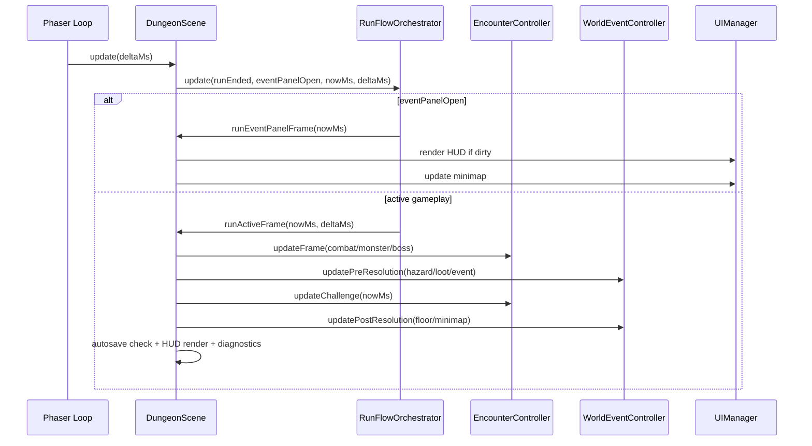
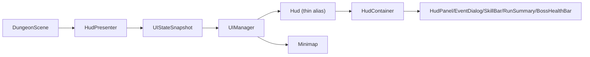

# Blodex 架构说明（Phase 4）

> 更新时间：2026-03-04  
> 适用范围：当前 `main`（Phase 4 改造后）  
> 目的：作为开发、评审、回归的统一架构基线，避免继续沿用旧版“单体 Scene”认知。

## 1. 设计目标

1. 将 `DungeonScene` 限制为场景壳（生命周期 + 装配），避免继续演化为 God Class。
2. 用显式编排层管理帧流程，确保更新顺序可读、可测、可替换。
3. 将高变业务（事件、Boss、危险区、推进、保存）模块化，降低跨功能回归风险。
4. 保持核心规则在 `@blodex/core`，客户端只做运行时适配与表现层映射。
5. 用架构预算门禁防止体量反弹。

---

## 2. Monorepo 分层

| 层 | 路径 | 职责 | 约束 |
|---|---|---|---|
| Client Runtime | `apps/game-client` | Phaser 场景、运行时模块、系统、UI、存档适配 | 不在 UI 层重写核心规则 |
| Core Domain | `packages/core` | 战斗、成长、随机、事件结算、运行与存档协议 | 不依赖 Phaser / DOM |
| Content Data | `packages/content` | 怪物/物品/掉落/Biome/事件/关卡配置 | 只承载数据与配置，不承载运行时副作用 |
| Tooling | `packages/tooling` | 资产计划编译、manifest 校验与报告 | 不侵入运行时逻辑 |

---

## 3. 客户端运行时总览

```mermaid
graph TD
  Main["main.ts"] --> Scene["DungeonScene (Scene Shell)"]
  Scene --> Flow["RunFlowOrchestrator"]
  Scene --> Encounter["EncounterController"]
  Scene --> World["WorldEventController"]

  Scene --> Debug["DebugRuntimeModule"]
  Scene --> Save["RunPersistenceModule"]
  Scene --> Event["EventRuntimeModule"]
  Scene --> Boss["BossRuntimeModule"]
  Scene --> Hazard["HazardRuntimeModule"]
  Scene --> Progress["ProgressionRuntimeModule"]
  Scene --> Floor["FloorProgressionModule"]
  Scene --> RunDone["RunCompletionModule"]
  Scene --> Action["PlayerActionModule"]

  Scene --> Systems["Movement/AI/Combat/Render/VFX/SFX Systems"]
  Scene --> UI["HudPresenter + UIManager + HudContainer"]

  Scene --> Core["@blodex/core"]
  Scene --> Content["@blodex/content"]
```

### 3.1 关键组件与职责

| 组件 | 路径 | 主要职责 |
|---|---|---|
| Scene 壳 | `apps/game-client/src/scenes/DungeonScene.ts` | Phaser 生命周期、模块装配、帧入口 |
| 帧总编排 | `apps/game-client/src/scenes/dungeon/orchestrator/RunFlowOrchestrator.ts` | `runEnded / eventPanelOpen` 分支编排 |
| 战斗遭遇编排 | `apps/game-client/src/scenes/dungeon/encounter/EncounterController.ts` | 玩家/怪物/Boss/挑战房更新顺序 |
| 世界事件编排 | `apps/game-client/src/scenes/dungeon/world/WorldEventController.ts` | Hazard/Loot/Event/Floor/Minimap 更新顺序 |
| 调试模块 | `apps/game-client/src/scenes/dungeon/debug/DebugRuntimeModule.ts` | Debug API 注入、热键命令分发 |
| 持久化模块 | `apps/game-client/src/scenes/dungeon/save/RunPersistenceModule.ts` | 快照构建、恢复、保存协调 |
| 事件模块 | `apps/game-client/src/scenes/dungeon/world/EventRuntimeModule.ts` | 随机事件节点、选项结算、商人流程 |
| Boss 模块 | `apps/game-client/src/scenes/dungeon/encounter/BossRuntimeModule.ts` | Boss 生成、战斗驱动、胜利分岔 |
| 危险区模块 | `apps/game-client/src/scenes/dungeon/world/HazardRuntimeModule.ts` | Hazard 生成、触发、伤害与视觉同步 |
| 推进模块 | `apps/game-client/src/scenes/dungeon/world/ProgressionRuntimeModule.ts` | 楼层初始化、地牢渲染、挑战房与隐藏房 |
| 楼层推进 | `apps/game-client/src/scenes/dungeon/world/FloorProgressionModule.ts` | 阶梯可见性、过层、Endless 进入与推进 |
| 结算模块 | `apps/game-client/src/scenes/dungeon/run/RunCompletionModule.ts` | Run 结束、奖励结算、Meta 回写 |
| HUD 适配 | `apps/game-client/src/scenes/dungeon/ui/HudPresenter.ts` | 构建 UI 快照，隔离 Scene 与 HUD |

### 3.2 结构决策说明

1. 不单独引入 `CombatRuntimeModule`，战斗职责由 `CombatSystem + EncounterController` 承载，避免重复抽象层。
2. 目前多个模块仍通过 `host: Record<string, any>` 访问 Scene 状态，这是 Phase 4 的兼容折中；后续可逐步收敛为显式 Host Interface。

---

## 4. 帧流程（Update Pipeline）

该顺序将“模拟”“事件交互”“表现刷新”分离，避免相互穿插造成的状态竞态。

---

## 5. 状态与数据边界

| 类别 | 主体 | 说明 |
|---|---|---|
| 领域状态 | `RunState` / `PlayerState` / `BossRuntimeState` 等（`@blodex/core`） | 规则层定义，客户端只消费与持有 |
| 运行时状态 | Scene 内 Sprite、输入、定时器、缓存 | 与 Phaser 强耦合，不进入 core |
| 内容配置 | `@blodex/content` 的 Def/Map | 数据驱动，不写流程分支 |
| 表现快照 | `UIStateSnapshot` | 通过 `HudPresenter` 生成，降低 HUD 与 Scene 耦合 |
| 事件总线 | `createEventBus<GameEventMap>()` | 用于日志、反馈、可观测事件归档 |

---

## 6. 持久化架构

### 6.1 Meta 与 Run 存档

| 存档 | key | schema | 兼容策略 |
|---|---|---|---|
| Meta | `blodex_meta_v2`（兼容 v1 读取） | `6` | `migrateMeta` 向后兼容 |
| Run | `blodex_run_save_v2`（兼容 v1 读取） | `2` | `deserializeRunStateResult` 自动迁移并回写 v2 |

### 6.2 Run 保存链路

1. `RunSaveSnapshotBuilder` 负责构建快照（含 `deferredOutcomes`）。
2. `SaveCoordinator` 统一调度 `flush / schedule / heartbeat / lifecycle`。
3. `SaveManager` 负责 localStorage 读写、跨 tab lease（TTL `15000ms`，心跳 `5000ms`）。
4. `RunStateRestorer` 负责恢复地牢、实体、事件、minimap、mutator、deferred outcome。

### 6.3 持久化决策（已落地）

1. Endless mutator 运行态保存在 `RunState`（随单局存档），不放入 `MetaProgression`。
2. 事件/商人延迟收益保存在 `RunSaveDataV2.deferredOutcomes?`，老存档缺省为 `[]` 语义。

---

## 7. UI 架构

要点：
1. `Hud.ts` 仅作为 `HudContainer` 的薄入口。
2. UI 组件拆分在 `ui/components/*`，容器集中在 `ui/hud/HudContainer.ts`。
3. `UIManager.renderSnapshot` 接收快照，不直接绑定 Scene 内部字段。

---

## 8. 架构治理与预算门禁

预算脚本：`scripts/check-architecture-budgets.sh`  
CI 集成：`pnpm ci:check` 包含 `pnpm check:architecture-budget`

| 文件 | 当前行数 | 阈值（lines） | 阈值（methods） |
|---|---:|---:|---:|
| `apps/game-client/src/scenes/DungeonScene.ts` | 4286 | 2600 | 90 |
| `apps/game-client/src/scenes/MetaMenuScene.ts` | 1092 | 1200 | 85 |
| `apps/game-client/src/ui/Hud.ts` | 5 | 300 | 25 |
| `apps/game-client/src/ui/hud/HudContainer.ts` | 1186 | 1100 | 60 |

说明：
1. `DungeonScene.ts` 当前仍高于目标预算，脚本使用临时 debt ceiling `4286 lines / 92 methods` 做 no-regression gate。
2. `HudContainer.ts` 当前也高于目标预算，脚本使用临时 debt ceiling `1186 lines` 做 no-regression gate。
3. 这不是放宽目标预算；`DungeonScene <= 2600 / 90` 与 `HudContainer <= 1100 / 60` 仍是明确收口目标。
4. 发布 DoD 仍要求继续收口 `DungeonScene < 2500`。

---

## 9. 开发约束（执行时必须遵守）

1. 新业务逻辑默认进入 `scenes/dungeon/*` 模块，不回流 `DungeonScene`。
2. 模块间交互优先通过编排器/服务接口，不直接互相读取实现细节。
3. 修改存档协议时，必须同时补齐迁移兼容测试与回归样例。
4. 影响玩家可见行为的改动需同步更新 `en-US` / `zh-CN` 文案与回归矩阵。

---

## 10. 后续收敛方向

1. 将模块 `host: Record<string, any>` 逐步替换为强类型 Host Port，降低隐式耦合。
2. 继续拆分 `DungeonScene` 与 `HudContainer` 的剩余聚合职责，降低预算压力。
3. 在 `docs/plans/phase4/release/*` 维持发布证据链（回归矩阵、性能对比、回滚手册）。
