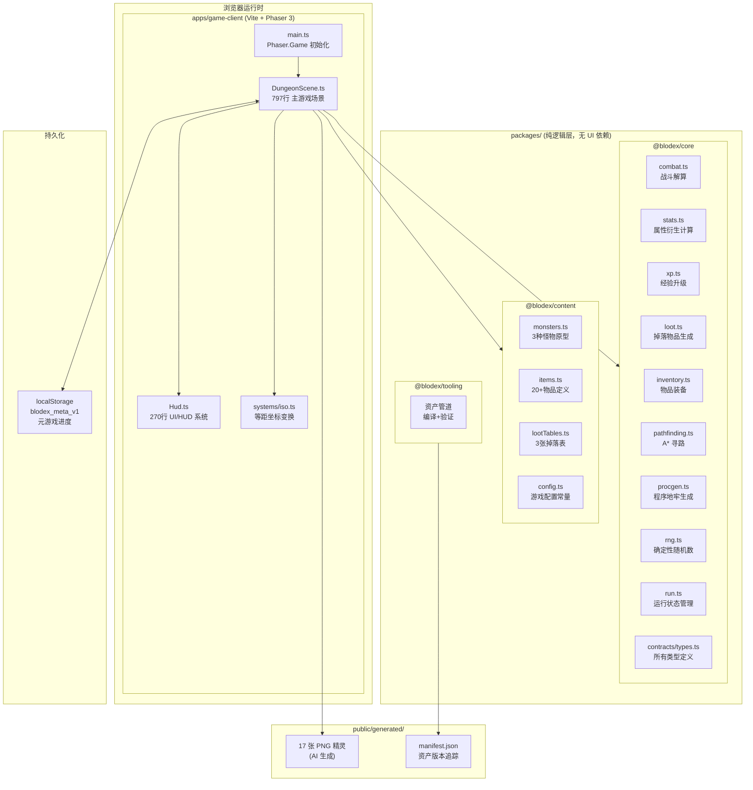
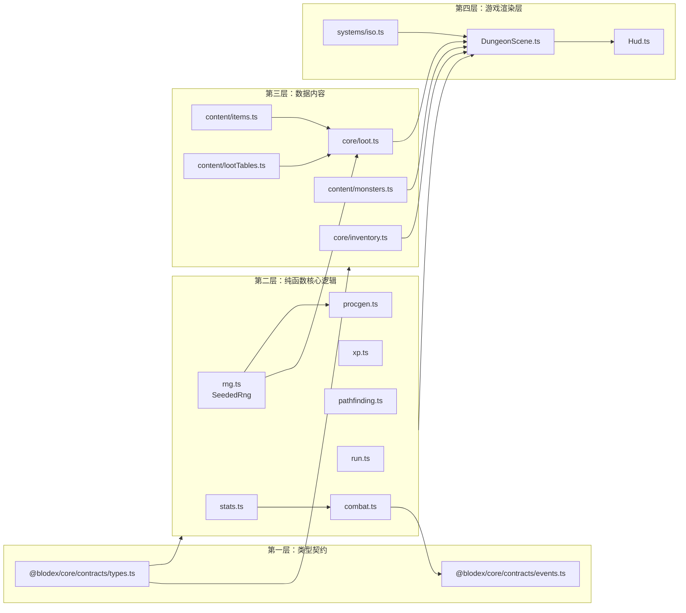
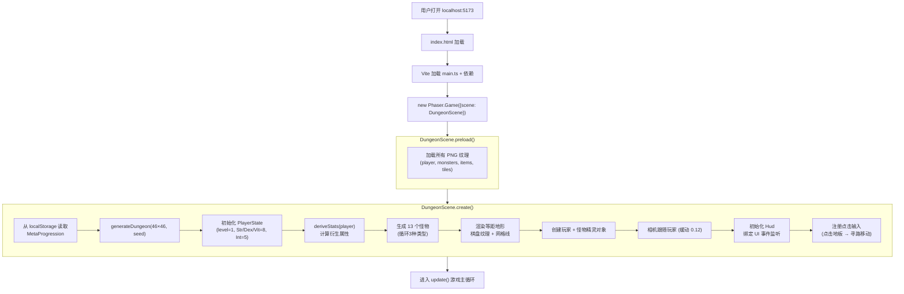
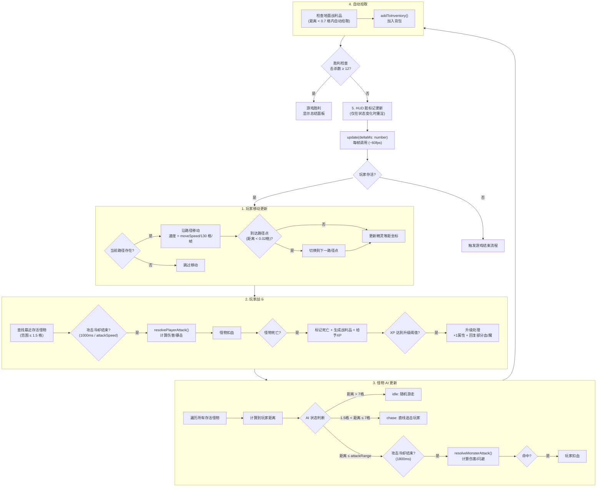
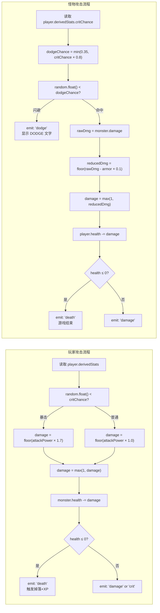
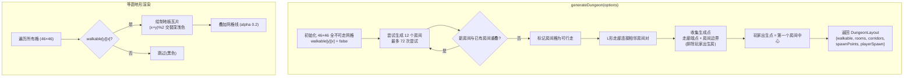
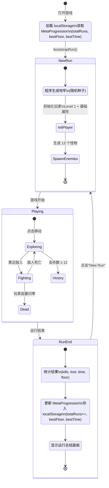
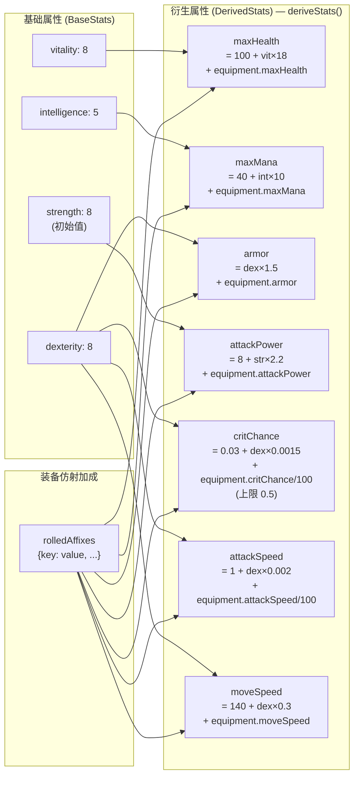
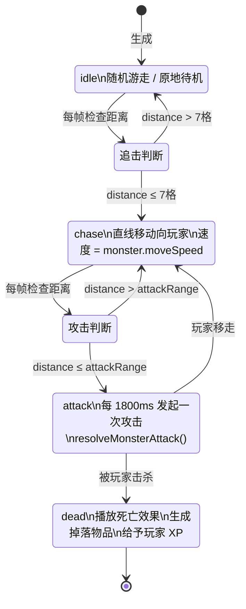

# Blodex 项目深度分析

## 一、项目概述

**Blodex** 是一个基于浏览器的 **等距视角（Isometric）黑暗奇幻 ARPG MVP**，采用 Phaser 3 + TypeScript 构建，核心玩法类似 Diablo / Path of Exile 的单次运行（Roguelike-like）地牢爬行游戏。

---

## 二、整体架构图



---

## 三、模块依赖关系



---

## 四、游戏初始化流程



---

## 五、游戏主循环流程



---

## 六、战斗系统详细流程



---

## 七、物品与装备系统流程

```mermaid
flowchart TD
  subgraph LootGeneration["物品掉落生成"]
    MonsterDie["怪物死亡\n(dropTableId 决定用哪张掉落表)"]
    --> DropCheck["查找对应 LootTable"]
    --> FilterItems["按 minFloor 过滤有效物品"]
    --> WeightedRoll["按 weight 加权随机选取 ItemDef"]
    --> RollAffixes["rollAffixes(rng, affixPool)\n随机选 minAffixes~maxAffixes 个仿射"]
    --> CreateInstance["创建 ItemInstance\n{id, defId, rolledAffixes}"]
    --> SpawnOnGround["在怪物死亡位置生成地面物品精灵"]
  end

  subgraph AutoPickup["自动拾取 (距离 < 0.7格)"]
    NearLoot["检测到附近物品"]
    --> addToInventory["addToInventory(player, item)\n加入 player.inventory 数组"]
    --> HUDRefresh["HUD 刷新背包格子显示"]
  end

  subgraph EquipFlow["装备物品 (点击 HUD 装备槽)"]
    ClickItem["玩家点击背包中的物品"]
    --> CheckLevel{"player.level ≥ item.requiredLevel?"}
    CheckLevel -- 否 --> ShowError["显示等级不足提示"]
    CheckLevel -- 是 --> CheckSlotOccupied{"对应装备槽已有装备?"}
    CheckSlotOccupied -- 是 --> UnequipOld["unequip 旧装备 → 返回背包"]
    CheckSlotOccupied -- 否 --> Equip
    UnequipOld --> Equip["equip(player, item)\n放入 player.equipment[slot]"]
    Equip --> RecalcStats["deriveStats(player)\n重新计算全部衍生属性"]
    RecalcStats --> HUDRefresh2["HUD 刷新属性面板"]
  end

  subgraph UnequipFlow["卸下装备 (点击已装备槽)"]
    ClickEquipped["玩家点击已装备物品"]
    --> UnequipItem["unequip(player, slot)\n返回 player.inventory"]
    --> RecalcStats2["deriveStats(player)\n重新计算属性"]
    --> HUDRefresh3["HUD 刷新"]
  end
```



---

## 八、地牢生成流程



---

## 九、运行生命周期与元游戏流程



---

## 十、属性计算系统



---

## 十一、怪物 AI 状态机



---

## 十二、游戏怎么玩

### 目标

在随机生成的等距地牢中，消灭 **12 个敌人** 即可完成本次运行。

---

### 基本操作

| 操作 | 说明 |
|------|------|
| **点击地板** | 玩家自动寻路移动到目标位置 |
| **靠近敌人** | 距离 ≤ 1.5 格时自动攻击（无需手动操作） |
| **靠近掉落物** | 距离 < 0.7 格时自动拾取，无需点击 |
| **点击背包物品** | 装备物品（需满足等级要求） |
| **点击已装备物品** | 卸下装备，返回背包 |

---

### 游戏流程

```
1. 游戏开始 → 随机生成地牢地图（12 个房间 + 走廊）
2. 玩家出生在第一个房间中心
3. 13 个怪物散布在走廊/房间边界处
4. 探索地图，找到并消灭敌人
5. 击杀后拾取物品 → 在 HUD 中装备提升属性
6. 击杀 12 个敌人 → 胜利
   玩家血量归零 → 失败
7. 查看本次运行统计，点击"New Run"重新开始
```

---

### 三种敌人

| 敌人 | 血量 | 特点 | 策略 |
|------|------|------|------|
| **Crypt Hound（墓地獒犬）** | 基准 | 近战，速度普通 | 直接靠近打 |
| **Ash Acolyte（灰烬侍僧）** | -25% | 远程 5 格攻击，较快 | 快速逼近取消其远程优势 |
| **Iron Revenant（铁复仇者）** | +70% | 近战坦克，高伤害，高 XP | 优先处理，可获 40XP |

---

### 成长系统

**升级**：击杀敌人获得 XP，满足 `80 + level² × 18` 经验后升级，每级：
- +1 基础属性点（优先分配 strength）
- 恢复部分血量 (+12) 和魔法值 (+4)

**装备**：物品有三种稀有度（普通/魔法/稀有），不同槽位：
- `weapon` 武器：提升攻击力/暴击/攻速
- `helm` 头盔：提升护甲/血量
- `chest` 胸甲：提升护甲/血量
- `boots` 靴子：提升移速/护甲
- `ring` 戒指：各类属性加成

---

### HUD 面板说明

**左侧 HUD（340px 宽）包含：**
- **Meta**：历史统计（总运行次数、最佳楼层、最佳时间）
- **Stats**：当前角色属性（等级、XP、HP/Mana、攻击力、护甲）
- **Run**：本次进度（楼层、击杀数 x/12、拾取物品数）
- **Inventory**：5 个装备槽 + 背包格子
- **Summary**（运行结束后）：本次总结

---

### 胜利/失败条件

- **胜利**：击杀数 ≥ 12 → 显示总结面板，更新最佳记录
- **失败**：HP 归零 → 运行结束，同样显示总结面板
- **重置**：点击"New Run"按钮 → 重新生成地牢开始新运行

---

## 十三、关键文件路径索引

| 文件 | 路径 | 功能 |
|------|------|------|
| 游戏入口 | `apps/game-client/src/main.ts` | Phaser.Game 初始化 |
| 主游戏场景 | `apps/game-client/src/scenes/DungeonScene.ts` | 游戏循环、实体、渲染 |
| HUD 系统 | `apps/game-client/src/ui/Hud.ts` | UI 交互与渲染 |
| 等距坐标 | `apps/game-client/src/systems/iso.ts` | 网格⟷屏幕坐标转换 |
| 战斗逻辑 | `packages/core/src/combat.ts` | 伤害计算 |
| 属性计算 | `packages/core/src/stats.ts` | 衍生属性推导 |
| A* 寻路 | `packages/core/src/pathfinding.ts` | 移动路径规划 |
| 地牢生成 | `packages/core/src/procgen.ts` | 程序地图生成 |
| 掉落系统 | `packages/core/src/loot.ts` | 物品生成 |
| 物品库 | `packages/content/src/items.ts` | 20+ 物品定义 |
| 怪物库 | `packages/content/src/monsters.ts` | 3 种怪物原型 |
| 掉落表 | `packages/content/src/lootTables.ts` | 3 张掉落表配置 |
| 类型定义 | `packages/core/src/contracts/types.ts` | 所有实体类型 |
