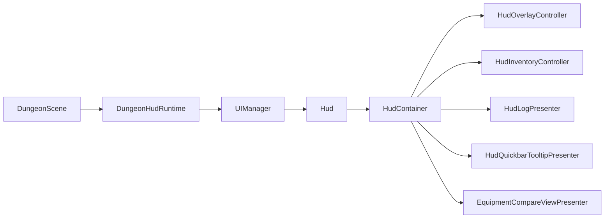

# Blodex 架构说明（Phase 7 基线）

> 更新时间：2026-03-09  
> 适用范围：当前 `main@c7a28a6`  
> 目的：作为 Phase 7 完成后的统一架构基线，明确当前主干已经完成的 shell 重构、`RunSaveV3`、evidence registry 与 content gate，不再沿用旧的 `Phase 4` / debt ceiling 叙事。

## 1. 设计目标

1. `DungeonScene` 只保留 scene shell、生命周期与顶层装配，不再承担业务协调。
2. `HudContainer` 只保留 view container 语义，不再吞掉 compare / overlay / summary 业务动作。
3. `MetaMenuScene` 只保留导航与装配，meta 业务统一收口到 controller / builder。
4. `save / restore` 只允许经过 `RunSaveV3` 的严格 schema 与固定恢复流水线。
5. `release evidence / threshold / calibration / content gate` 形成显式 registry，不再散落在报告构建器与阶段文档里。
6. 架构预算门禁不再依赖 `DungeonScene / HudContainer` 的 debt ceiling。

---

## 2. Monorepo 分层

| 层 | 路径 | 职责 | 约束 |
|---|---|---|---|
| Client Runtime | `apps/game-client` | Phaser 场景壳、runtime module、UI、debug、save/restore 适配、release evidence consumer | 不在 UI 层重写核心规则 |
| Core Domain | `packages/core` | 战斗、成长、掉落、story run、save schema、set/element/buff 规则 | 不依赖 Phaser / DOM |
| Content Data | `packages/content` | 怪物、Boss、物品、掉落表、事件、节点、registry 数据 | 只承载配置与静态元数据 |
| Tooling | `packages/tooling` | 资产计划编译、manifest/audio-manifest 校验、Phase 7 content gate | 不侵入运行时逻辑 |

---

## 3. 客户端运行时总览

```mermaid
graph TD
  Main["main.ts"] --> Dungeon["DungeonScene (Scene Shell)"]
  Main --> Meta["MetaMenuScene (Meta Shell)"]

  Dungeon --> Shell["DungeonSceneShellRuntime"]
  Dungeon --> Frame["DungeonFrameRuntime"]
  Dungeon --> Input["DungeonInputRuntime"]
  Dungeon --> Combat["DungeonCombatRuntime"]
  Dungeon --> HudRuntime["DungeonHudRuntime"]
  Dungeon --> MetaRuntime["DungeonMetaRuntime"]
  Dungeon --> Session["DungeonSessionFacade"]
  Dungeon --> Diag["DungeonDiagnosticsRuntime"]

  Dungeon --> Save["RunPersistenceModule"]
  Dungeon --> Event["EventRuntimeModule"]
  Dungeon --> Boss["BossRuntimeModule"]
  Dungeon --> Hazard["HazardRuntimeModule"]
  Dungeon --> Progress["ProgressionRuntimeModule"]
  Dungeon --> Floor["FloorProgressionModule"]
  Dungeon --> RunDone["RunCompletionModule"]
  Dungeon --> Action["PlayerActionModule"]

  Session --> Core["@blodex/core"]
  Dungeon --> Content["@blodex/content"]
  HudRuntime --> UI["UIManager -> Hud -> HudContainer"]
  Meta --> Flow["MetaFlowController"]
  Meta --> Builder["MetaMenuViewBuilder"]
```

### 3.1 当前关键组件

| 组件 | 路径 | 主要职责 |
|---|---|---|
| Scene 壳 | `apps/game-client/src/scenes/DungeonScene.ts` | Phaser 生命周期、顶层装配、runtime 委托入口 |
| Scene Shell Runtime | `apps/game-client/src/scenes/dungeon/shell/DungeonSceneShellRuntime.ts` | shell 级初始化与模块 wiring |
| 帧编排 | `apps/game-client/src/scenes/dungeon/shell/DungeonFrameRuntime.ts` | active/event/summary frame 调度 |
| 输入运行时 | `apps/game-client/src/scenes/dungeon/shell/DungeonInputRuntime.ts` | pointer、keyboard、移动与 debug hotkey |
| 战斗运行时 | `apps/game-client/src/scenes/dungeon/shell/DungeonCombatRuntime.ts` | combat、monster、loot、pressure peak 驱动 |
| HUD 运行时 | `apps/game-client/src/scenes/dungeon/shell/DungeonHudRuntime.ts` | HUD snapshot、overlay flush、compare prompt 协调 |
| Meta 运行时 | `apps/game-client/src/scenes/dungeon/shell/DungeonMetaRuntime.ts` | meta 加载/保存、difficulty、daily、release note 提示 |
| Session Facade | `apps/game-client/src/scenes/dungeon/shell/DungeonSessionFacade.ts` | player/set/buff/talent/synergy 汇总重算与 run-level 状态汇口 |
| Diagnostics Runtime | `apps/game-client/src/scenes/dungeon/shell/DungeonDiagnosticsRuntime.ts` | diagnostics panel、snapshot 与 debug 输出 |
| Meta 业务流 | `apps/game-client/src/scenes/meta/MetaFlowController.ts` | meta business flow、按钮行为、继续挑战与遗产路径 |
| Meta 视图构建 | `apps/game-client/src/scenes/meta/MetaMenuViewBuilder.ts` | meta view model 与面板数据 |

### 3.2 Host / Source Discipline

1. `DungeonScene` 不再把 `this as unknown as Host` 直接传给 runtime module。
2. 统一通过 `apps/game-client/src/scenes/dungeon/dungeonSceneHostFactories.ts` 构造 typed bridge / overlay source。
3. `shell` 目录下的 runtime / facade 不再依赖 source-side cast；统一接收显式 `Source`。

---

## 4. UI 架构

```mermaid
graph LR
  Scene["DungeonScene"] --> HudRuntime["DungeonHudRuntime"]
  HudRuntime --> UIManager["UIManager"]
  UIManager --> Hud["Hud"]
  Hud --> Container["HudContainer"]
  Container --> Overlay["HudOverlayController"]
  Container --> Inventory["HudInventoryController"]
  Container --> Log["HudLogPresenter"]
  Container --> Tooltip["HudQuickbarTooltipPresenter"]
  Container --> Compare["EquipmentCompareViewPresenter"]
```

### 4.1 UI 约束

1. `HudContainer` 当前仅承载 view/container 组合，行数基线已压到 `339`。
2. compare 行为语义回到 runtime：
   - `equip / later / ignore`
   - `immediate / deferred compare`
   - `queued compare flush`
3. `MetaMenuPanel` 与 `MetaMenuScene` 也已经拆分为：
   - `MetaFlowController`
   - `MetaMenuViewBuilder`
   - `MetaMenuPanelRender`

---

## 5. Save / Resume 架构

### 5.1 当前协议

| 项目 | 现状 |
|---|---|
| Run key | `blodex_run_save_v3` |
| Schema | `RunSaveV3` |
| 流水线 | `strict deserialize -> load persistent -> rebuild derived -> bootstrap ephemeral` |
| 旧 key 处理 | 旧 `v1/v2` 直接清理，并显示一次性提示 |

### 5.2 状态分层

| 层 | 说明 |
|---|---|
| `domain` | `run / player / consumables / mutation / blueprint` 等稳定领域状态 |
| `runtime` | dungeon、monster、boss、event、minimap、power spike budget、telemetry aggregates |
| `session` | compare prompt、progression prompt、lease 等会话态 |

### 5.3 当前例外

1. 当前主干仍保留一个**窄兼容例外**：对旧版 `RunSaveV3` 中 `powerSpikeBudgetState.pairStates["5"]` 的归一化。
2. 该例外仅用于 `7.8` 将 reward curve 从 `1-2 / 3-4 / 5` 扩展为 `1-2 / 3-4 / 5-6 / 7-8` 时，接住 pre-change 的 V3 save。
3. 这不构成 `v1/v2` 兼容回流，也不恢复旧 migration helper。

---

## 6. Evidence / Calibration / Release 治理

### 6.1 当前治理结构

| 组件 | 路径 | 职责 |
|---|---|---|
| Calibration / Threshold Governance | `apps/game-client/src/systems/balance/BalanceThresholdGovernance.ts` | policy threshold、override allowlist、diffClass |
| Evidence Registry | `apps/game-client/src/systems/balance/Phase6EvidenceRegistry.ts` | smoke scenario、sign-off checklist、threshold registry |
| Release Artifact Index | `apps/game-client/src/systems/balance/Phase6ReleaseArtifactIndex.ts` | manual/doc/screenshot artifact registry |
| Evidence Pack | `apps/game-client/src/systems/balance/Phase6EvidencePack.ts` | 只消费 registry，不再维护第二套规则 |
| Release Consistency | `apps/game-client/src/systems/balance/Phase6ReleaseConsistency.ts` | release 文档与 artifact 一致性校验 |

### 6.2 当前原则

1. `report` 不再直接吃 raw calibration；effective thresholds 必须经 governance resolver。
2. smoke / sign-off / artifact 不再用文档短语手工拼状态。
3. `phase6:evidence:check` 与 `phase6:evidence:report` 是 release evidence 的唯一自动化入口。

---

## 7. Content Gate 与资源入口门

### 7.1 Content Gate

正式 gate：`pnpm phase7:content-gate:check`

它会检查：

1. `7.0A ~ 7.1` 阶段文档完成态
2. `check:architecture-budget`
3. `phase6:evidence:check`
4. `Phase 6 release readiness = Signed`
5. `S6-01 ~ S6-07 = Pass`
6. `asset-plan/audio-plan` 的 phase7 gate metadata
7. runtime binding 的 manifest / placeholder compatibility

### 7.2 资源策略

1. `assets/source-prompts/asset-plan.yaml`
2. `assets/source-prompts/audio-plan.yaml`
3. `assets/generated/manifest.json`
4. `assets/generated/audio-manifest.json`

当前主干已要求：

1. 新增美术资源的实际生成必须先提供 Gemini Key。
2. 在未提供 Gemini Key 前，只允许：
   - style prompt
   - plan freeze
   - manifest placeholder
   - runtime binding

---

## 8. 当前架构预算

预算脚本：`scripts/check-architecture-budgets.sh`

| 文件 | 当前行数 | lines 阈值 | methods 阈值 |
|---|---:|---:|---:|
| `apps/game-client/src/scenes/DungeonScene.ts` | `1531` | `1532` | `60` |
| `apps/game-client/src/scenes/MetaMenuScene.ts` | `543` | `650` | `85` |
| `apps/game-client/src/ui/Hud.ts` | `5` | `300` | `25` |
| `apps/game-client/src/ui/hud/HudContainer.ts` | `339` | `450` | `25` |

说明：

1. 当前主干已经移除了 `DungeonScene / HudContainer` 的 debt ceiling 模式。
2. `DungeonScene` 仍然接近 hard limit，后续如继续扩 bridge/method pack，应优先再拆 source/method pack，而不是回流 Scene。

---

## 9. 当前玩法扩展基线

Phase 7 已经把以下基础设施接入主干：

1. Boss encounter registry / dispatcher
2. `story / branch / challenge` reward / compare / summary metadata
3. `RunSaveV3`
4. `item set` skeleton
5. `physical / arcane / fire / cold / lightning` 元素基础
6. `8` 层 story run 与 mid-run node
7. dedicated `8-floor` long-run evidence

但需要注意：

1. `7.8` 的 runtime topology 已完成，不等于 long-run tuning 已签署。
2. 长线 pacing / reward curve 的最终质量门槛，当前由单独的 `7.8` follow-up 文档继续追踪。

---

## 10. 维护约束

1. 新业务逻辑默认进入 `scenes/dungeon/*` runtime / module / controller，不回流 `DungeonScene`。
2. 新的 save 字段必须先判断其归属：
   - `domain`
   - `runtime`
   - `session`
3. 新的 release / smoke / calibration 结论必须先入 registry，再入文档。
4. 阶段文档、summary report、architecture doc 必须同步更新，避免再次出现“脚本是对的、文档还是旧的”。

