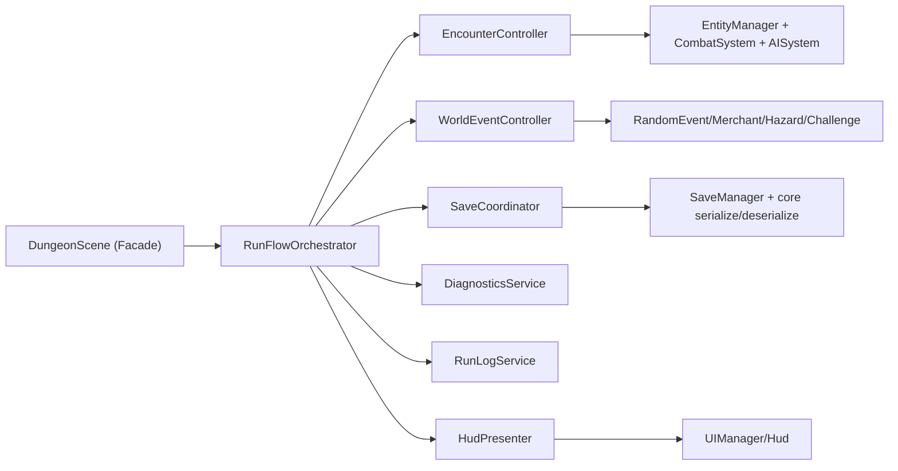

# R1 场景与 UI 架构拆分实施文档（PR 级，长期主义版）

**日期**: 2026-03-03  
**阶段**: Phase 3 / R1  
**目标摘要**: 在不改变玩法语义与 deterministic 行为的前提下，拆解 `DungeonScene` 与 UI 渲染耦合，为 R2（i18n 基础设施）提供稳定边界。  
**关联文档**: 
- `docs/plans/phase3/2026-03-03-phase3-project-refactor-i18n-plan.md`
- `docs/plans/phase2/README.md`
- `docs/plans/2026-02-27-phase3-experience-polish.md`

---

## 1. 直接结论

R1 采用“**渐进式解耦（Strangler Fig）**”而不是一次性重写：

1. 保留 `DungeonScene` 作为唯一生命周期入口（`init/create/update/cleanup`），但把业务职责按领域拆成可独立测试的 Controller/Service。
2. 先抽离“稳定收益且低风险”的横切层：`RunLogService`、`HudPresenter`、`SaveCoordinator`、`DiagnosticsService`。
3. 再抽离高复杂领域：`EncounterController` 与 `WorldEventController`。
4. 通过 feature flag + 逐 PR 回退能力，保证每步可回滚。

R1 完成后的硬结果：

- `DungeonScene.ts` 从当前 **5788 行 / 157 private 方法** 降至可控规模（目标 `< 2500 行 / < 70 private 方法`）。
- UI 与日志输出不再由 Scene 直接拼接字符串，为 R2 的 i18n `t(key, params)` 接入提供单点。
- 运行时行为（战斗结论、随机性、存档兼容）保持等价。

---

## 2. 长期主义设计原则（R1 必须遵守）

1. **语义稳定优先于结构优雅**
   - R1 不改玩法规则、不改数值、不改核心流程判定语义。
2. **边界先行**
   - `@blodex/core` 继续纯逻辑；`apps/game-client` 负责编排和表现。
3. **可观测、可回滚**
   - 每个 PR 必须可通过 flag 关闭新路径。
4. **增量演进**
   - 不做大爆炸迁移；每个 PR 目标单一、可验证。
5. **为 R2/R3 预留扩展点**
   - 所有玩家可见文本改由 presenter/log service 输出 key，不在 Scene 内散落字符串。

---

## 3. 现状与问题证据

### 3.1 代码现状

- `apps/game-client/src/scenes/DungeonScene.ts`: **5788 行**，职责覆盖：
  - 运行生命周期
  - 战斗/怪物/Boss
  - 事件/商店/挑战房
  - hazard/掉落/清层
  - HUD/minimap/日志
  - 存档与恢复
  - debug API 与诊断
- `apps/game-client/src/ui/Hud.ts`: **846 行**，`innerHTML` 写入约 24 处。
- `apps/game-client/src/ui/components/MetaMenuPanel.ts`: **571 行**，模板字符串拼接高密度。

### 3.2 架构层问题

1. `DungeonScene` 既是 orchestrator，又是 domain handler、UI 组装器、日志格式化器。
2. UI 数据和文案构造在 Scene/Hud 混杂，难以统一接入 i18n。
3. Debug/Diagnostics 与主流程耦合，影响可读性与稳定性。
4. Save/restore 逻辑规模大且分散，故障定位成本高。

---

## 4. R1 范围与非目标

## 4.1 范围

1. Scene 内业务逻辑分层拆分（Controller/Service）。
2. UI 数据准备从 Scene 分离到 Presenter。
3. 日志输出收敛到统一服务（先 key 化接口，不强制本 PR 全量翻译）。
4. Save/restore 编排从 Scene 中抽离。
5. Debug/diagnostics 从主流程剥离。

## 4.2 非目标

1. 不引入新玩法。
2. 不修改 `@blodex/core` 的战斗规则语义。
3. 不在 R1 内完成全量 i18n 翻译（R2/R3 负责）。
4. 不在 R1 内做 CSS 模块化（R4 负责）。

---

## 5. 目标架构（R1 结束态）



### 5.1 组件职责定义

1. `DungeonScene`（Facade）
   - 只保留 Phaser 生命周期、输入透传、对象装配。
2. `RunFlowOrchestrator`
   - 驱动每帧更新顺序，协调 controller 间依赖。
3. `EncounterController`
   - 怪物/Boss/挑战房战斗相关更新与结算触发。
4. `WorldEventController`
   - event/merchant/hazard/loot/floorProgress 交互。
5. `SaveCoordinator`
   - 自动保存、立即保存、恢复、lease 生命周期。
6. `RunLogService`
   - 接收结构化事件并输出日志消息 key + params。
7. `HudPresenter`
   - 生成 `UIStateSnapshot`，不负责规则计算。
8. `DiagnosticsService`
   - perf panel、debug snapshot、stress hooks。

### 5.2 运行时上下文对象

建议新增 `DungeonRuntimeContext`（只在 client 内部）：

```typescript
export interface DungeonRuntimeContext {
  run: RunState;
  player: PlayerState;
  meta: MetaProgression;
  floorConfig: FloorConfig;
  nowMs: number;
  deltaMs: number;
  flags: {
    runEnded: boolean;
    eventPanelOpen: boolean;
    debugCheatsEnabled: boolean;
  };
}
```

用途：

- 防止 controller 直接依赖 `DungeonScene` 全量字段。
- 为后续 i18n、测试桩和回放验证提供一致输入模型。

---

## 6. PR 级实施计划（R1）

> 规则：每个 PR 都必须可独立合并、独立回滚、独立验证。

### PR-R1-01：骨架与边界建立（不改行为）

**目标**: 引入新目录与接口，完成“空实现 + 透传调用”。

**新增文件**:
- `apps/game-client/src/scenes/dungeon/runtime/DungeonRuntimeContext.ts`
- `apps/game-client/src/scenes/dungeon/orchestrator/RunFlowOrchestrator.ts`
- `apps/game-client/src/scenes/dungeon/logging/RunLogService.ts`
- `apps/game-client/src/scenes/dungeon/ui/HudPresenter.ts`
- `apps/game-client/src/scenes/dungeon/save/SaveCoordinator.ts`
- `apps/game-client/src/scenes/dungeon/diagnostics/DiagnosticsService.ts`

**修改文件**:
- `apps/game-client/src/scenes/DungeonScene.ts`
- `apps/game-client/src/config/uiFlags.ts`

**关键点**:
1. 加入新 flag：`sceneRefactorR1Enabled`（默认 `false`）。
2. 新类先做“pass-through”，行为完全等价。

**验收**:
- 关闭 flag 时 100% 走旧路径。
- 打开 flag 时逻辑结果与旧路径一致。

---

### PR-R1-02：日志层抽离（RunLogService）

**目标**: Scene 不直接拼接玩家可见日志文本。

**新增文件**:
- `apps/game-client/src/scenes/dungeon/logging/logEvents.ts`

**修改文件**:
- `apps/game-client/src/scenes/DungeonScene.ts`
- `apps/game-client/src/scenes/dungeon/logging/RunLogService.ts`

**关键点**:
1. 把 `appendLog("...")` 替换为 `runLog.emit(event)`。
2. 事件先定义英文 fallback 文案，下一阶段对接 i18n key。

**事件样例**:

```typescript
export type RunLogEvent =
  | { type: "equip_failed_not_found"; itemId: string }
  | { type: "equip_success"; itemName: string; slot: string }
  | { type: "event_discovered"; eventName: string; floor: number }
  | { type: "floor_cleared"; floor: number; kills: number };
```

**验收**:
- 日志条数、级别、触发时机与旧版一致。
- Scene 文件中不再出现新增的自由文案拼接。

---

### PR-R1-03：HUD 数据组装抽离（HudPresenter）

**目标**: Scene 只提供 runtime state，HUD 渲染输入由 presenter 统一产出。

**修改文件**:
- `apps/game-client/src/scenes/DungeonScene.ts`
- `apps/game-client/src/scenes/dungeon/ui/HudPresenter.ts`
- `apps/game-client/src/ui/state/UIStateAdapter.ts`

**关键点**:
1. 将 `renderHud()` 中的数据构造迁入 `HudPresenter`。
2. `HudPresenter` 输出结构化 view model，未来可注入 `t()`。
3. 保留 UI 现有视觉与交互行为。

**验收**:
- UI 视觉无回归（Boss 条、skillbar、low hp、summary、event panel）。
- `DungeonScene.renderHud()` 仅包含 1-2 行委托调用。

---

### PR-R1-04：存档编排抽离（SaveCoordinator）

**目标**: Scene 不再直接处理保存调度、lease 心跳、恢复流程细节。

**修改文件**:
- `apps/game-client/src/scenes/DungeonScene.ts`
- `apps/game-client/src/scenes/dungeon/save/SaveCoordinator.ts`
- `apps/game-client/src/systems/SaveManager.ts`（仅必要适配）

**关键点**:
1. 封装：`scheduleSave/flushSave/restoreFromSave/startHeartbeat/dispose`。
2. Scene 只持有 coordinator，不再直接调用 `SaveManager` 多处 API。

**验收**:
- resume、abandon、auto-save、跨 tab lease 行为无回归。
- 现有 `saveManager.test.ts` 全绿，并新增 coordinator 单测。

---

### PR-R1-05：战斗域抽离（EncounterController）

**目标**: 把 monster/boss/challenge 相关更新逻辑从 Scene 中迁出。

**新增文件**:
- `apps/game-client/src/scenes/dungeon/encounter/EncounterController.ts`

**修改文件**:
- `apps/game-client/src/scenes/DungeonScene.ts`
- `apps/game-client/src/scenes/dungeon/orchestrator/RunFlowOrchestrator.ts`

**关键点**:
1. 迁移方法族：
   - `updateMonsters/updateMonsterCombat/updateBossCombat`
   - `spawnBoss/spawnSummonedMonsters/spawnSplitChildren`
   - `challenge` 相关更新入口
2. 对外只暴露明确输入输出，不直接耦合 UI。

**验收**:
- 战斗事件数、Boss phase、challenge 成败触发与旧版一致。
- 高压场景帧时间无显著退化。

---

### PR-R1-06：世界交互域抽离（WorldEventController）

**目标**: event/merchant/hazard/loot/floor progress 逻辑迁出 Scene。

**新增文件**:
- `apps/game-client/src/scenes/dungeon/world/WorldEventController.ts`

**关键点**:
1. 迁移方法族：
   - hazard 初始化与 tick/trigger
   - floor event/merchant panel
   - loot pickup 与 floor clear progression
2. 明确 event panel 状态机输入输出。

**验收**:
- 事件出现率、购买流程、hazard tick、掉落拾取行为一致。

---

### PR-R1-07：诊断与调试抽离（DiagnosticsService）

**目标**: debug API/perf panel 与主流程解耦。

**新增文件**:
- `apps/game-client/src/scenes/dungeon/debug/DebugApiBinder.ts`

**关键点**:
1. 抽离 `installDebugApi/removeDebugApi/renderDiagnosticsPanel/collectDiagnosticsSnapshot`。
2. Scene 只在 create/cleanup 生命周期挂接服务。

**验收**:
- `window.__blodexDebug` 现有命令可用。
- cleanup 后无残留 listener。

---

### PR-R1-08：收敛与删旧路径

**目标**: 在前 7 个 PR 稳定后，默认开启新路径并清理冗余代码。

**关键点**:
1. `sceneRefactorR1Enabled` 默认改为 `true`。
2. 删除已完全替代的旧委托与重复逻辑。
3. 更新文档和架构图。

**验收**:
- `DungeonScene` 文件规模达到目标。
- 所有既有测试通过，新增测试覆盖关键服务。

---

## 7. 关键接口草案

### 7.1 RunFlowOrchestrator

```typescript
export interface RunFlowOrchestrator {
  bootstrap(ctx: DungeonRuntimeContext): void;
  update(ctx: DungeonRuntimeContext): void;
  cleanup(ctx: DungeonRuntimeContext): void;
}
```

### 7.2 RunLogService

```typescript
export interface RunLogService {
  emit(event: RunLogEvent, nowMs: number): void;
}
```

### 7.3 HudPresenter

```typescript
export interface HudPresenter {
  buildView(ctx: DungeonRuntimeContext): UIRenderState;
}
```

### 7.4 SaveCoordinator

```typescript
export interface SaveCoordinator {
  restore(): boolean;
  schedule(): void;
  flush(): void;
  startHeartbeat(): void;
  dispose(): void;
}
```

---

## 8. 质量门禁与验证

### 8.1 每个 PR 的最低门禁

```bash
pnpm --filter @blodex/game-client typecheck
pnpm --filter @blodex/game-client test
pnpm --filter @blodex/core test
```

### 8.2 R1 阶段附加门禁

1. 对照日志快照：同 seed + 同输入下，关键日志事件序列一致。
2. 对照存档快照：resume 前后 `RunSummary` 一致。
3. 对照行为回放：Boss 结算、challenge、daily/endless 不回归。

### 8.3 新增测试建议

1. `apps/game-client/src/scenes/dungeon/logging/__tests__/runLogService.test.ts`
2. `apps/game-client/src/scenes/dungeon/ui/__tests__/hudPresenter.test.ts`
3. `apps/game-client/src/scenes/dungeon/save/__tests__/saveCoordinator.test.ts`
4. `apps/game-client/src/scenes/dungeon/orchestrator/__tests__/runFlowOrchestrator.test.ts`

---

## 9. 风险与回滚策略

### 9.1 主要风险

1. 拆分过程中状态读写顺序变化引入隐式回归。
2. controller 间边界不清导致反向耦合。
3. 调试能力在重构中临时失效影响排障效率。

### 9.2 缓解与回滚

1. 每个 PR 均保留旧路径与新路径双跑开关。
2. 关键路径引入“行为对照测试”（snapshot + event sequence）。
3. 若出现高风险回归：仅回退当前 PR，不影响前序已稳定 PR。

---

## 10. R1 完成定义（Definition of Done）

1. `DungeonScene` 只保留 Facade 责任，核心业务迁移至独立模块。
2. Scene 内新增玩家可见文案为 0（统一经 `RunLogService`/Presenter）。
3. Save/restore/debug/diagnostics 全部有独立服务承载。
4. 全量测试通过，且新增测试覆盖关键服务。
5. 为 R2 提供稳定注入点：
   - `RunLogService` 支持 key + params
   - `HudPresenter` 支持 i18n context 注入

---

## 11. R1 对 R2 的直接产出

R1 完成后，R2 可以直接执行以下工作而无需再次大拆 Scene：

1. 在 `RunLogService` 接入 `t(key, params)`。
2. 在 `HudPresenter` 接入 locale-aware 文本格式化。
3. 在 UI 组件中只消费翻译后的文案字段，不侵入业务层。

这就是 R1 的长期价值：**先把结构边界稳定下来，再低风险推进多语言与内容国际化。**
