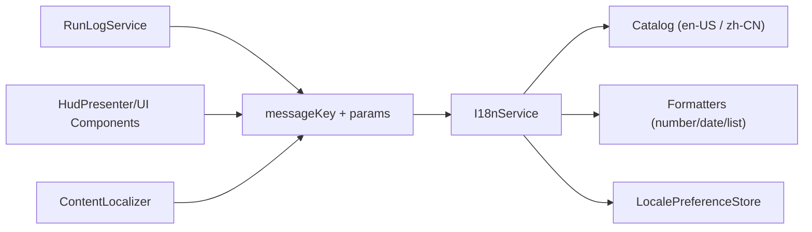

# R2 i18n 基础设施实施文档（PR 级，长期主义版）

**日期**: 2026-03-03  
**阶段**: Phase 3 / R2  
**目标摘要**: 在 R1 完成的结构边界上，建立稳定、可扩展、可验证的 i18n 基础设施；R2 只做“基础设施 + 文本边界治理”，不做完整 `zh-CN` 内容交付（R3 承接）。  
**关联文档**:
- `docs/plans/phase3/2026-03-03-r1-scene-ui-architecture-refactor.md`
- `docs/plans/phase3/2026-03-03-phase3-project-refactor-i18n-plan.md`

---

## 1. 直接结论

R2 的核心不是“翻译多少文案”，而是“**把文本从业务逻辑里彻底剥离出来**”，形成长期可演进的国际化底座：

1. 所有玩家可见文本改为 `messageKey + params`，由统一 `I18nService` 渲染。
2. UI、日志、内容展示都走同一套 locale 解析链路，但 R2 默认只保证 `en-US` 完整可用。
3. 通过静态校验与测试门禁，禁止未来回到硬编码字符串模式。

R2 完成后的硬结果：

- `DungeonScene/Hud/MetaMenuPanel/...` 新增玩家可见文案硬编码为 0。
- 日志系统改为结构化事件 + key 映射。
- R3 只需补 `zh-CN` 词条与语言选择交互，不需要再次做结构性改造。

---

## 2. 长期主义设计原则（R2 必须遵守）

1. **文本与规则彻底解耦**
   - core 只表达状态与事件，不承担语言语义。
2. **Key 稳定性优先**
   - key 一旦发布，不因文案润色频繁改名。
3. **Fallback 可用性优先**
   - 任意缺失翻译不得导致空白/崩溃。
4. **参数一致性可验证**
   - `{param}` 占位必须在编译/测试阶段校验。
5. **渐进接入**
   - 先建立通路，再扩大覆盖面；避免“一次性全量替换”带来的回归爆炸。

---

## 3. 当前问题基线（R2 输入）

1. 当前未发现统一 i18n 基础设施（`i18n/locale/messages/translator`）。
2. UI 模板与日志文本广泛硬编码：
   - `DungeonScene` 日志输出调用约 79 处；
   - `Hud.ts`/`MetaMenuPanel.ts` 文案硬编码密集。
3. 内容定义 (`packages/content`) 的 `name/description` 与玩法定义同文件耦合。
4. 缺少 i18n 相关质量门禁（完整性、未使用 key、参数匹配）。

---

## 4. R2 范围与非目标

### 4.1 范围

1. 建立 `apps/game-client` 侧 i18n 内核（catalog、service、formatter、fallback）。
2. 抽离 UI 与日志文本到 key 化资源。
3. 建立 `packages/content` 的本地化适配层接口（可先 `en-US` 实现）。
4. 补齐 i18n 自动化校验与测试门禁。

### 4.2 非目标

1. 不要求 R2 完成完整 `zh-CN` 文案（R3 完成）。
2. 不要求 R2 引入“首次启动语言选择弹层”（R3 完成）。
3. 不改动核心战斗规则与随机流程。

---

## 5. 目标架构（R2 结束态）



### 5.1 关键组件职责

1. `I18nService`
   - `t(key, params)`、`setLocale()`、`getLocale()`、fallback。
2. `CatalogRegistry`
   - 管理多语言词典及版本信息。
3. `LocalePreferenceStore`
   - 持久化 locale 偏好（R2 先 localStorage）。
4. `ContentLocalizer`
   - 将 `packages/content` 的 domain data 映射为 locale 文本展示。
5. `I18nDiagnostics`
   - 记录 missing key、placeholder mismatch、fallback 命中率。

---

## 6. 关键数据模型

### 6.1 Locale 与消息类型

```typescript
export type LocaleCode = "en-US" | "zh-CN";

export interface MessageCatalog {
  locale: LocaleCode;
  messages: Record<string, string>;
}

export type MessageParams = Record<string, string | number | boolean | null | undefined>;
```

### 6.2 i18n 服务契约

```typescript
export interface I18nService {
  getLocale(): LocaleCode;
  setLocale(locale: LocaleCode): void;
  t(key: string, params?: MessageParams): string;
  hasKey(key: string, locale?: LocaleCode): boolean;
}
```

### 6.3 内容本地化契约

```typescript
export interface ContentLocalizer {
  itemName(itemId: string, fallback: string): string;
  skillName(skillId: string, fallback: string): string;
  skillDescription(skillId: string, fallback: string): string;
  eventName(eventId: string, fallback: string): string;
  eventChoiceName(eventId: string, choiceId: string, fallback: string): string;
}
```

---

## 7. Key 设计与命名规范

### 7.1 命名空间

1. `ui.*`：静态 UI 文案
2. `log.*`：运行日志模板
3. `content.*`：内容展示文案
4. `system.*`：错误与诊断提示

### 7.2 命名规范

1. 全小写、点分层：`ui.meta.start_run`
2. 不包含语言语义：禁止 `ui.meta.start_run_english`
3. 参数占位统一 `{name}` 格式
4. key 不绑定布局细节，优先绑定语义

### 7.3 示例

```text
ui.meta.title
ui.meta.start_run
ui.hud.run.mode
log.item.equip_success
log.event.discovered
content.skill.cleave.name
content.skill.cleave.description
```

---

## 8. PR 级实施计划（R2）

> 每个 PR 目标单一、可回滚、可验证。

### PR-R2-01：i18n 内核骨架（仅 en-US）

**目标**: 建立最小可运行 i18n 基础设施，不改现有行为。

**新增文件**:
- `apps/game-client/src/i18n/types.ts`
- `apps/game-client/src/i18n/I18nService.ts`
- `apps/game-client/src/i18n/CatalogRegistry.ts`
- `apps/game-client/src/i18n/catalog/en-US.ts`
- `apps/game-client/src/i18n/index.ts`

**修改文件**:
- `apps/game-client/src/main.ts`
- `apps/game-client/src/config/uiFlags.ts`

**关键点**:
1. 新增 flag：`i18nInfrastructureEnabled`（默认 `false`）。
2. `t()` 在 key 缺失时 fallback 到 key 本身并记录诊断。

**验收**:
- 关闭 flag：行为完全不变。
- 打开 flag：无 UI 行为变化、无崩溃。

---

### PR-R2-02：Locale 偏好存储与初始化

**目标**: 增加 locale 读写能力，为 R3 启动语言选择做准备。

**新增文件**:
- `apps/game-client/src/i18n/LocalePreferenceStore.ts`
- `apps/game-client/src/i18n/resolveInitialLocale.ts`

**关键点**:
1. R2 使用 `localStorage` (`blodex_locale_v1`) 存储。
2. 初始化优先级：storage > browser locale > default `en-US`。

**验收**:
- 刷新后 locale 保持稳定。
- 非法 locale 值自动回退默认。

---

### PR-R2-03：RunLogService 全量 key 化

**目标**: 清理 Scene 中玩家可见日志字符串。

**修改文件**:
- `apps/game-client/src/scenes/dungeon/logging/RunLogService.ts`
- `apps/game-client/src/scenes/dungeon/logging/logEvents.ts`
- `apps/game-client/src/scenes/DungeonScene.ts`
- `apps/game-client/src/i18n/catalog/en-US.ts`

**关键点**:
1. `RunLogEvent -> messageKey + params` 统一映射。
2. 禁止在 Scene 中新增自由文本日志。

**验收**:
- 日志触发数量与时机与旧行为一致。
- `DungeonScene` 不再新增 `appendLog("literal")`。

---

### PR-R2-04：HUD 与 Overlay 文案 key 化

**目标**: HUD 及弹层（death/event/summary/tooltip）全部改为 `t()`。

**修改文件**:
- `apps/game-client/src/ui/Hud.ts`
- `apps/game-client/src/ui/components/RunSummaryScreen.ts`
- `apps/game-client/src/ui/components/EventDialog.ts`
- `apps/game-client/src/ui/components/SkillBar.ts`
- `apps/game-client/src/i18n/catalog/en-US.ts`

**关键点**:
1. 所有标签、按钮、状态文本提取为 key。
2. 统一数值格式化入口（不要在模板内手写格式细节）。

**验收**:
- UI 视觉/交互无回归。
- 关键组件中新增文本必须来自 catalog。

---

### PR-R2-05：MetaMenu 文案 key 化

**目标**: 清理 `MetaMenuScene + MetaMenuPanel` 模板硬编码文本。

**修改文件**:
- `apps/game-client/src/scenes/MetaMenuScene.ts`
- `apps/game-client/src/ui/components/MetaMenuPanel.ts`
- `apps/game-client/src/i18n/catalog/en-US.ts`

**关键点**:
1. 章节标题、按钮、状态文案全部 key 化。
2. 热键、动态参数通过 params 注入。

**验收**:
- MetaMenu 主要路径（Start/Daily/Continue/Abandon）文案正确。
- 旧路径 fallback（`metaMenuDomEnabled=false`）也可渲染正确文本。

---

### PR-R2-06：ContentLocalizer 适配层（en-US 完整）

**目标**: 把内容展示入口从裸字段读取升级为 localizer 读取。

**新增文件**:
- `apps/game-client/src/i18n/content/ContentLocalizer.ts`
- `apps/game-client/src/i18n/content/contentKeys.ts`

**修改文件**:
- `apps/game-client/src/scenes/DungeonScene.ts`（事件名/技能名/物品名展示）
- `apps/game-client/src/ui/Hud.ts`
- `apps/game-client/src/i18n/catalog/en-US.ts`

**关键点**:
1. 内容原始定义仍保留英文 fallback。
2. UI 层不再直接依赖 `item.name/skill.description` 字段输出。

**验收**:
- 内容显示文本全部经 localizer 出口。
- 未提供翻译时准确回退英文。

---

### PR-R2-07：i18n 质量门禁与工具脚本

**目标**: 防止 i18n 债务回流。

**新增文件**:
- `apps/game-client/scripts/check-i18n-catalog.ts`
- `apps/game-client/src/i18n/__tests__/catalog-completeness.test.ts`
- `apps/game-client/src/i18n/__tests__/placeholder-consistency.test.ts`
- `apps/game-client/src/i18n/__tests__/fallback.test.ts`

**修改文件**:
- `apps/game-client/package.json`

**关键点**:
1. 新增命令：`pnpm --filter @blodex/game-client i18n:check`
2. 检查项：missing key、unused key、placeholder mismatch。

**验收**:
- CI 可运行 i18n 检查并 fail-fast。

---

### PR-R2-08：默认开启与旧字面量清理

**目标**: 将 R2 新路径设为默认，并建立字面量防回流约束。

**关键点**:
1. `i18nInfrastructureEnabled` 默认改为 `true`。
2. 清理关键模块残留硬编码文案。
3. 可选新增脚本：扫描关键目录中新增玩家可见 literal。

**验收**:
- 新路径默认运行稳定。
- 回退开关仍可临时保底。

---

## 9. 验证与测试计划

### 9.1 每个 PR 最低门禁

```bash
pnpm --filter @blodex/game-client typecheck
pnpm --filter @blodex/game-client test
pnpm --filter @blodex/core test
```

### 9.2 R2 阶段附加门禁

```bash
pnpm --filter @blodex/game-client i18n:check
```

### 9.3 手工 smoke

1. 英文默认渲染完整，无 key 泄漏。
2. 切换 locale（通过 debug/store）后 UI 文案可重渲染。
3. 日志、结算、事件弹窗均能正确参数替换。
4. 缺失 key 场景不崩溃且可观测。

---

## 10. 风险与回滚策略

### 10.1 主要风险

1. 批量替换文本导致局部 UI 文案缺失。
2. 参数占位不一致导致 runtime 报错。
3. 文案 key 分层混乱，后期维护成本上升。

### 10.2 缓解与回滚

1. 先 en-US 完整，再逐步接 zh-CN。
2. placeholder 一致性测试作为强门禁。
3. 每个 PR 均保留 fallback 与开关回退。

---

## 11. R2 完成定义（Definition of Done）

1. `I18nService + Catalog + PreferenceStore` 稳定可用。
2. 日志与 UI 文案出口统一为 `t(key, params)`。
3. 内容展示通过 `ContentLocalizer` 统一出口。
4. i18n 校验脚本与测试门禁已接入。
5. R3 所需能力全部就绪：
   - 可插入 `zh-CN` catalog
   - 可在 MetaMenu 接入语言选择入口
   - 可低风险扩展到 content 全量翻译

---

## 12. R2 对 R3 的承接清单

R3 将直接消费 R2 的基础设施并完成产品化交付：

1. 补齐 `zh-CN` 全量词条（UI + content）。
2. 在游戏开始时增加语言选择交互。
3. 语言切换与玩家偏好策略升级（可评估迁移到 `MetaProgression.preferredLocale`）。

R2 的长期价值：**先稳定文本基础设施，再交付多语言功能，避免“功能上线后返工架构”的技术债循环。**
