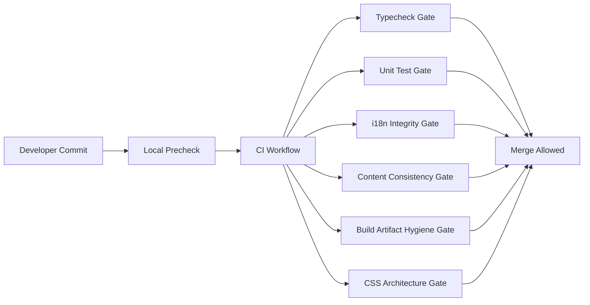

# R4 工程治理与质量门禁实施文档（PR 级，长期主义版）

**日期**: 2026-03-03  
**阶段**: Phase 3 / R4  
**目标摘要**: 在 R1-R3 完成架构拆分与多语言功能后，建立可持续的工程治理体系，重点收敛测试门禁、CSS 模块化、翻译完整性校验、构建产物隔离与 CI 质量基线。  
**关联文档**:
- `docs/plans/phase3/2026-03-03-r1-scene-ui-architecture-refactor.md`
- `docs/plans/phase3/2026-03-03-r2-i18n-infrastructure.md`
- `docs/plans/phase3/2026-03-03-r3-zh-cn-localization-and-language-gate.md`

---

## 1. 直接结论

R4 的本质是把“可运行工程”升级为“可长期稳定演进工程”。

1. 把当前分散的质量检查升级为强制门禁链：`typecheck + unit test + i18n check + content consistency + build hygiene`。
2. 把 `style.css` 单文件拆分为可维护模块，建立 token 与分层规则，阻断 CSS 债务继续堆积。
3. 建立翻译完整性与占位符一致性门禁，避免 R3 后 i18n 质量回退。
4. 清理 `src` 目录编译产物混入问题，建立“源代码与构建产物严格隔离”制度。

R4 完成后的硬结果：

- PR 进入主干前必须通过统一 CI 门禁。
- 样式与文案质量可自动化校验。
- 仓库目录边界清晰，搜索与审查噪声显著降低。

---

## 2. 治理目标与非目标

### 2.1 治理目标

1. 建立可审计、可自动执行、可失败阻断的质量门禁。
2. 建立前端样式架构规范，降低维护复杂度。
3. 建立多语言内容的持续一致性校验机制。
4. 建立构建产物与源码隔离制度。

### 2.2 非目标

1. 不新增玩法内容。
2. 不重做渲染框架或开发栈。
3. 不在 R4 内引入复杂平台级 DevOps 系统（保持轻量可落地）。

---

## 3. 当前治理缺口（R4 输入）

1. 仓库当前未见统一 CI 工作流（`.github/workflows` 缺失）。
2. `packages/content` 仍无测试基线，翻译与内容一致性缺少持续校验。
3. `apps/game-client/src/style.css` 为单文件高体量（1,817 行）。
4. `packages/core/src` / `packages/content/src` / `apps/game-client/src` 仍混入 `.js/.d.ts/.map` 构建产物。
5. lint 基线主要依赖 `tsc --noEmit`，缺少样式与 i18n 专项规则。

---

## 4. R4 治理总架构



---

## 5. 工程规范（R4 落地后生效）

### 5.1 代码与目录规范

1. `src/**` 仅允许源代码，不允许编译产物。
2. 构建输出统一在 `dist/**` 或工具指定目录。
3. 新增玩家可见文本必须走 i18n key。

### 5.2 CSS 规范

1. 采用分层文件结构（base/layout/components/overlays/themes/responsive）。
2. 尺寸、间距、层级、动效统一 token 化。
3. 禁止新增高特异性选择器（ID 选择器严格受限）。

### 5.3 测试与门禁规范

1. `core`、`game-client`、`content` 均需至少具备基础测试集。
2. i18n 检查失败必须阻断合并。
3. 构建卫生检查失败必须阻断合并。

---

## 6. PR 级实施计划（R4）

### PR-R4-01：建立统一 CI 工作流

**目标**: 将质量门禁从“约定”变为“系统强制”。

**新增文件**:
- `.github/workflows/ci.yml`

**关键步骤**:
1. Node + pnpm 环境初始化与缓存。
2. 并行执行核心门禁任务。
3. 失败即阻断合并。

**门禁任务（初版）**:

```bash
pnpm -r typecheck
pnpm --filter @blodex/core test
pnpm --filter @blodex/game-client test
pnpm --filter @blodex/game-client i18n:check
pnpm --filter @blodex/content typecheck
```

**验收**:
- PR 页面可见明确的必过检查项。

---

### PR-R4-02：构建产物隔离与仓库卫生清理

**目标**: 清理 `src` 混入产物，并防止回流。

**修改文件**:
- `.gitignore`
- 各 package `tsconfig.json`
- 必要时 `package.json` 脚本

**关键步骤**:
1. 清理 `src` 下 `.js/.d.ts/.map` 产物。
2. 校准 `outDir` 与构建脚本，确保产物仅进入 `dist`。
3. 增加检查脚本扫描 `src` 非法产物。

**新增脚本建议**:
- `scripts/check-source-hygiene.sh`

**验收**:
- `src` 目录中非法产物为 0。
- CI 中 hygiene check 可稳定执行。

---

### PR-R4-03：CSS 架构拆分（文件级）

**目标**: 把单文件样式拆分为模块化结构。

**新增目录**:
- `apps/game-client/src/styles/`

**建议文件**:
- `base.css`
- `tokens.css`
- `layout.css`
- `hud.css`
- `meta-menu.css`
- `overlays.css`
- `components.css`
- `responsive.css`

**修改文件**:
- `apps/game-client/src/main.ts`（按顺序引入样式模块）
- `apps/game-client/src/style.css`（迁移或删除）

**关键步骤**:
1. 先无行为变化迁移，后做选择器收敛。
2. 保留视觉一致性，防止一次性重构导致 UI 回归。

**验收**:
- 视觉回归最小化。
- 样式变更定位成本下降。

---

### PR-R4-04：CSS token 与特异性治理

**目标**: 把魔法值和高特异性债务纳入可控范围。

**修改文件**:
- `apps/game-client/src/styles/tokens.css`
- `apps/game-client/src/styles/*.css`

**关键步骤**:
1. 抽取 spacing/font/radius/z-index/motion tokens。
2. 将高频 `px` 字面量替换为 token。
3. 收敛 ID 选择器，优先 class 语义化选择器。

**验收**:
- 新增样式禁止引入未登记 magic number（白名单除外）。
- 高特异性规则数量下降。

---

### PR-R4-05：样式门禁与规则检查

**目标**: 让 CSS 规范可自动化执行。

**新增文件**:
- `apps/game-client/stylelint.config.cjs`（或等价方案）
- `apps/game-client/scripts/check-css-architecture.ts`

**修改文件**:
- `apps/game-client/package.json`

**新增命令建议**:

```bash
pnpm --filter @blodex/game-client css:lint
pnpm --filter @blodex/game-client css:check
```

**检查维度**:
1. 禁止新增 ID 选择器（可配置例外）。
2. 禁止未 token 化的尺寸字面量（白名单机制）。
3. 检查文件分层引用顺序。

**验收**:
- CSS 检查失败可阻断 CI。

---

### PR-R4-06：内容翻译完整性门禁（content 侧）

**目标**: 防止内容词条新增后翻译漏配。

**新增文件**:
- `packages/content/src/__tests__/locale-consistency.test.ts`
- `apps/game-client/src/i18n/content/__tests__/content-coverage.test.ts`
- `scripts/check-content-locale-consistency.ts`

**关键步骤**:
1. 基于 id 生成内容 key 列表。
2. 校验 en-US/zh-CN 覆盖与占位符一致。
3. 对白名单缺失项做显式登记。

**验收**:
- 内容翻译缺失可被 CI 自动阻断。

---

### PR-R4-07：i18n 诊断与可观测性收敛

**目标**: 将 missing key/fallback 命中率纳入可观测数据。

**新增文件**:
- `apps/game-client/src/i18n/I18nDiagnostics.ts`

**修改文件**:
- `apps/game-client/src/i18n/I18nService.ts`
- `apps/game-client/src/scenes/dungeon/diagnostics/DiagnosticsService.ts`（若 R1 已落地）

**关键步骤**:
1. 记录 missing key 数、fallback 次数、top N 问题 key。
2. dev 模式可在诊断面板展示摘要。

**验收**:
- 研发阶段可快速定位翻译问题来源。

---

### PR-R4-08：内容模块测试基线补齐

**目标**: 给 `packages/content` 建立最小单测护城河。

**新增文件**:
- `packages/content/src/__tests__/integrity.test.ts`
- `packages/content/src/__tests__/ids-uniqueness.test.ts`

**关键步骤**:
1. 校验 id 唯一性。
2. 校验跨表引用一致性（item/loot/event/blueprint 等）。
3. 与翻译一致性校验联动。

**验收**:
- content 改动不再“零门禁”。

---

### PR-R4-09：统一本地 precheck 与开发脚本

**目标**: 缩短问题发现路径，降低 CI 失败成本。

**新增文件**:
- `scripts/precheck.sh`

**修改文件**:
- 根 `package.json`

**建议命令**:

```bash
pnpm check
pnpm test
pnpm --filter @blodex/game-client i18n:check
pnpm --filter @blodex/game-client css:check
./scripts/check-source-hygiene.sh
```

**验收**:
- 开发者可一键执行与 CI 等价的核心检查。

---

### PR-R4-10：治理策略收敛与文档化

**目标**: 把治理结果沉淀为团队长期规则。

**修改文件**:
- `README.md`
- `docs/plans/phase3/*.md`
- 新增 `docs/engineering/quality-gates.md`

**关键步骤**:
1. 明确“必过门禁列表”。
2. 明确“新增文本/样式/内容”的提交流程与检查要求。
3. 明确“例外申请机制”（白名单审批）。

**验收**:
- 文档与 CI 行为一致，无隐性规则。

---

## 7. R4 门禁矩阵（最终版）

| 门禁类别 | 命令 | 阻断级别 |
|---|---|---|
| TypeCheck | `pnpm -r typecheck` | 必阻断 |
| Core Tests | `pnpm --filter @blodex/core test` | 必阻断 |
| Client Tests | `pnpm --filter @blodex/game-client test` | 必阻断 |
| Content Tests | `pnpm --filter @blodex/content test`（R4 后提供） | 必阻断 |
| i18n Check | `pnpm --filter @blodex/game-client i18n:check` | 必阻断 |
| CSS Check | `pnpm --filter @blodex/game-client css:check` | 必阻断 |
| Source Hygiene | `./scripts/check-source-hygiene.sh` | 必阻断 |

---

## 8. 风险与缓解

### 8.1 主要风险

1. 门禁过多导致初期开发效率下降。
2. CSS 模块化迁移期间可能出现视觉回归。
3. content 测试新增后可能暴露历史债务导致短期不稳定。

### 8.2 缓解策略

1. 分阶段开启阻断：先 warning，后 mandatory（每个 PR 明确切换点）。
2. CSS 迁移采用“逐模块搬迁 + 回归截图”策略。
3. 对历史债务建立临时白名单并附到期清理计划。

---

## 9. R4 完成定义（Definition of Done）

1. CI 质量门禁覆盖 type/test/i18n/css/hygiene 全链路并强制执行。
2. `style.css` 单文件架构完成模块化拆分并通过规则检查。
3. 翻译完整性与内容一致性具备自动化校验，新增缺失可阻断。
4. `src` 与构建产物严格隔离，仓库卫生规则可持续执行。
5. 团队文档与脚本收敛完成，工程治理进入长期稳定态。

---

## 10. R4 的长期价值

R4 完成后，项目将具备以下长期演进能力：

1. 新功能不会轻易突破既有质量边界。
2. 多语言不会因为内容增长而持续劣化。
3. 样式和构建体系具备规模化维护能力。
4. 新成员可通过明确门禁快速对齐质量标准。

R4 的核心价值不是“再做一次重构”，而是**把质量保证机制产品化**，让未来每次迭代都站在更高的工程基线之上。
