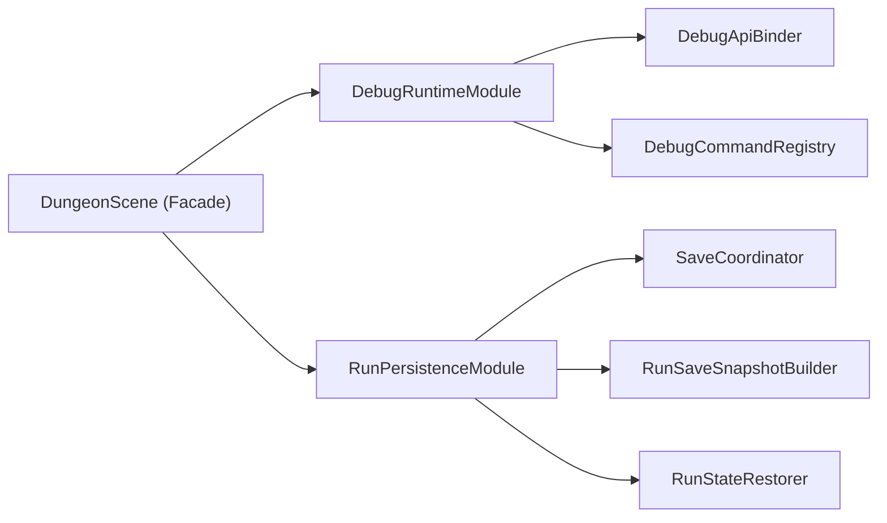

# Phase 4.1 Scene 深拆 M1（Debug + Save）实施文档（PR 级）

**日期**: 2026-03-03  
**阶段**: Phase 4 / 4.1  
**目标摘要**: 在不改变玩法语义、随机行为与存档协议的前提下，把 `DungeonScene` 中 Debug 与 Save 相关职责迁出为独立 Runtime Module，建立后续 4.2/4.3 深拆节奏。

**关联文档**:
1. `docs/plans/phase4/2026-03-03-phase4-integrated-execution-plan.md`
2. `docs/plans/phase4/2026-03-03-phase4-0-baseline-freeze-and-governance.md`
3. `docs/plans/phase3/2026-03-03-r1-scene-ui-architecture-refactor.md`

---

## 1. 直接结论

4.1 采用“先稳定边界、再迁移实现、最后删除壳层”的三步策略：

1. 先定义 `DebugRuntimeModule` 与 `RunPersistenceModule` 的 ports（不改行为）。
2. 再把 `DungeonScene` 中 23 个 debug 方法与 6 个 save 相关方法按簇迁移到模块。
3. 最后把 Scene 收敛为薄编排层，保留生命周期与模块装配。

4.1 完成后的硬结果：

1. `DungeonScene.ts` 行数由当前 6301 降到 `<= 5200`。
2. Debug/Save 核心实现不再驻留在 Scene。
3. 读档、自动保存、多 tab lease、debug API 行为保持等价。
4. 为 4.2（Event/Boss）预留稳定扩展边界。

---

## 2. 设计约束（4.1 必须遵守）

1. **行为等价约束**
   - 不改变玩法规则、随机流游标推进顺序、技能/战斗结算语义。
2. **存档协议稳定约束**
   - 不改 `RunSaveDataV2` schema；仅重构构建/恢复实现位置。
3. **生命周期约束**
   - `DungeonScene` 仍是唯一 `create/update/cleanup` 入口。
4. **可回滚约束**
   - 每个 PR 可单独回滚，不依赖后续 PR 才能编译。
5. **预算收敛约束**
   - 每个 PR 至少减少一类 Scene 职责；不允许“迁出后又新增同类方法”。

---

## 3. 现状与问题证据（4.1 输入）

### 3.1 体量与预算

1. `DungeonScene.ts`: 6301 行，161 methods。
2. 架构预算白名单当前阈值：`DungeonScene 7000/220`。

### 3.2 Debug 职责分布（Scene 内）

当前 Debug 相关方法 23 个，主要分布在：

1. API 装配：`installDebugApi/removeDebugApi`
2. 输入路由：`showDebugHelp/handleDebugHotkeys`
3. 命令实现：`debugAddObols/debugSpawnEvent/debugForceClearFloor/...`
4. 诊断输出：`debugDumpDiagnostics/debugStressRuns`

### 3.3 Save 职责分布（Scene 内）

当前 Save 相关方法 6 个，核心入口：

1. `buildRunSaveSnapshot(nowMs)`
2. `restoreRunFromSave(save)`
3. `collectRngCursor/currentEventNodeSnapshot`
4. `flushRunSave/scheduleRunSave`（已委托 `SaveCoordinator`）

结论：`SaveCoordinator` 已存在，但只覆盖调度，不覆盖“快照构建与恢复编排”。

---

## 4. 范围与非目标

## 4.1 范围

1. 抽离 Debug Runtime Module：
   - debug API 构建与绑定
   - 热键命令分发
   - debug 命令实现按职责聚合
2. 抽离 Run Persistence Module：
   - snapshot builder
   - restore orchestrator
   - save flush/schedule 统一入口
3. 更新 Scene 装配逻辑与调用链。
4. 增补对应单测与回归检查。

## 4.2 非目标

1. 不迁移 Event/Boss/Hazard 逻辑（属于 4.2/4.3）。
2. 不清理 `UI_POLISH_FLAGS`（属于 4.4）。
3. 不改 HUD 渲染结构（属于 4.4）。
4. 不引入新 debug 功能或新存档字段。

---

## 5. 目标结构（4.1 结束态）



### 5.1 组件职责定义

1. `DebugRuntimeModule`
   - 负责 debug API 安装/卸载、热键路由、命令分发。
2. `DebugCommandRegistry`
   - 维护命令映射与参数校验，不持有 Scene 全量状态。
3. `RunPersistenceModule`
   - 统一 `flush/schedule/buildSnapshot/restore` 流程。
4. `RunSaveSnapshotBuilder`
   - 纯构建：从运行时状态产出 `RunSaveDataV2`。
5. `RunStateRestorer`
   - 纯恢复：从 `RunSaveDataV2` 回放到运行时状态。

### 5.2 推荐接口草案

```ts
export interface DebugRuntimeModule {
  install(): void;
  uninstall(): void;
  handleHotkey(event: KeyboardEvent): boolean;
}

export interface RunPersistenceModule {
  flush(): void;
  schedule(): void;
  buildSnapshot(nowMs: number): RunSaveDataV2 | null;
  restore(save: RunSaveDataV2): boolean;
}
```

---

## 6. PR 级实施计划（4.1）

> 规则：每个 PR 必须“编译通过 + 自动化通过 + 手动可验证”。

### PR-4.1-01：Debug 边界建立（不改语义）

**目标**: 建立 debug 模块边界，Scene 仅保留调用壳。

**新增文件（建议）**:
1. `apps/game-client/src/scenes/dungeon/debug/DebugRuntimeModule.ts`
2. `apps/game-client/src/scenes/dungeon/debug/DebugCommandRegistry.ts`
3. `apps/game-client/src/scenes/dungeon/debug/types.ts`

**修改文件**:
1. `apps/game-client/src/scenes/DungeonScene.ts`
2. `apps/game-client/src/scenes/dungeon/debug/DebugApiBinder.ts`（如需轻微扩展）

**迁移范围**:
1. `installDebugApi/removeDebugApi`
2. `showDebugHelp/handleDebugHotkeys`
3. 命令注册表（先搬路由，再搬实现）

**验收标准**:
1. `window.__blodexDebug` 功能与参数行为一致。
2. Alt 热键触发结果与迁移前一致。
3. Scene 不再直接构造 debug API payload。

---

### PR-4.1-02：Debug 命令实现迁移与收敛

**目标**: 把具体命令实现从 Scene 剥离到 Debug 模块。

**新增文件（建议）**:
1. `apps/game-client/src/scenes/dungeon/debug/commands/RunControlCommands.ts`
2. `apps/game-client/src/scenes/dungeon/debug/commands/EconomyCommands.ts`
3. `apps/game-client/src/scenes/dungeon/debug/commands/EncounterCommands.ts`

**修改文件**:
1. `apps/game-client/src/scenes/DungeonScene.ts`
2. `apps/game-client/src/scenes/dungeon/debug/DebugRuntimeModule.ts`

**迁移方法簇**:
1. `debugAddObols/debugGrantConsumables`
2. `debugSpawnEvent/debugOpenMerchant/debugForceChallengeRoom/...`
3. `debugForceClearFloor/debugJumpToFloor/debugForceDeath/debugSetHealth`
4. `debugDumpDiagnostics/debugStressRuns`

**验收标准**:
1. 命令返回值/日志内容/副作用顺序保持一致。
2. Scene 中 `debug*` 方法数量显著下降（目标 <= 5 个壳方法）。
3. 新增 debug 模块单测覆盖命令分发与参数边界。

---

### PR-4.1-03：Save 快照与恢复模块化（M1 核心）

**目标**: 完成 `RunPersistenceModule` 落地，Scene 不再持有复杂 save 细节。

**新增文件（建议）**:
1. `apps/game-client/src/scenes/dungeon/save/RunPersistenceModule.ts`
2. `apps/game-client/src/scenes/dungeon/save/RunSaveSnapshotBuilder.ts`
3. `apps/game-client/src/scenes/dungeon/save/RunStateRestorer.ts`
4. `apps/game-client/src/scenes/dungeon/save/types.ts`

**修改文件**:
1. `apps/game-client/src/scenes/DungeonScene.ts`
2. `apps/game-client/src/scenes/dungeon/save/SaveCoordinator.ts`
3. `apps/game-client/src/scenes/dungeon/save/__tests__/saveCoordinator.test.ts`

**迁移方法簇**:
1. `buildRunSaveSnapshot`
2. `restoreRunFromSave`
3. `collectRngCursor/currentEventNodeSnapshot`
4. `flushRunSave/scheduleRunSave`（最终汇聚到 persistence module）

**验收标准**:
1. 读档成功率与恢复后状态一致性不下降。
2. auto-save / lease heartbeat / flush 时机不变。
3. Save 模块新增单测覆盖“空快照、无效快照、恢复失败回退”。

---

## 7. 验证与回归清单

### 7.1 自动化

```bash
pnpm --filter @blodex/game-client typecheck
pnpm --filter @blodex/game-client test
pnpm --filter @blodex/core test
pnpm check:architecture-budget
```

涉及跨包联动时补跑：

```bash
pnpm ci:check
```

### 7.2 手动冒烟

1. Debug API：
   - `window.__blodexDebug.help()`
   - `window.__blodexDebug.addObols(100)`
   - `window.__blodexDebug.spawnEvent()`
2. Hotkeys：`Alt+H/L/J/O/P/E/M/C/K/B/N/F/X` 至少抽样验证。
3. Save：
   - 开局 30 秒后刷新页面，验证恢复。
   - Event 面板/商人面板打开状态下保存恢复。
   - Endless 中层保存恢复。
4. 多 tab：至少验证 lease 心跳与接管无明显异常。

### 7.3 指标对比（4.1 出口）

1. `DungeonScene.ts` 行数：`6301 -> <= 5200`。
2. Scene 内 debug/save 方法数明显下降（记录迁移前后对比）。
3. `check:architecture-budget` 通过且白名单阈值不放宽。

---

## 8. 风险与止损策略

| 风险 | 等级 | 触发信号 | 止损策略 |
|---|:---:|---|---|
| Debug 命令行为偏移 | 中 | 命令结果与旧版不一致 | 先保留薄代理回调，分批替换命令实现 |
| Save 恢复回归 | 高 | 恢复后状态缺失/错位 | 对 `restore` 做阶段性双跑比对（旧实现对照） |
| 生命周期泄漏 | 中 | cleanup 后事件监听未释放 | 在模块 `uninstall/dispose` 中统一回收 |
| PR 粒度过大 | 中 | 审查困难、回滚困难 | 坚持每 PR 单簇迁移原则 |

回滚原则：

1. 任一 PR 出现恢复一致性问题，先回滚该 PR，不跨 PR 修补。
2. Save 相关 PR 回滚后，必须重新运行存档恢复冒烟。

---

## 9. 4.1 出口门禁（Done 定义）

4.1 只有在以下条件全部满足时才算完成：

1. DebugRuntimeModule 与 RunPersistenceModule 已落地并接管主逻辑。
2. `DungeonScene.ts` <= 5200 行。
3. Debug API、hotkeys、save/restore 行为保持等价。
4. `pnpm check:architecture-budget` 与阶段自动化检查通过。
5. 4.2 输入文档已更新：
   - 明确 Event/Boss 可迁移边界
   - 记录 4.1 迁移后的新基线数据

---

## 10. 与 4.2 的交接清单

进入 4.2 前必须确认：

1. Debug 与 Save 迁移后，Scene 只保留编排入口。
2. 读档、重置、结算、切楼层流程已稳定。
3. 新增模块接口文档已补齐（types + 用法说明）。
4. 4.2 的 PR-04/05/06 不再改动 Debug/Save 迁移代码。

