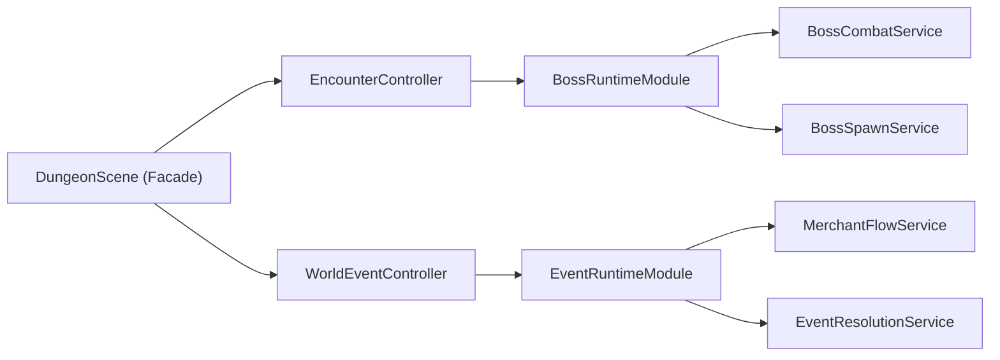

# Phase 4.2 Scene 深拆 M2（Event + Boss）实施文档（PR 级）

**日期**: 2026-03-03  
**阶段**: Phase 4 / 4.2  
**目标摘要**: 将 `DungeonScene` 中随机事件/商人/Boss 战斗等高复杂流程迁移为独立 Runtime Module，在保持行为等价的前提下显著降低场景耦合度，为 4.3（Hazard/Progression）打通主循环收敛路径。

**关联文档**:
1. `docs/plans/phase4/2026-03-03-phase4-integrated-execution-plan.md`
2. `docs/plans/phase4/2026-03-03-phase4-1-scene-decomposition-m1-debug-save.md`
3. `docs/plans/phase4/2026-03-03-phase4-0-baseline-freeze-and-governance.md`

---

## 1. 直接结论

4.2 的核心是“把高复杂业务流从 Scene 中剥离”，不是改玩法：

1. Event 侧迁移：`event node -> panel -> choice -> reward/penalty -> merchant -> save snapshot restore` 全链路。
2. Boss 侧迁移：`player hit boss -> boss attack select/resolve -> summon -> phase event -> victory choice` 全链路。
3. Scene 仅保留 orchestrator 调用与少量生命周期钩子，不再承载具体业务状态机。

4.2 完成后的硬结果：

1. `DungeonScene.ts` 目标降到 `<= 4200`。
2. Event/Boss 主流程代码不再驻留 Scene。
3. 事件、商人、Boss 行为与日志触发时机保持等价。
4. 为 4.3 的主循环收敛（Hazard/Progression）释放复杂度空间。

---

## 2. 设计约束（4.2 必须遵守）

1. **玩法语义不变**
   - 不修改事件概率、奖励风险、Boss 技能数值与冷却语义。
2. **事件总线语义不变**
   - `event:*`、`merchant:*`、`boss:*` 的触发时机与 payload 结构保持兼容。
3. **存档恢复一致性**
   - 事件节点与商店状态恢复路径保持兼容，不改 `RunSaveDataV2` schema。
4. **模块边界约束**
   - Event/Boss 模块通过 ports 协作，禁止互相直接访问 Scene 私有状态。
5. **阶段边界约束**
   - 不在 4.2 中引入 Boss telegraph 新玩法（属于 4.6 / G4）。

---

## 3. 现状与问题证据（4.2 输入）

### 3.1 Event/Boss 方法簇（Scene 内）

当前 Event + Boss 相关私有方法共 17 个（核心簇）：

1. Event 簇：
   - `setupFloorEvent/createEventNode/updateEventInteraction/openEventPanel/dismissCurrentEvent`
   - `applyEventCost/applyEventReward/applyEventPenalty/resolveEventChoice`
   - `openMerchantPanel/tryBuyMerchantOffer/consumeCurrentEvent`
2. Boss 簇：
   - `updateBossCombat/spawnSummonedMonsters/spawnBoss/syncBossSprite/openBossVictoryChoice`

### 3.2 关键耦合点

1. Event 与 UI 耦合：`uiManager.showEventDialog/showMerchantDialog` 直接由 Scene 驱动。
2. Event 与 Save 耦合：restore 中直接恢复 `eventNode` + `merchantOffers`。
3. Boss 与 Combat 耦合：Scene 同时负责玩家对 Boss、Boss 对玩家、召唤怪入场。
4. Boss 与日志/反馈耦合：`boss:phaseChange`、`boss:summon` 事件发射嵌在 Scene 主逻辑。

### 3.3 当前可复用基础

1. `EncounterController` 已支持 `updateBossCombat` 委托入口。
2. `WorldEventController` 已支持 `updateEventInteraction` 委托入口。
3. `@blodex/core` 已有可复用纯函数：
   - Boss: `selectBossAttack/resolveBossAttack/markBossAttackUsed/applyDamageToBoss`
   - Event: `pickRandomEvent/canPayEventCost/rollEventRisk/createMerchantOffers`

---

## 4. 范围与非目标

## 4.1 范围

1. EventRuntimeModule 落地：
   - 楼层事件生成、交互、选择结算
   - 商人面板与购买流程
   - event snapshot restore 协议接入
2. BossRuntimeModule 落地：
   - Boss 生成、同步、攻击/召唤/phase 流程
   - 胜利选择入口迁移
3. Scene 调用收敛：
   - 由 controller 调用模块 ports，Scene 仅保留装配与壳层委托
4. 模块测试与回归补齐。

## 4.2 非目标

1. 不调整事件内容设计（G7 在 4.6 处理）。
2. 不实现 Boss 预警机制（G4 在 4.6 处理）。
3. 不改 Endless 规则（G6 在 4.6 处理）。
4. 不做 HUD 架构拆分（4.4 处理）。

---

## 5. 目标结构（4.2 结束态）



### 5.1 组件职责定义

1. `EventRuntimeModule`
   - 管理事件节点状态机、choice 结算、商店面板流程。
2. `EventResolutionService`
   - 负责 cost/reward/penalty 纯规则执行与日志事件回传。
3. `MerchantFlowService`
   - 负责报价、购买、库存与 sold-out 处理。
4. `BossRuntimeModule`
   - 负责 Boss 战斗循环、phase 变更、召唤怪流程与胜利入口。
5. `BossCombatService`
   - 封装 Boss 攻防结算与事件发射点。

### 5.2 推荐接口草案

```ts
export interface EventRuntimeModule {
  setupFloorEvent(nowMs: number): void;
  updateInteraction(nowMs: number): void;
  resolveChoice(choiceId: string, nowMs: number): void;
  restoreFromSnapshot(snapshot: RuntimeEventNodeState | null): void;
  snapshot(): RuntimeEventNodeState | null;
}

export interface BossRuntimeModule {
  spawn(): void;
  syncSprite(): void;
  updateCombat(nowMs: number): void;
  openVictoryChoice(nowMs: number): void;
}
```

---

## 6. PR 级实施计划（4.2）

> 规则：沿用主计划编号，使用 `PR-04/PR-05/PR-06`。

### PR-4.2-04：Event Runtime 边界建立与主流程迁移

**目标**: 完成事件主流程迁移（不含商人购买细节）。

**新增文件（建议）**:
1. `apps/game-client/src/scenes/dungeon/world/EventRuntimeModule.ts`
2. `apps/game-client/src/scenes/dungeon/world/EventResolutionService.ts`
3. `apps/game-client/src/scenes/dungeon/world/types.ts`

**修改文件**:
1. `apps/game-client/src/scenes/DungeonScene.ts`
2. `apps/game-client/src/scenes/dungeon/world/WorldEventController.ts`

**迁移方法簇**:
1. `setupFloorEvent/createEventNode/updateEventInteraction/openEventPanel/dismissCurrentEvent`
2. `applyEventCost/applyEventReward/applyEventPenalty/resolveEventChoice`
3. `consumeCurrentEvent`

**验收标准**:
1. 事件出现率、可选项可用性与原逻辑一致。
2. `event:spawn/event:choice` 事件与日志触发时机一致。
3. Scene 不再包含 reward/penalty 大段分支实现。

---

### PR-4.2-05：Merchant 与 Event Restore 迁移收口

**目标**: 完成商店流程与事件存档恢复链路迁移。

**新增文件（建议）**:
1. `apps/game-client/src/scenes/dungeon/world/MerchantFlowService.ts`
2. `apps/game-client/src/scenes/dungeon/world/EventSnapshotAdapter.ts`

**修改文件**:
1. `apps/game-client/src/scenes/DungeonScene.ts`
2. `apps/game-client/src/scenes/dungeon/save/RunStateRestorer.ts`（若 4.1 已落地）
3. `apps/game-client/src/scenes/dungeon/save/RunSaveSnapshotBuilder.ts`（若 4.1 已落地）

**迁移方法簇**:
1. `openMerchantPanel/tryBuyMerchantOffer`
2. 恢复路径中的 `eventNode + merchantOffers` 重建逻辑

**验收标准**:
1. 商店报价、购买、售罄行为一致。
2. 事件中断保存后恢复可继续交互或正确关闭。
3. `merchant:offer/merchant:purchase` 事件兼容。

---

### PR-4.2-06：Boss Runtime 迁移（战斗 + 生成 + 胜利入口）

**目标**: 完成 Boss 相关运行时迁移，不引入新玩法。

**新增文件（建议）**:
1. `apps/game-client/src/scenes/dungeon/encounter/BossRuntimeModule.ts`
2. `apps/game-client/src/scenes/dungeon/encounter/BossCombatService.ts`
3. `apps/game-client/src/scenes/dungeon/encounter/BossSpawnService.ts`

**修改文件**:
1. `apps/game-client/src/scenes/DungeonScene.ts`
2. `apps/game-client/src/scenes/dungeon/encounter/EncounterController.ts`

**迁移方法簇**:
1. `updateBossCombat/spawnSummonedMonsters`
2. `spawnBoss/syncBossSprite`
3. `openBossVictoryChoice`

**验收标准**:
1. Boss phase 变化、召唤数量与频率保持一致。
2. `boss:phaseChange/boss:summon` 事件与日志一致。
3. Boss 击杀后胜利选择流程与原行为一致。

---

## 7. 验证与回归清单

### 7.1 自动化

```bash
pnpm --filter @blodex/game-client typecheck
pnpm --filter @blodex/game-client test
pnpm --filter @blodex/core test
pnpm check:architecture-budget
```

跨包联动 PR 或合并前补跑：

```bash
pnpm ci:check
```

### 7.2 建议新增/补强测试

1. `EventRuntimeModule`：
   - choice 不可支付、可支付、风险触发三路径。
   - mapping/xp/item/consumable/obol 五类奖励路径。
2. `MerchantFlowService`：
   - 库存为空、余额不足、购买成功、售罄收口。
3. `BossRuntimeModule`：
   - phase change 触发阈值。
   - summon 分支与 `spawnedIds` 事件。
   - 胜利选择分支（claim vs abyss）。

可复用现有 core 测试基础：

1. `packages/core/src/__tests__/boss.test.ts`
2. `packages/core/src/__tests__/randomEvent.test.ts`
3. `packages/core/src/__tests__/integration-phase2-economy-event.test.ts`

### 7.3 手动冒烟

1. 普通楼层至少触发 2 次随机事件，含 1 次风险惩罚分支。
2. 商人触发并完成至少 1 笔购买。
3. Boss 楼层完整战斗，观察 phase 切换与召唤。
4. Event/Boss 关键状态下保存并恢复。

### 7.4 指标对比（4.2 出口）

1. `DungeonScene.ts` 行数：目标 `<= 4200`。
2. Scene 内 Event/Boss 私有方法数量显著下降（迁移前 17 个）。
3. `check:architecture-budget` 通过且白名单阈值不放宽。

---

## 8. 风险与止损策略

| 风险 | 等级 | 触发信号 | 止损策略 |
|---|:---:|---|---|
| 事件流程语义漂移 | 高 | choice 后奖励/惩罚异常 | 保留旧实现对照回放，逐分支迁移并对拍 |
| 商店恢复不一致 | 高 | 恢复后 offer 缺失或重复 | snapshot/restore 统一通过 adapter，禁止双写 |
| Boss 战斗节奏变化 | 高 | DPS/phase 时机偏移 | 锁定 `nextPlayerAttackAt/nextBossAttackAt` 更新语义 |
| 模块边界反向侵入 | 中 | 新模块直接操作 Scene 私有字段 | 通过 ports 注入，只暴露最小接口 |
| PR 过大难回滚 | 中 | 一次迁移 Event+Boss 全量 | 严格拆 PR-04/05/06，逐段合并 |

回滚原则：

1. Event 与 Boss PR 独立回滚，不交叉修补。
2. 涉及 restore 回归时优先回滚 restore 变更，再定位模块逻辑。

---

## 9. 4.2 出口门禁（Done 定义）

4.2 完成必须满足：

1. EventRuntimeModule 与 BossRuntimeModule 已接管主逻辑。
2. `DungeonScene.ts` <= 4200 行。
3. 事件、商店、Boss 行为与日志触发语义等价。
4. Event/Boss 在保存恢复后的状态一致性通过验证。
5. 自动化检查和架构预算检查通过。

---

## 10. 与 4.3 的交接清单

进入 4.3 前必须确认：

1. Event/Boss 模块接口已稳定，4.3 不再重构其内部实现。
2. `EncounterController` 与 `WorldEventController` 的调用边界清晰。
3. 主循环中剩余高复杂簇主要集中于 Hazard/Progression，便于 4.3 接管。
4. 已记录 4.2 迁移后的行数与方法数快照，作为 4.3 起点。

