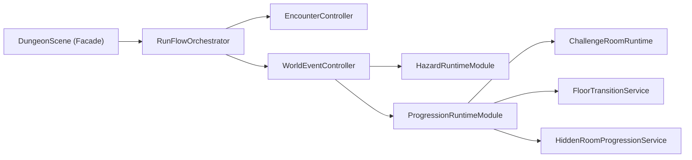

# Phase 4.3 Scene 深拆 M3（Hazard + Progression）实施文档（PR 级）

**日期**: 2026-03-03  
**阶段**: Phase 4 / 4.3  
**目标摘要**: 将 `DungeonScene` 中 Hazard 与 Progression（楼层推进/挑战房/分支楼梯/隐藏房）主流程迁移为独立 Runtime Module，完成主循环收敛并把 Scene 压缩为稳定编排壳层。

**关联文档**:
1. `docs/plans/phase4/2026-03-03-phase4-integrated-execution-plan.md`
2. `docs/plans/phase4/2026-03-03-phase4-2-scene-decomposition-m2-event-boss.md`
3. `docs/plans/phase4/2026-03-03-phase4-1-scene-decomposition-m1-debug-save.md`

---

## 1. 直接结论

4.3 的核心是“完成 Scene 主循环去中心化”，不是玩法改造：

1. Hazard 迁移：`hazard init -> contact -> tick/trigger -> damage -> kill side effects -> visual sync` 全链路迁移到 `HazardRuntimeModule`。
2. Progression 迁移：`challenge room -> floor clear -> staircase/branch -> floor transition/endless bonus` 全链路迁移到 `ProgressionRuntimeModule`。
3. 帧循环收敛：将 `runActiveFrame` 固化为可测试的 phase pipeline，Scene 不再承载具体领域分支。

4.3 完成后的硬结果：

1. `DungeonScene.ts` 目标降到 `<= 3000`。
2. Hazard 与 Progression 核心实现不再驻留 Scene。
3. 楼层推进、挑战房、hazard 伤害与事件触发时机保持等价。
4. 为 4.4（工程收敛：flag 清理 + HUD 拆分 + 系统测试）提供稳定基线。

---

## 2. 设计约束（4.3 必须遵守）

1. **玩法语义不变**
   - 不改 hazard 伤害/触发频率，不改 challenge 波次逻辑，不改楼层推进与 endless 奖励规则。
2. **存档兼容不变**
   - `RunSaveDataV2` 字段与语义保持兼容，尤其是 `hazards/staircase/run/eventNode` 相关恢复路径。
3. **帧顺序稳定**
   - 迁移后必须保持“输入->模拟->结算->反馈->UI”顺序，不允许无测试地调整 phase 顺序。
4. **边界约束**
   - 新模块通过 ports 注入依赖，禁止直接访问 `DungeonScene` 私有字段集合。
5. **阶段边界约束**
   - 不在 4.3 内做 HUD 重构与 flag 清理（属于 4.4），不引入新玩法（属于 4.5/4.6）。

---

## 3. 现状与问题证据（4.3 输入）

### 3.1 Scene 内 Hazard/Progression 方法簇

当前 `DungeonScene` 中 Hazard + Progression 相关方法簇仍高度集中，核心包括：

1. Hazard 簇：
   - `clearHazards/pickHazardPositions/initializeHazards/addHazardVisual`
   - `resolvePlayerHazardMovementMultiplier/updateHazardContactEvents`
   - `applyHazardDamageToPlayer/applyHazardDamageToMonsters/updateHazards`
2. Progression 簇：
   - `setupFloor/renderNormalFloor/renderBossFloor/renderStaircases/updateFloorProgress`
   - `initializeChallengeRoom/openChallengeRoomPanel/spawnChallengeWave/startChallengeEncounter`
   - `finishChallengeEncounter/restoreChallengeRoom/updateChallengeRoom`
   - `revealHiddenRoom/revealNearbyHiddenRoomsByMutation`

### 3.2 关键耦合点

1. Hazard 与主循环耦合：移动倍率、接触事件、伤害结算、击杀奖励都在 Scene 同一方法簇内。
2. Challenge 与战斗/掉落耦合：波次推进、怪物生成、奖励发放、失败惩罚和 Scene 状态混杂。
3. Floor progression 与运行态耦合：楼梯显隐、分支选择、`enterNextFloor/advanceEndlessFloor` 直接在 Scene 编排。
4. 存档恢复耦合：hazard/challenge/staircase 恢复路径依赖 Scene 私有字段重建。

### 3.3 当前可复用基础

1. `WorldEventController` 已有 `updatePreResolution/updatePostResolution` 两段式入口。
2. `EncounterController` 已有 `updateChallenge` 专用阶段入口。
3. `@blodex/core` 已有可复用纯逻辑：
   - Hazard: `createHazardRuntimeState/shouldRunHazardTick/shouldTriggerPeriodicHazard/nextHazardTickAt/nextHazardTriggerAt`
   - Challenge/Progression: `createChallengeRoomState/startChallengeRoom/advanceChallengeRoomWave/shouldFailChallengeRoomByTimeout`
   - Floor/Endless: `enterNextFloor/advanceEndlessFloor/endlessFloorClearBonus`

### 3.4 阶段起点刷新（执行前必做）

1. 4.3 的输入基线应取 4.2 出口实测值，不得沿用固定写死数字。
2. 执行前必须回填：
   - `DungeonScene.ts` 当前行数
   - 预算脚本输出中的 methods 统计
3. 刷新命令：

```bash
wc -l apps/game-client/src/scenes/DungeonScene.ts
pnpm check:architecture-budget
```

---

## 4. 范围与非目标

### 4.1 范围

1. `HazardRuntimeModule` 落地：
   - hazard 初始化、更新、接触与伤害流程迁移。
   - hazard 视觉同步与事件触发点收敛。
2. `ProgressionRuntimeModule` 落地：
   - challenge room 生命周期（发现/进入/波次/成功失败/恢复）迁移。
   - 楼层推进、楼梯显隐、branch 选择、endless 推进迁移。
   - 隐藏房推进相关逻辑收敛（如 proximity reveal）。
3. 帧流水线收敛：
   - `runActiveFrame` 拆为可测试 phase pipeline，Scene 保留编排壳层。
4. 模块测试与回归补齐。

### 4.2 非目标

1. 不调整 hazard 数值、challenge 奖励表、楼层数值配置。
2. 不改 Boss telegraph 与 Event 设计内容（4.6 处理）。
3. 不改 HUD 渲染架构（4.4 处理）。
4. 不做 save schema 变更（仅调整实现位置与装配方式）。

---

## 5. 目标结构（4.3 结束态）



### 5.1 组件职责定义

1. `HazardRuntimeModule`
   - 管理 hazard 初始化、更新、接触事件、伤害分发、视觉反馈。
2. `HazardDamageService`
   - 纯结算侧：玩家/怪物伤害、死亡副作用、事件 payload 组装。
3. `ProgressionRuntimeModule`
   - 管理 challenge/floor/staircase/branch/endless 推进主流程。
4. `ChallengeRoomRuntime`
   - challenge 发现、开局、波次推进、超时失败、恢复重建。
5. `FloorTransitionService`
   - 清层判定、楼梯显隐、分支选择、楼层推进与奖励发放。

### 5.2 推荐接口草案

```ts
export interface HazardRuntimeModule {
  initializeForFloor(nowMs: number): void;
  clearForFloor(): void;
  resolveMovementMultiplier(): number;
  update(nowMs: number): void;
  snapshot(): HazardRuntimeState[];
  restore(snapshot: HazardRuntimeState[], nowMs: number): void;
}

export interface ProgressionRuntimeModule {
  initializeForFloor(nowMs: number): void;
  updateChallenge(nowMs: number): void;
  updateFloorProgress(nowMs: number): void;
  updateHiddenRoomProgress(nowMs: number): void;
  snapshot(): {
    staircase: StaircaseState;
    challengeRoomState: ChallengeRoomState | null;
  };
  restore(input: {
    staircase: StaircaseState;
    challengeRoomState: ChallengeRoomState | null;
    nowMs: number;
  }): void;
}
```

---

## 6. PR 级实施计划（4.3）

> 规则：沿用主计划编号，使用 `PR-07/PR-08/PR-09`。

### PR-4.3-07：Hazard Runtime 模块化迁移

**目标**: 完成 hazard 全链路迁移，Scene 不再持有 hazard 细节实现。

**新增文件（建议）**:
1. `apps/game-client/src/scenes/dungeon/world/HazardRuntimeModule.ts`
2. `apps/game-client/src/scenes/dungeon/world/HazardDamageService.ts`
3. `apps/game-client/src/scenes/dungeon/world/HazardVisualService.ts`

**修改文件**:
1. `apps/game-client/src/scenes/DungeonScene.ts`
2. `apps/game-client/src/scenes/dungeon/world/WorldEventController.ts`

**迁移方法簇**:
1. `clearHazards/pickHazardPositions/initializeHazards/addHazardVisual`
2. `resolvePlayerHazardMovementMultiplier/updateHazardContactEvents`
3. `applyHazardDamageToPlayer/applyHazardDamageToMonsters/updateHazards`

**验收标准**:
1. `hazard:enter/exit/trigger/damage` 事件触发时机与 payload 一致。
2. 玩家在 `movement_modifier` 区域内移动速度倍率语义不变。
3. periodic trap telegraph 与触发窗口语义保持一致。
4. Scene 不再包含 hazard 伤害与循环分支实现。

---

### PR-4.3-08：Progression Runtime 模块化迁移（Challenge + Floor）

**目标**: 完成 progression 主链路迁移（challenge/floor/staircase/hidden-room）。

**新增文件（建议）**:
1. `apps/game-client/src/scenes/dungeon/world/ProgressionRuntimeModule.ts`
2. `apps/game-client/src/scenes/dungeon/world/ChallengeRoomRuntime.ts`
3. `apps/game-client/src/scenes/dungeon/world/FloorTransitionService.ts`
4. `apps/game-client/src/scenes/dungeon/world/HiddenRoomProgressionService.ts`

**修改文件**:
1. `apps/game-client/src/scenes/DungeonScene.ts`
2. `apps/game-client/src/scenes/dungeon/world/WorldEventController.ts`
3. `apps/game-client/src/scenes/dungeon/encounter/EncounterController.ts`（challenge 更新入口对齐）

**迁移方法簇**:
1. `initializeChallengeRoom/openChallengeRoomPanel/spawnChallengeWave/startChallengeEncounter`
2. `finishChallengeEncounter/restoreChallengeRoom/updateChallengeRoom/onMonsterDefeated`（challenge 相关部分）
3. `renderStaircases/updateFloorProgress`
4. `revealHiddenRoom/revealNearbyHiddenRoomsByMutation`

**验收标准**:
1. challenge 波次推进、超时失败、成功奖励与原逻辑一致。
2. `floor:clear`、`floor_transition`、`branchChoice` 触发条件和时机一致。
3. endless 推进和 `endlessFloorClearBonus` 结算时机一致。
4. 保存后恢复到 challenge/hazard/floor 临界状态时行为一致。

---

### PR-4.3-09：Frame Pipeline 收敛与 Orchestrator 清理

**目标**: 将 `runActiveFrame` 收敛为可测试 phase pipeline，固定更新顺序并减少 Scene 分支。

**新增文件（建议）**:
1. `apps/game-client/src/scenes/dungeon/orchestrator/FramePipeline.ts`
2. `apps/game-client/src/scenes/dungeon/orchestrator/__tests__/framePipeline.test.ts`
3. `apps/game-client/src/scenes/dungeon/world/__tests__/worldEventController.test.ts`

**修改文件**:
1. `apps/game-client/src/scenes/DungeonScene.ts`
2. `apps/game-client/src/scenes/dungeon/orchestrator/RunFlowOrchestrator.ts`
3. `apps/game-client/src/scenes/dungeon/encounter/__tests__/encounterController.test.ts`

**收敛内容**:
1. 固定 phase 顺序：`Input -> Simulation -> Resolution -> Feedback -> UI/Save`。
2. `WorldEventController` 与 `EncounterController` 的职责只保留模块调用编排。
3. Scene 仅保留生命周期入口、模块装配与最少事件桥接。

**验收标准**:
1. phase 顺序有单测锁定（防止后续回退）。
2. `runEnded/eventPanelOpen` 分支仍符合现有行为。
3. `DungeonScene.ts` 达成阶段体量目标并保持可读调用链。

---

## 7. 验证与回归清单

### 7.1 自动化

```bash
pnpm --filter @blodex/game-client typecheck
pnpm --filter @blodex/game-client test
pnpm --filter @blodex/core test
pnpm check:architecture-budget
```

跨包联动 PR 或合并前补跑：

```bash
pnpm ci:check
```

### 7.2 建议新增/补强测试

1. `HazardRuntimeModule`：
   - damage zone tick 触发窗口；
   - periodic trap telegraph + trigger；
   - player/monster 同时受伤与死亡副作用。
2. `ProgressionRuntimeModule`：
   - challenge 开始/波次推进/超时失败；
   - floor clear 阈值触发与 staircase visible；
   - branch 选择与 `branchChoice` 更新；
   - endless floor transition bonus。
3. Controller/Orchestrator：
   - `WorldEventController` pre/post 顺序；
   - `RunFlowOrchestrator` phase pipeline 顺序与短路路径。
4. core 侧可复用对拍：
   - `packages/core/src/__tests__/hazard.test.ts`
   - `packages/core/src/__tests__/challengeRoom.test.ts`
   - `packages/core/src/__tests__/floor.test.ts`
   - `packages/core/src/__tests__/endless.test.ts`

### 7.3 手动冒烟

1. 普通楼层触发至少 2 种 hazard，验证 enter/exit/trigger/damage 日志。
2. challenge room：至少一次成功与一次失败（含超时失败）。
3. 楼层推进：普通 1->5 层 + boss 结算 + endless 首层进入。
4. floor 过渡与 challenge/hazard 活跃状态下保存并恢复。

### 7.4 指标对比（4.3 出口）

1. `DungeonScene.ts` 行数：目标 `<= 3000`。
2. Scene 内 Hazard/Progression 私有方法数显著下降（迁移前主簇 > 20）。
3. `check:architecture-budget` 通过且白名单阈值不放宽。

---

## 8. 风险与止损策略

| 风险 | 等级 | 触发信号 | 止损策略 |
|---|:---:|---|---|
| Hazard tick 漂移 | 高 | 玩家/怪物受伤频率异常 | 锁定 `nextTickAtMs/nextTriggerAtMs` 语义并做时序对拍 |
| Challenge 恢复错位 | 高 | 恢复后波次/计时器异常 | challenge snapshot/restore 统一通过 runtime adapter |
| Floor transition 语义偏移 | 高 | 清层后无法进楼或提前进楼 | 对 `clearThreshold + staircase + transition` 建立回归测试 |
| 帧顺序回归 | 中 | 迁移后出现间歇性状态错乱 | phase pipeline 用单测固化顺序，禁止隐式插桩 |
| 模块边界反侵入 | 中 | 新模块直接读写 Scene 私有状态 | 统一 ports 注入，评审时拒绝跨边界读写 |

回滚原则：

1. Hazard 与 Progression PR 独立回滚，避免交叉修复。
2. 若出现恢复一致性回归，优先回滚最近一次 snapshot/restore 相关变更。

---

## 9. 4.3 出口门禁（Done 定义）

4.3 完成必须满足：

1. `HazardRuntimeModule` 与 `ProgressionRuntimeModule` 已接管主逻辑。
2. `DungeonScene.ts` <= 3000 行。
3. phase pipeline 顺序有测试锁定并通过回归。
4. hazard/challenge/floor 在保存恢复后的状态一致性通过验证。
5. 自动化检查与架构预算检查通过。

---

## 10. 与 4.4 的交接清单

进入 4.4 前必须确认：

1. Scene 中仅保留装配与轻量编排，不再有 Hazard/Progression 大段规则实现。
2. `WorldEventController` / `EncounterController` 与 runtime module 边界稳定。
3. 已记录 4.3 迁移后的行数与方法数快照，作为 4.4 起点。
4. 4.4 可专注执行：
   - `UI_POLISH_FLAGS` 清理；
   - `Hud.ts` 面板化拆分；
   - `AISystem/MovementSystem/MonsterSpawnSystem` 测试补齐。
