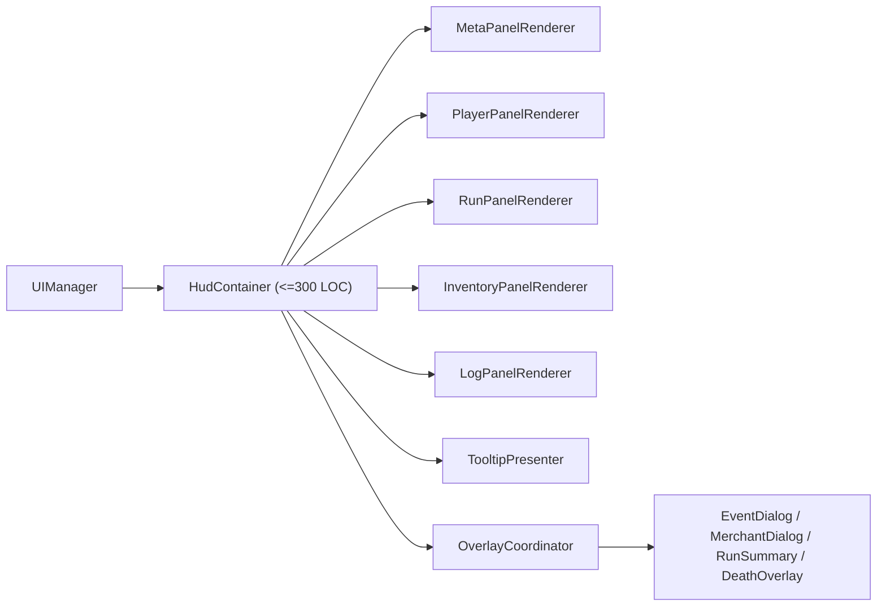

# Phase 4.4 工程收敛（E2 + E3 + E4）实施文档（PR 级）

**日期**: 2026-03-03  
**阶段**: Phase 4 / 4.4  
**目标摘要**: 在 4.1~4.3 完成 Scene 深拆后，集中完成工程收敛三件事：清理 `UI_POLISH_FLAGS` 死分支、把 `Hud.ts` 拆成容器 + 面板、补齐 `AISystem/MovementSystem/MonsterSpawnSystem` 测试并收紧架构预算门禁。

**关联文档**:
1. `docs/plans/phase4/2026-03-03-phase4-integrated-execution-plan.md`
2. `docs/plans/phase4/2026-03-03-phase4-3-scene-decomposition-m3-hazard-progression.md`
3. `docs/plans/phase4/2026-03-03-phase4-0-baseline-freeze-and-governance.md`

---

## 1. 直接结论

4.4 的本质是“把重构成果固化为长期可维护基线”，不是新增玩法：

1. 清理 flag 分支：`UI_POLISH_FLAGS` 迁移期开关全部落地为固定行为，删除死分支与双路径维护成本。
2. HUD 结构收敛：`Hud.ts` 从“渲染 + 事件绑定 + tooltip + inventory 交互”大类拆为容器层 + 面板模块。
3. 测试安全网补齐：为 `AISystem/MovementSystem/MonsterSpawnSystem` 增加系统级单测，锁住关键边界与随机路径。
4. 门禁收紧：把预算阈值从“临时债务容忍”收紧到 4.4 目标，阻断后续回流。

4.4 完成后的硬结果：

1. `DungeonScene.ts` 目标 `<= 2500`，`Hud.ts` 目标 `<= 300`（容器层）。
2. 业务代码中不再依赖 `UI_POLISH_FLAGS` 进行运行时分支。
3. 三大系统具备可持续回归测试，迁移后风险可控。
4. `check:architecture-budget` 反映新阈值并在 `ci:check` 持续生效。

---

## 2. 设计约束（4.4 必须遵守）

1. **行为等价约束**
   - 不改战斗、掉落、成长、事件概率与数值，仅做结构收敛与测试补强。
2. **兼容约束**
   - 不改存档 schema，不改 `@blodex/core` 对外协议。
3. **UI 语义约束**
   - HUD 拆分后，信息可见性、文案 key、交互入口（装备/丢弃/快捷键）保持一致。
4. **门禁约束**
   - 预算阈值必须随阶段收紧，禁止“白名单长期冻结”。
5. **阶段边界约束**
   - 不在 4.4 内引入 G1~G7 体验增强项（统一留在 4.5/4.6）。

---

## 3. 现状与问题证据（4.4 输入）

### 3.1 Flag 现状

`UI_POLISH_FLAGS` 当前定义 5 个开关且全部为 `true`：

1. `metaMenuDomEnabled`
2. `runSummaryV2Enabled`
3. `skillCooldownOverlayEnabled`
4. `sceneRefactorR1Enabled`
5. `i18nInfrastructureEnabled`

仍存在业务引用，典型位置：

1. `apps/game-client/src/scenes/DungeonScene.ts`
2. `apps/game-client/src/scenes/MetaMenuScene.ts`
3. `apps/game-client/src/ui/components/RunSummaryScreen.ts`
4. `apps/game-client/src/ui/components/SkillBar.ts`
5. `apps/game-client/src/main.ts`

### 3.2 HUD 现状

1. `apps/game-client/src/ui/Hud.ts` 当前 963 行。
2. 单文件同时承担：
   - 玩家/运行状态渲染
   - inventory 渲染与按钮绑定
   - tooltip 组装与定位
   - log panel 渲染
   - event/merchant/summary/death overlay 调度
3. 已有可复用组件基础：
   - `BossHealthBar`、`EventDialog`、`SkillBar`、`RunSummaryScreen`
   - `UIStateAdapter` / `HudPresenter` 作为状态输入层

### 3.3 系统测试现状

`apps/game-client/src/systems` 中目前缺失以下目标测试文件：

1. `AISystem` 专项测试
2. `MovementSystem` 专项测试
3. `MonsterSpawnSystem` 专项测试

现有测试聚焦于 `CombatSystem/EntityManager/SaveManager/spatialHash`，无法覆盖 4.3 之后主循环关键系统风险。

### 3.4 预算门禁现状

`scripts/check-architecture-budgets.sh` 当前 allowlist 阈值仍偏宽：

1. `DungeonScene.ts`: 7000 行 / 220 methods
2. `Hud.ts`: 1100 行 / 80 methods
3. `MetaMenuScene.ts`: 1300 行 / 90 methods

4.4 需要把阈值调整到“接近目标态”的工程门槛。

### 3.5 阶段起点刷新（执行前必做）

1. 4.4 的输入基线应取 4.3 出口实测值（而不是 4.0/4.1 的历史值）。
2. `DungeonScene <= 2500` 的收敛来源包含：
   - flag 分支与迁移期壳层清理（Scene 降行）
   - HUD 容器化（Hud 降行）
   - 调用链收敛（Scene 残余委托清理）
3. 执行前刷新命令：

```bash
wc -l apps/game-client/src/scenes/DungeonScene.ts apps/game-client/src/ui/Hud.ts
pnpm check:architecture-budget
```

---

## 4. 范围与非目标

### 4.1 范围

1. E2：`UI_POLISH_FLAGS` 业务引用清理、常量化行为落地。
2. E3：`Hud.ts` 模块化拆分 + 容器化 + 增量渲染路径收敛。
3. E4：`AISystem/MovementSystem/MonsterSpawnSystem` 单测补齐。
4. 门禁收紧：预算脚本阈值更新、CI 过线标准更新。

### 4.2 非目标

1. 不改玩法规则与数值。
2. 不改 i18n 词条语义，仅保证拆分后 key 使用一致。
3. 不改 `MetaProgression` schema 与 run save schema。
4. 不在 4.4 内引入新视觉特效/新交互机制（4.5+ 处理）。

---

## 5. 目标结构（4.4 结束态）



### 5.1 组件职责定义

1. `HudContainer`
   - 只负责 DOM 根节点持有、渲染编排、跨面板生命周期。
2. `InventoryPanelRenderer`
   - 负责装备/背包 DOM 生成与动作绑定，不处理全局日志/summary。
3. `TooltipPresenter`
   - 负责 tooltip 内容与定位，避免散落在 Hud 主文件。
4. `OverlayCoordinator`
   - 统一 event/merchant/summary/death 的显隐与 action bind。
5. `LogPanelRenderer`
   - 维护 log entries 渲染与最大条目策略。

### 5.2 推荐接口草案

```ts
export interface HudPanelRenderer<State> {
  render(state: State): void;
  reset(): void;
}

export interface HudOverlayCoordinator {
  showDeath(reason: string): void;
  hideDeath(): void;
  showEventPanel(input: EventPanelInput): void;
  showMerchantPanel(input: MerchantPanelInput): void;
  clearSummary(): void;
}
```

---

## 6. PR 级实施计划（4.4）

> 规则：沿用主计划编号，使用 `PR-10/PR-11/PR-12/PR-13`。

### PR-4.4-10：UI_POLISH_FLAGS 清理与常量化

**目标**: 清除迁移期 flag 分支，收敛为单路径实现。

**修改文件（建议）**:
1. `apps/game-client/src/config/uiFlags.ts`
2. `apps/game-client/src/main.ts`
3. `apps/game-client/src/scenes/DungeonScene.ts`
4. `apps/game-client/src/scenes/MetaMenuScene.ts`
5. `apps/game-client/src/ui/components/RunSummaryScreen.ts`
6. `apps/game-client/src/ui/components/SkillBar.ts`

**关键动作**:
1. 删除恒为 `true` 的条件分支与 fallback 路径。
2. 迁移期 flag 保留“兼容空壳”或直接删除（二选一，禁止继续业务引用）。
3. 更新相关测试，移除“通过修改 flag 断言分支”的写法。

**验收标准**:
1. 业务代码不再出现 `UI_POLISH_FLAGS.*` 条件分支。
2. `runSummary/skill cooldown/meta menu/scene refactor` 均走单路径逻辑。
3. 行为与当前默认值（全 true）保持一致。

---

### PR-4.4-11：Hud 结构拆分（容器 + 面板）

**目标**: 完成 `Hud.ts` 职责分离，不改外部 API。

**新增文件（建议）**:
1. `apps/game-client/src/ui/hud/HudContainer.ts`
2. `apps/game-client/src/ui/hud/panels/MetaPanelRenderer.ts`
3. `apps/game-client/src/ui/hud/panels/PlayerPanelRenderer.ts`
4. `apps/game-client/src/ui/hud/panels/RunPanelRenderer.ts`
5. `apps/game-client/src/ui/hud/panels/InventoryPanelRenderer.ts`
6. `apps/game-client/src/ui/hud/panels/LogPanelRenderer.ts`
7. `apps/game-client/src/ui/hud/TooltipPresenter.ts`

**修改文件（建议）**:
1. `apps/game-client/src/ui/Hud.ts`
2. `apps/game-client/src/ui/UIManager.ts`

**关键动作**:
1. `Hud.ts` 作为兼容 facade，逐步转发到 `HudContainer`。
2. 把 inventory/tooltip/log 的内部实现迁移到独立模块。
3. 统一 DOM 查询与绑定入口，避免散落副作用。

**验收标准**:
1. `Hud.ts` 体量显著下降并仅保留容器职责。
2. 外部调用接口不变（`UIManager` 无破坏性改动）。
3. 现有 `BossHealthBar/SkillBar/EventDialog/RunSummaryScreen` 复用不回退。

---

### PR-4.4-12：HUD 增量渲染与交互绑定收敛

**目标**: 降低 HUD 重绘成本并稳定交互副作用边界。

**新增文件（建议）**:
1. `apps/game-client/src/ui/hud/HudRenderDiff.ts`
2. `apps/game-client/src/ui/hud/HudActionBinder.ts`
3. `apps/game-client/src/ui/__tests__/hud-render-diff.test.ts`

**修改文件（建议）**:
1. `apps/game-client/src/ui/Hud.ts`
2. `apps/game-client/src/ui/state/UIStateAdapter.ts`

**关键动作**:
1. 基于 `UIStateSnapshot` 收敛到“按面板 diff”渲染，而非全量 `innerHTML` 刷新。
2. 绑定逻辑与渲染逻辑解耦，避免重复绑定和事件泄漏。
3. 为频繁刷新区域（log/skill cooldown/inventory changes）设置稳定刷新策略。

**验收标准**:
1. 常规帧下 HUD 不再全量重绘。
2. 交互行为（equip/unequip/discard/use consumable/tooltip）与迁移前一致。
3. 不出现重复监听或 UI 状态滞后。

---

### PR-4.4-13：系统测试补齐 + 预算收紧

**目标**: 补齐 3 个系统测试安全网，并把预算阈值收紧到 4.4 水平。

**新增文件（建议）**:
1. `apps/game-client/src/systems/__tests__/aiSystem.test.ts`
2. `apps/game-client/src/systems/__tests__/movementSystem.test.ts`
3. `apps/game-client/src/systems/__tests__/monsterSpawnSystem.test.ts`

**修改文件（建议）**:
1. `scripts/check-architecture-budgets.sh`
2. `package.json`
3. `apps/game-client/package.json`（若补 `test:coverage` 脚本）

**建议覆盖点**:
1. `AISystem`: chase/kite/ambush/support/shield 状态切换与 support 冷却。
2. `MovementSystem`: `clampToWalkable`、path cache 命中与 TTL 过期、`updatePlayerMovement` 边界。
3. `MonsterSpawnSystem`: blockedPositions、biome pool 回退、extraAffixCount、boss floor 保护路径。

**预算收紧目标（建议）**:
1. `DungeonScene.ts`: `7000/220 -> 2500/90`
2. `Hud.ts`: `1100/80 -> 300/25`
3. `MetaMenuScene.ts`: `1300/90 -> 1200/85`（保持平稳收敛）

**验收标准**:
1. 三个系统测试落地并纳入日常 `pnpm --filter @blodex/game-client test`。
2. 预算收紧后 `pnpm check:architecture-budget` 通过。
3. `ci:check` 链路维持绿色。

---

## 7. 验证与回归清单

### 7.1 自动化

```bash
pnpm --filter @blodex/game-client typecheck
pnpm --filter @blodex/game-client test
pnpm --filter @blodex/core test
pnpm check:architecture-budget
```

跨包联动 PR 或合并前补跑：

```bash
pnpm ci:check
```

### 7.2 建议新增/补强测试

1. Flag 清理：
   - 删除分支后的功能等价测试（run summary、skill cooldown、scene flow）。
2. HUD 拆分：
   - 关键面板 DOM 快照（meta/player/run/inventory/log）。
   - tooltip 内容/定位与行为测试。
3. 系统测试：
   - `AISystem` 行为分支全覆盖；
   - `MovementSystem` 路径与缓存边界；
   - `MonsterSpawnSystem` 随机池与阻塞位逻辑。

### 7.3 手动冒烟

1. 正常战斗 10 分钟观察 HUD：血蓝条、日志、技能栏、背包、tooltip 全链路可用。
2. 装备流程：拾取 -> 对比 -> 装备 -> 卸下 -> 丢弃。
3. run summary 与死亡面板：成功/失败各走一遍。
4. challenge/hazard/boss 场景中 HUD 与日志同步无异常。

### 7.4 指标对比（4.4 出口）

1. `DungeonScene.ts` 行数：目标 `<= 2500`。
2. `Hud.ts` 行数：目标 `<= 300`（容器层）。
3. `UI_POLISH_FLAGS` 业务引用：目标 `0`。
4. 三大系统测试：文件齐备并纳入默认测试链路。

---

## 8. 风险与止损策略

| 风险 | 等级 | 触发信号 | 止损策略 |
|---|:---:|---|---|
| Flag 清理误删保护路径 | 中 | 某些入口页面/面板不再触发 | 先做等价快照，再分批删分支 |
| HUD 拆分引发交互失效 | 高 | 装备/丢弃/tooltip 异常 | 保留 façade API，面板逐步迁移并逐步替换 |
| 增量渲染导致状态滞后 | 中 | 日志/冷却显示延迟 | 面板级 diff + 强制刷新兜底策略 |
| 系统测试脆弱（随机性） | 中 | CI 间歇性失败 | 通过固定 seed 与 deterministic stub 稳定测试 |
| 门禁收紧过快阻塞主线 | 中 | 连续 PR 因预算失败 | 按 PR-13 一次性收紧并保证前置重构完成 |

回滚原则：

1. `PR-10`（flag 清理）与 `PR-11/12`（HUD 拆分）独立回滚。
2. `PR-13` 预算收紧若阻塞，可先回滚阈值再定位结构问题，不放弃测试补齐。

---

## 9. 4.4 出口门禁（Done 定义）

4.4 完成必须满足：

1. `UI_POLISH_FLAGS` 业务分支清理完成。
2. `Hud.ts` 已收敛为容器层并达成行数目标。
3. `AISystem/MovementSystem/MonsterSpawnSystem` 测试补齐并稳定通过。
4. `check:architecture-budget` 阈值已收紧且通过。
5. 自动化检查和手动冒烟通过，无行为回归。

---

## 10. 与 4.5 的交接清单

进入 4.5 前必须确认：

1. 工程债主线（flag/HUD/系统测试）已收口，4.5 可专注体验增强。
2. 关键 UI 与系统边界稳定，不再阻碍 G1/G2/G3/G5 交付。
3. 已记录 4.4 后体量与预算快照，作为 4.5 起点。
4. 4.5 的 `PR-14~17` 已明确仅做体验增强，不回流架构债。
