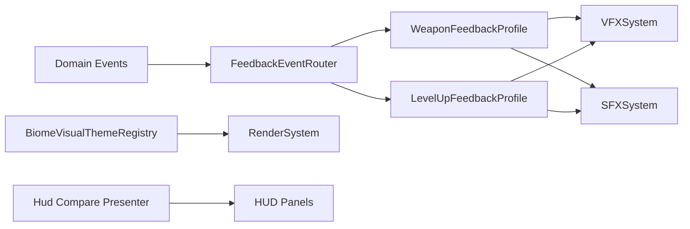

# Phase 4.5 体验增强 I（G1 + G2 + G3 + G5）实施文档（PR 级）

**日期**: 2026-03-03  
**阶段**: Phase 4 / 4.5  
**目标摘要**: 在 4.4 工程收敛基线上，完成中前期体验增强闭环：Biome 视觉差异化、武器可见反馈、升级强反馈、装备对比可读性增强。

**关联文档**:
1. `docs/plans/phase4/2026-03-03-phase4-integrated-execution-plan.md`
2. `docs/plans/phase4/2026-03-03-phase4-4-engineering-convergence-e2-e3-e4.md`
3. `docs/plans/phase4/2026-03-03-phase4-3-scene-decomposition-m3-hazard-progression.md`

---

## 1. 直接结论

4.5 的目标不是“改规则”，而是把已有机制做成“玩家可感知”的体验：

1. G1（Biome）：从“仅色调差异”升级到“材质/色调/氛围联合差异”，让 6 个 Biome 肉眼可区分。
2. G2（武器）：在不改数值规则的前提下，为 6 种武器提供至少 1 个稳定可见反馈差异。
3. G3（升级）：把 `player:levelup` 从日志事件升级为 VFX+SFX+HUD 联动反馈。
4. G5（装备对比）：在现有 tooltip 对比基础上增加方向性提示与 HUD 属性高亮，降低决策成本。

4.5 完成后的硬结果：

1. 6 种 Biome 可快速识别（视觉+听觉氛围）。
2. 6 种武器命中反馈不再同质化。
3. 升级反馈从“日志可见”提升到“瞬时可感知”。
4. 装备对比决策从“读长文本”变成“看方向/高亮”。

---

## 2. 设计约束（4.5 必须遵守）

1. **玩法语义不变**
   - 不改武器平衡数值、不改成长曲线、不改事件与 Boss 机制。
2. **协议兼容不变**
   - 不改 `RunSaveDataV2` 与 `MetaProgression` schema。
3. **分层约束**
   - 体验逻辑走 presentation/feedback 层，不回流到 `DungeonScene` 业务规则层。
4. **资产与国际化约束**
   - 新增文案必须中英文同步；新增音效/贴图必须进入资产清单与校验链路。
5. **阶段边界约束**
   - 不提前实现 4.6 的 G4/G6/G7（Boss 预警深化、Endless 规则突变、事件深化）。

---

## 3. 现状与问题证据（4.5 输入）

### 3.1 Biome 现状（G1 输入）

1. 内容层有 6 个 Biome，且定义了 `ambientColor/floorTilesetKey/wallStyleKey`。
2. 当前 `BIOME_DEFS` 的 `floorTilesetKey` 全部是 `tile_floor_01`，贴图层几乎同源。
3. `RenderSystem.drawDungeon` 当前固定使用 `"tile_floor_01"`，仅接受可选 `tintColor`。
4. `DungeonScene.resolveBiomeTileTint` 仅对少数 Biome 给出 tint，导致整体差异不足。

结论：当前 Biome 差异主要靠 ambient + 局部 tint，识别度不足。

### 3.2 武器反馈现状（G2 输入）

1. 内容层已有 6 种武器机制（`none/aoe_cleave/crit_bonus/skill_amp/stagger`）。
2. 战斗反馈路由（`feedbackEventRouter`）的 `combat_hit` 仅区分 `critical`，不区分武器类型。
3. `VFXSystem.playCombatHit`、`SFXSystem.playCombatHit` 也是通用路径，缺乏 weapon profile。

结论：机制差异存在，但“命中体感”仍高度同质化。

### 3.3 升级反馈现状（G3 输入）

1. `DungeonScene` 已发射 `player:levelup` 事件并记录日志。
2. 现有反馈路由未包含 `player:levelup` 分支。
3. `VFXSystem/SFXSystem` 无 level up 专用 cue。

结论：升级反馈当前以日志为主，缺少强即时感知。

### 3.4 装备对比现状（G5 输入）

1. `Hud.ts` 已支持 affix delta（`delta-up/down/equal`）与 power delta。
2. 现有对比主要集中在 tooltip 内部，缺少“核心属性面板联动高亮”。
3. 在高频拾取场景下，玩家仍需要逐条阅读而非快速方向判断。

结论：对比基础已在，但“决策速度”与“显著性”仍可提升。

---

## 4. 范围与非目标

### 4.1 范围

1. G1：Biome 视觉与氛围差异化（材质/色调/环境音一致化策略）。
2. G2：武器命中可见反馈差异（VFX/SFX/轻屏幕反馈）。
3. G3：升级反馈联动（VFX+SFX+HUD）。
4. G5：装备对比可读性增强（方向箭头 + 属性高亮）。

### 4.2 非目标

1. 不改武器数值平衡与技能机制规则。
2. 不改 Boss 技能预警（4.6 G4）。
3. 不改 Endless 规则突变（4.6 G6）。
4. 不改事件内容策略深化（4.6 G7）。

---

## 5. 目标结构（4.5 结束态）



### 5.1 组件职责定义

1. `BiomeVisualThemeRegistry`
   - 将 biome id 映射为材质/色调/环境参数，不承载业务规则。
2. `WeaponFeedbackProfile`
   - 定义武器类型到命中反馈样式的映射。
3. `LevelUpFeedbackProfile`
   - 定义升级反馈序列（动画、声音、HUD 提示）。
4. `HudComparePresenter`
   - 输出装备前后关键属性方向与短时高亮状态。

### 5.2 推荐接口草案

```ts
export interface WeaponFeedbackContext {
  weaponType: WeaponType;
  critical: boolean;
  amount: number;
  targetId: string;
}

export interface BiomeVisualTheme {
  floorTileKey: string;
  fallbackTint?: number;
  accentColor: number;
  hazeAlpha: number;
}
```

---

## 6. PR 级实施计划（4.5）

> 规则：沿用主计划编号，使用 `PR-14/PR-15/PR-16/PR-17`。

### PR-4.5-14：Biome 差异化视觉落地（G1）

**目标**: 建立 6 个 Biome 的稳定视觉识别，不改玩法逻辑。

**新增文件（建议）**:
1. `apps/game-client/src/scenes/dungeon/presentation/BiomeVisualThemeRegistry.ts`
2. `apps/game-client/src/scenes/dungeon/presentation/BiomeVisualRenderer.ts`

**修改文件（建议）**:
1. `apps/game-client/src/systems/RenderSystem.ts`
2. `apps/game-client/src/scenes/DungeonScene.ts`（或 4.3 后对应 runtime module）
3. `packages/content/src/biomes.ts`（若补齐 `floorTilesetKey` 差异）

**关键动作**:
1. `drawDungeon` 从固定 tile key 升级为按 biome theme 渲染。
2. 保留现有 tint 兼容路径，逐步替换为 theme 参数。
3. Biome 入场时统一校准 ambient + hue + floor material 三者一致性。

**验收标准**:
1. 6 个 Biome 在同分辨率下可肉眼区分。
2. 切层时视觉主题切换稳定，无闪烁/残留。
3. 不影响路径可读性与 hazard 可见性。

---

### PR-4.5-15：武器可见反馈增强（G2）

**目标**: 在不改伤害公式前提下，为 6 种武器增加命中体感差异。

**新增文件（建议）**:
1. `apps/game-client/src/systems/feedback/WeaponFeedbackProfile.ts`
2. `apps/game-client/src/systems/feedback/WeaponFeedbackDispatcher.ts`

**修改文件（建议）**:
1. `apps/game-client/src/systems/feedbackEventRouter.ts`
2. `apps/game-client/src/systems/VFXSystem.ts`
3. `apps/game-client/src/systems/SFXSystem.ts`
4. `apps/game-client/src/scenes/DungeonScene.ts`

**关键动作**:
1. 为玩家攻击命中路径补充 `weaponType` 上下文（内部反馈上下文，不改存档协议）。
2. 将 `combat_hit` 从“仅 crit 分支”扩展为“weapon profile + crit”的组合反馈。
3. 给每种武器定义至少 1 个稳定可见差异（示例：击中色相、冲击半径、尾迹、命中音色）。

**验收标准**:
1. 6 种武器均可通过 3 次命中观察到差异。
2. 反馈增强不改变 DPS、攻速、命中判定。
3. 无明显音效节流异常或 VFX 堆积泄漏。

---

### PR-4.5-16：升级强反馈联动（G3）

**目标**: 让 `player:levelup` 具备可即时感知的反馈闭环。

**新增文件（建议）**:
1. `apps/game-client/src/systems/feedback/LevelUpFeedbackProfile.ts`
2. `apps/game-client/src/ui/hud/effects/LevelUpPulse.ts`

**修改文件（建议）**:
1. `apps/game-client/src/systems/feedbackEventRouter.ts`
2. `apps/game-client/src/systems/VFXSystem.ts`
3. `apps/game-client/src/systems/SFXSystem.ts`
4. `apps/game-client/src/scenes/DungeonScene.ts`
5. `apps/game-client/src/ui/Hud.ts`（或 4.4 后容器模块）

**关键动作**:
1. 新增 `player:levelup` -> `sfx/vfx/hud` 路由映射。
2. 增加升级 burst（角色周围环形/粒子）与专用音效 cue。
3. HUD 增加短时等级提升提示与属性跃迁可视状态（短时高亮）。

**验收标准**:
1. 每次升级都能稳定触发 VFX+SFX+HUD 联动。
2. 连续升级场景无提示丢失或重叠错乱。
3. 升级反馈不会遮挡关键战斗信息超过约定时长。

---

### PR-4.5-17：装备对比可读性增强（G5）

**目标**: 将装备决策从“读明细”升级为“先看方向，再看细节”。

**新增文件（建议）**:
1. `apps/game-client/src/ui/hud/compare/EquipmentDeltaPresenter.ts`
2. `apps/game-client/src/ui/hud/compare/StatDeltaHighlighter.ts`
3. `apps/game-client/src/ui/__tests__/equipment-delta-presenter.test.ts`

**修改文件（建议）**:
1. `apps/game-client/src/ui/Hud.ts`（或拆分后的 inventory panel）
2. `apps/game-client/src/styles/overlays.css`
3. `apps/game-client/src/styles/hud.css`
4. `apps/game-client/src/i18n/catalog/en-US.ts`
5. `apps/game-client/src/i18n/catalog/zh-CN.ts`

**关键动作**:
1. 在现有 tooltip delta 基础上增加“核心属性方向摘要”（↑/↓/≈）。
2. 在装备/卸下动作后，对 HUD 关键属性做短时高亮（如 attack/armor/crit）。
3. 对“可装备但降级”的情况给出弱警示，不阻断操作。

**验收标准**:
1. 玩家可在 2 秒内判断“该装/不该装”的方向。
2. tooltip 与 HUD 高亮信息一致，不出现相互矛盾。
3. i18n 文案新增项中英文齐全并通过校验。

---

## 7. 验证与回归清单

### 7.1 自动化

```bash
pnpm --filter @blodex/game-client typecheck
pnpm --filter @blodex/game-client test
pnpm --filter @blodex/core test
pnpm check:architecture-budget
```

跨包联动 PR 或合并前补跑：

```bash
pnpm ci:check
```

### 7.2 建议新增/补强测试

1. Biome 视觉：
   - theme registry 映射完整性；
   - 切层时 theme 切换一致性。
2. 武器反馈：
   - weapon profile 映射完整性（6/6）；
   - feedback router 输入去重与节流行为。
3. 升级反馈：
   - `player:levelup` 路由触发；
   - 连续升级触发顺序与幂等。
4. 装备对比：
   - delta summary 计算正确性；
   - HUD 属性高亮生命周期。

### 7.3 手动冒烟

1. Biome：逐层切换至少覆盖 6 个 biome，人工截图对比可区分性。
2. 武器：6 种武器分别命中至少 3 次，确认可见差异稳定存在。
3. 升级：触发至少 3 次升级，观察 VFX/SFX/HUD 三者联动。
4. 装备：至少 10 次拾取对比，验证方向提示与高亮一致。

### 7.4 指标对比（4.5 出口）

1. 6 个 Biome 可肉眼区分（通过冒烟截图检查表）。
2. 6 种武器均具备至少 1 个可见差异点。
3. 升级触发 VFX/SFX/HUD 同步反馈。
4. Tooltip 对比 + HUD 属性高亮满足可读性验收。

---

## 8. 风险与止损策略

| 风险 | 等级 | 触发信号 | 止损策略 |
|---|:---:|---|---|
| 视觉增强影响可玩性 | 中 | 地面信息可读性下降 | 先做可读性基准，再限制对比度和特效密度 |
| 武器反馈过强导致噪音 | 中 | 高频命中时视觉/音频疲劳 | 引入节流与层级，优先保留关键反馈 |
| 升级反馈打断战斗 | 中 | 升级瞬间遮挡目标/操作 | 控制时长与层级，不做强制暂停 |
| 装备对比信息过载 | 低 | tooltip 变复杂难读 | 先显示方向摘要，明细折叠/二级展示 |
| 资源加载回归 | 中 | 新增资产加载失败 | 资产清单校验 + fallback 资源路径 |

回滚原则：

1. G1/G2/G3/G5 以 PR 粒度独立回滚，避免交叉修复。
2. 任何反馈增强若影响可玩性，优先回滚表现层，不回滚领域规则层。

---

## 9. 4.5 出口门禁（Done 定义）

4.5 完成必须满足：

1. 6 个 Biome 视觉差异可被稳定识别。
2. 6 种武器具备可见反馈差异且无数值语义漂移。
3. 升级反馈已形成 VFX+SFX+HUD 联动闭环。
4. 装备对比具备方向提示与属性高亮。
5. 自动化检查与手动冒烟通过。

---

## 10. 与 4.6 的交接清单

进入 4.6 前必须确认：

1. 4.5 的表现层增强已稳定，不再影响架构主线。
2. feedback 体系可复用于 4.6 的 Boss telegraph 与 Endless 突变提示。
3. 关键资产与文案已入库并通过校验链路。
4. 4.6 可聚焦 G4/G6/G7（Boss 预警深化 + Endless 规则突变 + 事件深化）。

