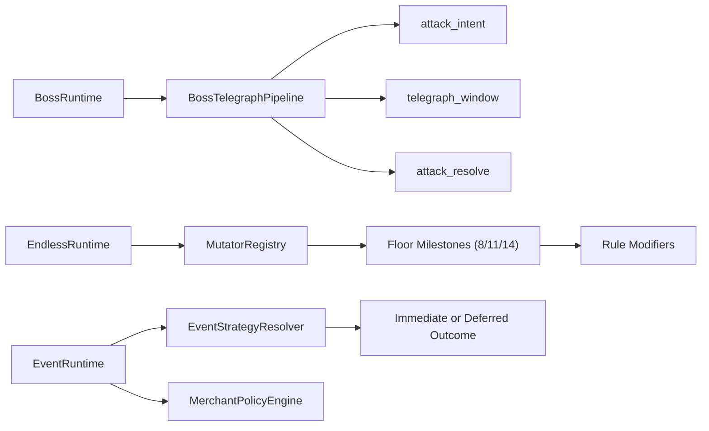

# Phase 4.6 体验增强 II（G4 + G6 + G7）实施文档（PR 级）

**日期**: 2026-03-03  
**阶段**: Phase 4 / 4.6  
**目标摘要**: 在 4.5 体验增强基础上，完成后期深度玩法升级：Boss 技能可预判可规避、Endless 规则级突变、随机事件与商店策略深化，并在必要时完成 Meta/Save 向后兼容迁移。

**关联文档**:
1. `docs/plans/phase4/2026-03-03-phase4-integrated-execution-plan.md`
2. `docs/plans/phase4/2026-03-03-phase4-5-experience-enhancement-i-g1-g2-g3-g5.md`
3. `docs/plans/phase4/2026-03-03-phase4-4-engineering-convergence-e2-e3-e4.md`

---

## 1. 直接结论

4.6 的核心是把“后期可玩深度”从数值叠加升级为规则层变化：

1. G4（Boss Telegraph）：将 `BossAttack.telegraphMs` 从静态配置转为运行时机制，形成“预警->执行->可规避”闭环。
2. G6（Endless Mutator）：在现有 endless 线性缩放上叠加阶段性规则突变（第 8/11/14 层作为里程碑）。
3. G7（Event/Merchant 深化）：引入条件化与延迟收益分支，提升策略分化并保持 deterministic。
4. PR-21 负责兼容收口：如新增 Meta/Run 状态字段，必须提供迁移与回归测试。

4.6 完成后的硬结果：

1. Boss 关键技能在释放前可感知、可规避，且不破坏现有难度曲线。
2. Endless 至少 3 个层级出现可观察规则突变，而非仅“数值变大”。
3. 事件至少新增 3 个非同质分支，商店决策不再仅靠即时报价。
4. 老存档与旧 Meta 数据可兼容加载。

---

## 2. 设计约束（4.6 必须遵守）

1. **确定性约束**
   - 新增 Boss telegraph、Endless mutator、事件分支必须走 seed 驱动路径，保持 replay 与 save 可重放。
2. **兼容性约束**
   - 如引入新字段，采用“可选字段 + 迁移默认值”策略；禁止直接破坏旧存档加载。
3. **玩法边界约束**
   - 强化后期深度，但不推翻 4.5 已验证的中前期体验反馈。
4. **分层约束**
   - 规则放在 `@blodex/core` 或 runtime module；表现层仅负责反馈呈现。
5. **阶段边界约束**
   - 4.6 不做 4.7 发布收口工作（发布与全量复盘留给 4.7）。

---

## 3. 现状与问题证据（4.6 输入）

### 3.1 Boss Telegraph 现状（G4 输入）

1. 内容层 `BossAttack` 已配置 `telegraphMs`（如 `heavy_strike`、`bone_spikes`）。
2. `packages/core/src/boss.ts` 的 `resolveBossAttack` 当前直接结算，无 telegraph 运行态分支。
3. 事件契约存在 `boss:attack`，但当前代码未发射该事件。
4. 场景里仅 hazard 的 periodic trap 使用了 telegraph 视觉窗口，Boss 尚未接入同类机制。

结论：Boss 预警字段存在，但运行时链路缺失。

### 3.2 Endless 现状（G6 输入）

1. 当前 endless 主要由：
   - `resolveEndlessScalingMultiplier`
   - `resolveEndlessAffixBonusCount`
   - `endlessFloorClearBonus/endlessKillShardReward`
2. 阈值型变化主要是 affix 数在 floor>=8/10 增加。
3. `RunState/MetaProgression` 目前无 mutator runtime/unlock state 字段。

结论：Endless 目前偏“数值增长”，缺少规则级突变层。

### 3.3 Event/Merchant 现状（G7 输入）

1. `RANDOM_EVENT_DEFS` 目前 6 个事件，分支多为即时奖励+风险惩罚。
2. `createMerchantOffers` 以固定价格区间（5~15）抽样，不含动态供需/延迟收益机制。
3. 事件与商店虽然有 unlock 与 biome/floor 过滤，但后期策略分化仍弱。

结论：事件和商店可运行，但中后期“策略深度”不足。

### 3.4 测试与迁移现状

1. `boss.test.ts`、`endless.test.ts`、`randomEvent.test.ts` 已覆盖基础规则。
2. 目前未覆盖 “boss telegraph 状态机 / endless mutator 组合 / 事件延迟收益结算” 场景。
3. `MetaProgression` 当前 schemaVersion 为 `6`，迁移链完整，但尚未包含 4.6 新状态。

---

## 4. 范围与非目标

## 4.1 范围

1. G4：Boss 攻击预警运行时接入（至少覆盖 `heavy_strike`、`bone_spikes`）。
2. G6：Endless mutator 体系（规则层 + 运行时接入 + UI/日志可观测）。
3. G7：事件/商店策略深化（条件化分支、延迟收益、难度维度）。
4. 迁移与兼容：必要字段演进 + 迁移 + fixture 回归。

## 4.2 非目标

1. 不重写 Boss 全套 AI，仅在现有攻击选择链路上增强 telegraph。
2. 不调整 4.5 的 Biome/武器/升级/装备对比目标。
3. 不在 4.6 内完成发布文档与最终复盘（4.7 执行）。
4. 不引入不可回放的非确定性机制。

---

## 5. 目标结构（4.6 结束态）



### 5.1 组件职责定义

1. `BossTelegraphPipeline`
   - 管理 attack intent、预警窗口、执行结算与取消条件。
2. `EndlessMutatorRegistry`
   - 管理 mutator 定义、楼层激活规则、互斥关系、叠加策略。
3. `EndlessMutatorRuntime`
   - 在战斗/掉落/事件流程中应用 mutator 修饰。
4. `EventStrategyResolver`
   - 解析事件分支的条件、收益时机（即时/延迟）与风险。
5. `MerchantPolicyEngine`
   - 处理报价策略、库存稀缺、阶段折扣/溢价逻辑。

### 5.2 推荐接口草案

```ts
export interface BossTelegraphState {
  attackId: string;
  startedAtMs: number;
  executeAtMs: number;
  target?: { x: number; y: number };
}

export interface EndlessMutator {
  id: string;
  tier: 1 | 2 | 3;
  unlockFloor: number;
  apply(input: MutatorApplyInput): MutatorApplyOutput;
}
```

---

## 6. PR 级实施计划（4.6）

> 规则：沿用主计划编号，使用 `PR-18/PR-19/PR-20/PR-21`。

### PR-4.6-18：Boss Telegraph 运行时接入（G4）

**目标**: 让 Boss 核心技能具备可预判、可规避窗口。

**新增文件（建议）**:
1. `apps/game-client/src/scenes/dungeon/encounter/BossTelegraphRuntime.ts`
2. `apps/game-client/src/scenes/dungeon/encounter/BossTelegraphPresenter.ts`
3. `packages/core/src/bossTelegraph.ts`

**修改文件（建议）**:
1. `packages/core/src/boss.ts`
2. `apps/game-client/src/scenes/DungeonScene.ts`（或 4.3 后 BossRuntimeModule）
3. `packages/core/src/contracts/events.ts`
4. `apps/game-client/src/systems/feedbackEventRouter.ts`
5. `apps/game-client/src/systems/VFXSystem.ts`

**关键动作**:
1. 将 `telegraphMs` 纳入攻击执行时序，不再“选中即结算”。
2. 发射 `boss:attack_intent` / `boss:attack_resolve`（或等价事件）供日志与反馈层消费。
3. 关键技能增加地面提示/方向提示与可规避判定窗口。

**验收标准**:
1. `heavy_strike`、`bone_spikes` 可在 telegraph 窗口内被规避。
2. Boss 总体危险度可控（不因预警导致完全失压）。
3. `boss` 相关事件链路与日志时序一致。

---

### PR-4.6-19：Endless Mutator 核心（G6）

**目标**: 将 Endless 从“纯数值增长”升级为“规则突变 + 数值增长”。

**新增文件（建议）**:
1. `packages/core/src/endlessMutator.ts`
2. `packages/content/src/endlessMutators.ts`
3. `apps/game-client/src/scenes/dungeon/endless/EndlessMutatorRuntime.ts`
4. `apps/game-client/src/scenes/dungeon/endless/EndlessMutatorPresenter.ts`

**修改文件（建议）**:
1. `packages/core/src/endless.ts`
2. `apps/game-client/src/scenes/DungeonScene.ts`
3. `packages/core/src/contracts/types.ts`（如需 RunState 扩展）

**关键动作**:
1. 定义第 8/11/14 层 mutator 激活规则（可叠加，可观测）。
2. mutator 作用于至少两个维度（示例：怪物行为、战斗节奏、资源获取、环境压力）。
3. 通过事件/日志/HUD 暴露当前 mutator 集合与效果摘要。

**验收标准**:
1. 第 8/11/14 层均有可观察规则变化。
2. mutator 效果 deterministic，可通过 seed 回放一致复现。
3. 旧 endless 数值逻辑与新 mutator 可组合运行，无明显冲突。

---

### PR-4.6-20：Event/Merchant 策略深化（G7）

**目标**: 增强事件与商店的后期策略分化与风险收益层次。

**新增文件（建议）**:
1. `packages/core/src/eventStrategy.ts`
2. `packages/core/src/merchantPolicy.ts`
3. `packages/content/src/randomEventPhase4.ts`（或在 `randomEvents.ts` 增量扩展）
4. `apps/game-client/src/scenes/dungeon/world/EventBranchRuntime.ts`

**修改文件（建议）**:
1. `packages/core/src/randomEvent.ts`
2. `packages/content/src/randomEvents.ts`
3. `apps/game-client/src/scenes/DungeonScene.ts`（或 4.3 后 EventRuntimeModule）

**关键动作**:
1. 至少新增 3 个非同质事件分支（条件化、延迟收益、对赌型收益）。
2. 商店策略增加后期维度（库存稀缺、楼层系数、阶段策略商品）。
3. 延迟收益需可保存恢复（与 save snapshot 一致）。

**验收标准**:
1. 事件分支在中后期提供可辨识策略差异。
2. 商店决策不再只由“当前 obol 是否够”决定。
3. save->restore 后延迟收益状态不丢失、不重复结算。

---

### PR-4.6-21：Meta/Save 迁移与兼容测试收口

**目标**: 为 4.6 新状态提供向后兼容迁移与完整回归。

**新增文件（建议）**:
1. `packages/core/src/__tests__/integration-phase4d-boss-telegraph.test.ts`
2. `packages/core/src/__tests__/integration-phase4e-endless-mutator.test.ts`
3. `packages/core/src/__tests__/integration-phase4f-event-strategy.test.ts`
4. `packages/core/src/__tests__/meta.phase4-migration.test.ts`

**修改文件（建议）**:
1. `packages/core/src/meta.ts`
2. `packages/core/src/save.ts`
3. `packages/core/src/contracts/types.ts`
4. `packages/core/src/__tests__/save.test.ts`
5. `packages/core/src/__tests__/meta.test.ts`

**关键动作**:
1. 若新增 Meta 字段，升级 `schemaVersion`（建议 `6 -> 7`）并提供默认迁移。
2. 若新增 run/runtime 持久字段，确保 V1/V2 存档迁移链仍可通过。
3. 补齐跨版本 fixture（旧存档、旧 meta、混合字段）回归。

**验收标准**:
1. 老存档与老 meta 能正确加载并自动迁移。
2. 新字段缺失时可安全回退到默认行为。
3. 迁移测试覆盖成功路径与异常路径。

---

## 7. 验证与回归清单

### 7.1 自动化

```bash
pnpm --filter @blodex/game-client typecheck
pnpm --filter @blodex/game-client test
pnpm --filter @blodex/core test
pnpm check:architecture-budget
```

跨包联动 PR 或合并前补跑：

```bash
pnpm ci:check
```

### 7.2 建议新增/补强测试

1. Boss Telegraph：
   - telegraph 窗口内规避成功/失败；
   - attack intent 到 resolve 的时序一致性。
2. Endless Mutator：
   - 8/11/14 层激活规则；
   - 多 mutator 叠加与冲突处理。
3. Event/Merchant 深化：
   - 条件化分支可达性；
   - 延迟收益保存恢复一致性；
   - 报价策略 deterministic。
4. 迁移兼容：
   - schema 旧->新迁移；
   - 缺字段/脏字段容错。

### 7.3 手动冒烟

1. Boss 战：至少 3 次战斗，确认 telegraph 可感知且可规避。
2. Endless：推进到 14 层，检查 8/11/14 层突变是否按期生效。
3. 事件与商店：触发新增分支，验证延迟收益与阶段报价。
4. 兼容：加载旧存档后继续游玩到事件/Boss/Endless 场景。

### 7.4 指标对比（4.6 出口）

1. Boss 技能具备可规避预警，战斗日志可观测。
2. Endless 在 8/11/14 层具备规则级突变。
3. 事件至少 3 个新增非同质分支并可稳定触发。
4. 旧存档加载回归通过。

---

## 8. 风险与止损策略

| 风险 | 等级 | 触发信号 | 止损策略 |
|---|:---:|---|---|
| Boss telegraph 过长导致难度崩塌 | 中 | Boss 战胜率异常上升 | 缩短窗口或增加后摇惩罚，分技能校准 |
| Boss telegraph 过短导致不可读 | 高 | 玩家反馈“仍不可避” | 保底最小窗口 + 高对比提示 |
| Mutator 叠加过度惩罚 | 高 | Endless 中层流失显著提升 | 引入互斥与上限，分层回退 |
| 事件延迟收益双结算/漏结算 | 高 | save/restore 后收益异常 | 强制事件状态机快照，结算幂等化 |
| Meta/Save 迁移破坏旧档 | 高 | 旧档加载失败/异常字段丢失 | 先补迁移 fixture，再启用新字段 |

回滚原则：

1. G4/G6/G7 各 PR 独立回滚，避免跨系统混回滚。
2. 一旦出现兼容故障，优先回滚 schema 相关改动，再做热修复。

---

## 9. 4.6 出口门禁（Done 定义）

4.6 完成必须满足：

1. Boss 关键技能具备可预判可规避预警。
2. Endless 在第 8/11/14 层可观测到规则突变。
3. 事件至少 3 个新增策略分支，商店策略维度增强。
4. Meta/Save 迁移链路通过旧数据回归验证。
5. 自动化检查与手动冒烟通过。

---

## 10. 与 4.7 的交接清单

进入 4.7 前必须确认：

1. 4.6 新机制均有可观测指标与回归用例。
2. 所有新增字段迁移已完成并在 CI 稳定通过。
3. 风险项与已知限制清单已沉淀到发布候选文档。
4. 4.7 可专注执行最终收口：全量回归、性能对比、发布说明与 DoD 勾验。

