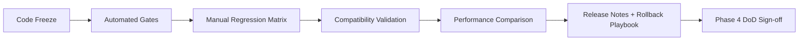

# Phase 4.7 收口与发布（DoD Freeze）实施文档（PR 级）

**日期**: 2026-03-03  
**阶段**: Phase 4 / 4.7  
**目标摘要**: 对 4.0~4.6 的架构改造与体验增强进行最终收口，完成全量回归、兼容性与性能对比、发布说明与回滚预案，形成可长期维护的稳定基线。

**关联文档**:
1. `docs/plans/phase4/2026-03-03-phase4-integrated-execution-plan.md`
2. `docs/plans/phase4/2026-03-03-phase4-6-experience-enhancement-ii-g4-g6-g7.md`
3. `docs/plans/phase4/2026-03-03-phase4-0-baseline-freeze-and-governance.md`

---

## 1. 直接结论

4.7 不再新增玩法能力，重点是“把已交付内容变成可发布系统”：

1. 冻结门禁：把 Phase 4 的 DoD 指标转为可执行发布门禁与明确验收记录。
2. 全量回归：覆盖 Normal/Boss/Endless/Event/Merchant/Save/Meta 全链路。
3. 兼容与性能：完成旧档迁移验证与关键运行指标对比，确保无显著退化。
4. 发布与回滚：产出 release note、风险清单、回滚路径，确保上线可控。

4.7 完成后的硬结果：

1. `pnpm ci:check` 与发布级回归矩阵全部通过。
2. DoD 全量打勾，技术债白名单有明确收敛状态与后续计划。
3. 旧 Meta/Save 兼容验证通过（含历史 fixture）。
4. 发布文档与回滚手册齐备，可执行。

---

## 2. 设计约束（4.7 必须遵守）

1. **冻结约束**
   - 4.7 期间禁止引入新玩法与新架构方向；仅允许修复阻塞发布的问题。
2. **可追溯约束**
   - 每个结论必须有命令输出或测试用例支撑，不能口头“认为没问题”。
3. **兼容优先约束**
   - 任何兼容风险优先级高于体验微调；先保证可用与可回滚。
4. **风险显式约束**
   - 已知限制与风险项必须进发布文档，不允许隐含风险“带病上线”。
5. **门禁统一约束**
   - 以主计划 DoD 为准，不再新增平行验收标准。

---

## 3. 现状与问题证据（4.7 输入）

### 3.1 已有门禁能力

仓库已具备基础质量门禁链路：

1. `pnpm ci:check`（toolchain/typecheck/test/i18n/css/content/source-hygiene/architecture-budget）
2. `pnpm quality:precheck`（快速发布前质量巡检）
3. `pnpm check:architecture-budget`（大类体量预算）

### 3.2 可观测能力现状

当前可用于发布前性能/稳定性采样的入口：

1. `DiagnosticsService`（页面 perf panel，FPS/实体数/监听数等）
2. Debug API：
   - `window.__blodexDebug.diagnostics()`
   - `window.__blodexDebug.stressRuns(iterations)`

### 3.3 兼容链路现状

1. Run Save：`V1 -> V2` 迁移链已存在（`migrateRunSaveV1ToV2` + `deserializeRunStateResult`）。
2. Meta：`migrateMeta` 已覆盖历史 schema 升级到当前版本。
3. 4.6 若引入新字段，4.7 需对新增迁移链进行发布级验证与回归固化。

### 3.4 DoD 约束来源

Phase 4 最终 DoD（主计划第 9 章）要求：

1. 工程：`DungeonScene < 2500`、`Hud < 300`、flag 清理、三系统覆盖、CI 通过。
2. 体验：G1~G7 全量目标达成。
3. 兼容与可观测：Meta 兼容、中英文同步、关键事件日志完整、性能无明显退化。

---

## 4. 范围与非目标

### 4.1 范围

1. 发布门禁冻结与证据归档。
2. 全量自动化 + 手动冒烟回归执行与缺陷收口。
3. 旧档兼容与迁移验证（save/meta）。
4. 性能对比报告与回滚预案。
5. 发布说明（面向开发与测试）。

### 4.2 非目标

1. 不新增 G 类体验需求。
2. 不进行跨模块重构（仅允许阻塞发布问题修复）。
3. 不修改已确认的架构边界（除非发现高风险缺陷）。
4. 不引入新的长周期实验开关。

---

## 5. 目标结构（4.7 结束态）



### 5.1 发布输出物定义

1. `phase4-release-readiness.md`：门禁结果、缺陷清单、剩余风险。
2. `phase4-regression-matrix.md`：手动场景勾验结果与证据。
3. `phase4-performance-compare.md`：关键指标对比（重构前后或阶段前后）。
4. `phase4-rollback-playbook.md`：按 PR/模块的回滚路径与触发条件。
5. `phase4-release-notes.md`：对外/对内变更摘要与兼容说明。

### 5.2 推荐目录（建议）

```text
docs/plans/phase4/release/
  2026-03-03-phase4-release-readiness.md
  2026-03-03-phase4-regression-matrix.md
  2026-03-03-phase4-performance-compare.md
  2026-03-03-phase4-rollback-playbook.md
  2026-03-03-phase4-release-notes.md
```

---

## 6. PR 级实施计划（4.7）

> 规则：沿用顺序执行，建议 `PR-22/PR-23/PR-24`。

### PR-4.7-22：发布门禁冻结与证据模板落地

**目标**: 把 DoD 与发布门禁从“口头标准”固化为可复核文档与模板。

**新增文件（建议）**:
1. `docs/plans/phase4/release/2026-03-03-phase4-release-readiness.md`
2. `docs/plans/phase4/release/2026-03-03-phase4-regression-matrix.md`

**修改文件（建议）**:
1. `docs/plans/phase4/2026-03-03-phase4-integrated-execution-plan.md`（补 4.7 执行链接）

**关键动作**:
1. 将 DoD 项拆分成可勾验条目（命令、阈值、负责人、证据链接）。
2. 固化“阻塞发布缺陷”定义（P0/P1）与准入/准出规则。
3. 冻结 4.7 期间允许的改动类型（仅发布阻塞修复）。

**验收标准**:
1. 发布清单可由任意成员独立执行并复核结果。
2. DoD 条目与主计划一致，无冲突标准。
3. 发布门禁具备“失败即阻塞”明确规则。

---

### PR-4.7-23：全量回归与兼容性收口

**目标**: 完成自动化、手动、迁移兼容三类验证并收口缺陷。

**建议执行命令**:

```bash
pnpm quality:precheck
pnpm check:architecture-budget
pnpm ci:check
pnpm assets:validate
```

**手动矩阵（必须覆盖）**:

1. Normal：1->5 层 + Boss 结算。
2. Endless：推进到 14 层，验证 8/11/14 规则变化。
3. Event/Merchant：触发至少 3 个新分支与商店策略路径。
4. Save/Restore：事件中、Boss 前、Endless 中段三类状态恢复。
5. i18n：中英文切换下关键反馈与新文案校验。

**兼容验证（必须覆盖）**:
1. 旧 Run Save fixture 加载并继续游玩。
2. 旧 Meta fixture 迁移后可进入完整流程。
3. 新字段缺失/旧字段脏值容错验证。

**验收标准**:
1. 自动化门禁全绿。
2. 手动矩阵无 P0/P1 缺陷。
3. 兼容场景全部通过且有记录。

---

### PR-4.7-24：性能对比、发布说明与回滚手册

**目标**: 形成上线可执行的最终交付包。

**新增文件（建议）**:
1. `docs/plans/phase4/release/2026-03-03-phase4-performance-compare.md`
2. `docs/plans/phase4/release/2026-03-03-phase4-rollback-playbook.md`
3. `docs/plans/phase4/release/2026-03-03-phase4-release-notes.md`

**建议数据采样**:
1. `window.__blodexDebug.diagnostics()` 快照（关键场景各 3 次）。
2. `window.__blodexDebug.stressRuns(24)` 前后对比。
3. 关键指标：FPS、eventBus listeners、实体数量、VFX 活跃对象、长帧比例（手动统计）。

**发布说明最小内容**:
1. 关键改造摘要（4.0~4.6）。
2. 兼容说明（save/meta）。
3. 已知限制与规避建议。
4. 回滚触发条件与步骤。

**验收标准**:
1. 性能对比结论明确（无明显退化或有可接受解释）。
2. 回滚路径可按文档执行。
3. 发布说明可供研发/测试/运维共用。

---

## 7. 验证与回归清单

### 7.1 自动化（发布级）

```bash
pnpm quality:precheck
pnpm check:architecture-budget
pnpm ci:check
pnpm assets:validate
```

### 7.2 回归最小矩阵（发布阻塞项）

1. 功能：Normal/Boss/Endless/Event/Merchant/Challenge 全链路。
2. 兼容：旧 save、旧 meta、迁移后连续游玩。
3. 反馈：武器差异、升级反馈、Boss 预警、Endless 突变提示。
4. UI：HUD 对比、日志、i18n 文案一致性。

### 7.3 发布前人工核对

1. 架构预算阈值与目标一致（不回退）。
2. 新增文案 en-US/zh-CN 同步。
3. 新增资源已通过资产校验。
4. 发布说明与回滚手册已评审。

---

## 8. 风险与止损策略

| 风险 | 等级 | 触发信号 | 止损策略 |
|---|:---:|---|---|
| 回归范围不足 | 高 | 线上发现基础流程缺陷 | 扩充矩阵到失败场景并强制补测 |
| 兼容回归漏测 | 高 | 旧档无法继续 | 旧档 fixture 前置为阻塞门禁 |
| 性能退化被忽略 | 中 | 长帧比例上升但未记录 | 强制性能报告字段，不填不准发布 |
| 紧急修复引入新风险 | 中 | freeze 后频繁补丁 | 严格限定仅 P0/P1 修复并复跑全门禁 |
| 文档与代码不一致 | 中 | 发布说明无法指导操作 | 文档评审前置，按 commit 校对 |

回滚原则：

1. 以 PR 粒度回滚，优先回滚最近的高风险变更。
2. 回滚后必须重跑 `ci:check` + 关键手动矩阵。
3. 若涉及迁移字段异常，优先回滚迁移入口并保留数据快照。

---

## 9. 4.7 出口门禁（Done 定义）

4.7 完成必须满足：

1. 主计划 DoD 全量达成并有证据记录。
2. 发布级自动化检查全部通过。
3. 手动回归矩阵无阻塞缺陷。
4. 旧存档/旧 Meta 兼容验证通过。
5. 发布说明、性能报告、回滚手册完整可执行。

---

## 10. Phase 4 关闭清单

Phase 4 关闭前必须确认：

1. `docs/plans/phase4` 的 4.0~4.7 文档均已齐备且互相一致。
2. `phase4-release-readiness.md` 标记为 Ready。
3. 关键遗留项已进入后续迭代 backlog（含优先级）。
4. 团队确认下一阶段（Phase 5）起点与约束继承规则。

