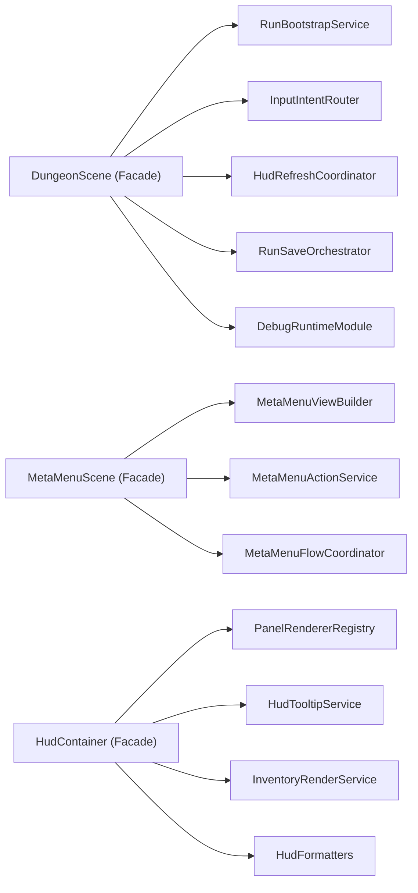

# Phase 5.1 架构底座收敛与超级类消减实施文档（PR 级）

**日期**: 2026-03-04  
**阶段**: Phase 5 / 5.1  
**优先级**: P0（第一优先级）  
**目标摘要**: 对 `DungeonScene.ts`、`MetaMenuScene.ts`、`HudContainer.ts` 进行更深层职责重构，完成 A/B 两段压线并锁定 C 段终态路径，建立可持续演进的场景与 UI 底座。

**关联文档**:
1. `docs/plans/phase5/2026-03-04-phase5-deep-review-and-roadmap.md`
2. `docs/plans/phase5/2026-03-04-phase5-0-baseline-freeze-and-observability-governance.md`
3. `docs/plans/phase5/roadmap.md`
4. `docs/plans/phase4/2026-03-03-phase4-4-engineering-convergence-e2-e3-e4.md`

---

## 1. 直接结论

5.1 的本质是“拆地基”，不是“做薄封装”：

1. `DungeonScene` 只保留 Phaser 生命周期和模块装配，运行细节下沉到 `run/input/hud/save/debug` 组件。
2. `MetaMenuScene` 拆成 `view-model + action service + flow coordinator`，去掉一类里混写渲染、业务、跳转。
3. `HudContainer` 拆成 `panel renderer + tooltip service + inventory diff + formatters`，容器只做编排。
4. `Record<string, any>` 在 `scenes/dungeon/*` 里从 18 处清零，改为 typed host ports。

5.1 的阶段化压线：

1. 阶段 A（结构解耦）: `DungeonScene <= 2300`，`MetaMenuScene <= 950`，`HudContainer <= 850`
2. 阶段 B（深层重构）: `DungeonScene <= 1800`，`MetaMenuScene <= 780`，`HudContainer <= 620`
3. 阶段 C（终态冻结，5.7 完成）: `DungeonScene <= 1500`，`MetaMenuScene <= 650`，`HudContainer <= 450`

---

## 2. 设计约束（5.1 必须遵守）

### 2.1 语义稳定约束

1. 不改核心玩法规则（伤害、暴击、成长、掉落、事件结算）。
2. 不改存档语义，只允许做“结构搬迁 + 类型收敛”。

### 2.2 分层边界约束

1. `DungeonScene` 禁止新增业务计算逻辑，只允许 wiring 和生命周期调度。
2. `scenes/dungeon/*` 的 runtime module 不得依赖 DOM。
3. HUD 层只消费快照，不反向写领域状态。

### 2.3 类型安全约束

1. 逐步替换 `Record<string, any>`，不得新增新的 any-host 别名。
2. host port 的演进必须“先接口、后实现、再收敛调用点”。

### 2.4 回滚约束

1. 每个 PR 必须保留可回滚边界，禁止跨模块大爆炸提交。
2. 关键路径抽离需有 regression tests 或 smoke checklist 对应。

---

## 3. 现状与问题证据（5.1 输入）

### 3.1 体量与预算（2026-03-04 实测）

| 文件 | 当前行数 | 当前预算 | 预算余量 |
|---|---:|---:|---:|
| `DungeonScene.ts` | 2581 | 2600 | 19 |
| `MetaMenuScene.ts` | 1092 | 1200 | 108 |
| `HudContainer.ts` | 1079 | 1100 | 21 |

### 3.2 结构风险

1. `DungeonScene` 当前仍承担输入意图、路径失败处理、run bootstrap、HUD 刷新编排等多域职责。
2. `MetaMenuScene` 同时处理 UI 构建、按钮行为、meta 变更和 run 切换流程。
3. `HudContainer` 仍混合渲染、tooltip、inventory 映射、格式化逻辑。

### 3.3 类型债务

1. `apps/game-client/src/scenes/dungeon` 下 `Record<string, any>` 仍有 18 处。
2. 多个 runtime/service 使用 `*Host = Record<string, any>`，影响可维护性与重构安全。

---

## 4. 范围与非目标

### 4.1 范围

1. `DungeonScene` 深层拆分（bootstrap/input/hud refresh/save orchestration）。
2. `MetaMenuScene` view/action/flow 解耦。
3. `HudContainer` panel 体系与 formatter/tooltip 收敛。
4. `scenes/dungeon/*` any-host 清零与 typed port 替换。
5. 架构预算阈值与跨层依赖门禁收紧。

### 4.2 非目标

1. 不在 5.1 引入移动可达性算法改造（留给 5.2）。
2. 不在 5.1 引入战斗体感机制（留给 5.3）。
3. 不在 5.1 引入新玩法系统（留给 5.6）。

---

## 5. 目标结构（5.1 结束态）



### 5.1 组件职责定义

1. `RunBootstrapService`
   - 负责 run 初始化、daily/meta 预处理、场景启动前校准。
2. `InputIntentRouter`
   - 统一鼠标/键盘输入优先级，输出移动/攻击/交互意图。
3. `HudRefreshCoordinator`
   - 基于 UI snapshot 决定各面板刷新时机，控制短时高亮生命周期。
4. `MetaMenuViewBuilder`
   - 只做 view model 组装，不处理业务副作用。
5. `MetaMenuActionService`
   - 处理购买、锻造、变异选择、开跑/续跑/放弃等业务动作。
6. `InventoryRenderService`
   - 负责装备/背包渲染与差异标记，避免容器层堆叠细节。

### 5.2 类型端口草案

```ts
export interface DungeonRuntimeHost {
  run: RunState;
  player: PlayerState;
  dungeon: DungeonLayout;
  eventBus: EventBus;
  nowMs(): number;
}

export interface MetaMenuPorts {
  readMeta(): MetaProgression;
  commitMeta(next: MetaProgression): void;
  openRun(mode: "new" | "continue"): void;
}
```

---

## 6. PR 级实施计划（5.1）

> 规则：按 `PR-5.1-01 -> PR-5.1-06` 顺序推进。

### PR-5.1-01：DungeonScene 启动链路收敛

**目标**: 抽离 run bootstrap 与场景启动配置。

**新增文件（建议）**:
1. `apps/game-client/src/scenes/dungeon/run/RunBootstrapService.ts`
2. `apps/game-client/src/scenes/dungeon/run/RunBootstrapTypes.ts`

**修改文件（建议）**:
1. `apps/game-client/src/scenes/DungeonScene.ts`
2. `apps/game-client/src/scenes/dungeon/run/RunStateRestorer.ts`

**验收标准**:
1. run 初始化路径不回归。
2. `DungeonScene` 行数下降并且不新增行为分支。

### PR-5.1-02：输入意图路由下沉

**目标**: 把鼠标/键盘/目标切换逻辑从 Scene 主类拆出。

**新增文件（建议）**:
1. `apps/game-client/src/scenes/dungeon/input/InputIntentRouter.ts`
2. `apps/game-client/src/scenes/dungeon/input/MovementIntentService.ts`

**修改文件（建议）**:
1. `apps/game-client/src/scenes/DungeonScene.ts`
2. `apps/game-client/src/systems/MovementSystem.ts`

**验收标准**:
1. 点击移动、方向键移动行为等价。
2. 路径失败日志与 replay input 记录不回归。

### PR-5.1-03：HUD 刷新编排收敛

**目标**: 抽离 HUD 刷新时机控制与高亮生命周期。

**新增文件（建议）**:
1. `apps/game-client/src/scenes/dungeon/ui/HudRefreshCoordinator.ts`
2. `apps/game-client/src/scenes/dungeon/ui/HudRefreshPolicy.ts`

**修改文件（建议）**:
1. `apps/game-client/src/scenes/DungeonScene.ts`
2. `apps/game-client/src/ui/hud/HudContainer.ts`

**验收标准**:
1. HUD 刷新稳定，无重复绑定/闪烁。
2. 完成阶段 A 压线目标：`2300 / 950 / 850`。

### PR-5.1-04：MetaMenu 深拆（View/Action/Flow）

**目标**: 将 `MetaMenuScene` 拆成可测试、可复用的服务边界。

**新增文件（建议）**:
1. `apps/game-client/src/scenes/meta/MetaMenuViewBuilder.ts`
2. `apps/game-client/src/scenes/meta/MetaMenuActionService.ts`
3. `apps/game-client/src/scenes/meta/MetaMenuFlowCoordinator.ts`

**修改文件（建议）**:
1. `apps/game-client/src/scenes/MetaMenuScene.ts`
2. `apps/game-client/src/scenes/meta/types.ts`

**验收标准**:
1. 元成长操作流程等价。
2. `MetaMenuScene` 进入阶段 B 目标区间（<=780）。

### PR-5.1-05：HudContainer 深拆（Tooltip/Inventory/Formatter）

**目标**: 让容器类只做编排，细节归位到服务。

**新增文件（建议）**:
1. `apps/game-client/src/ui/hud/HudTooltipService.ts`
2. `apps/game-client/src/ui/hud/InventoryRenderService.ts`
3. `apps/game-client/src/ui/hud/HudFormatters.ts`

**修改文件（建议）**:
1. `apps/game-client/src/ui/hud/HudContainer.ts`
2. `apps/game-client/src/ui/hud/panels/*`

**验收标准**:
1. tooltip 与 inventory 交互行为无回归。
2. `HudContainer` 行数达到阶段 B 目标（<=620）。

### PR-5.1-06：Typed Host Ports 收口与预算门禁收紧

**目标**: 清零 any-host 并固化新的架构门槛。

**修改文件（建议）**:
1. `apps/game-client/src/scenes/dungeon/**`（替换 `Record<string, any>`）
2. `scripts/check-architecture-budgets.sh`
3. `docs/plans/phase5/roadmap.md`

**关键动作**:
1. `Record<string, any>` 在 `scenes/dungeon/*` 清零。
2. 预算阈值收紧到阶段 B 值。
3. 新增跨层依赖巡检（Scene 不得直接操作面板细节）。

**验收标准**:
1. any-host 引用计数为 0。
2. 阶段 B 压线稳定通过。
3. 阶段 C 终态路径与责任清单冻结到 5.7。

---

## 7. 验证与回归清单

### 7.1 自动化

```bash
pnpm --filter @blodex/game-client typecheck
pnpm --filter @blodex/game-client test
pnpm --filter @blodex/core test
pnpm check:architecture-budget
pnpm ci:check
```

### 7.2 建议新增/补强测试

1. `InputIntentRouter`：鼠标/键盘冲突优先级与去抖行为。
2. `MetaMenuActionService`：购买/锻造/开跑边界条件。
3. `HudTooltipService`：同帧多次悬停与快速切换生命周期。
4. typed host ports：编译期约束（缺字段不可通过 typecheck）。

### 7.3 手动冒烟

1. 默认优先使用金手指（debug cheats）快速通关到目标验证节点（开局、事件、清层、结算）；必要时补 1 轮非金手指复测。
2. Normal 一局全流程（开局->战斗->事件->清层->结算）。
3. MetaMenu 完整闭环（强化->购买->开跑/续跑）。
4. HUD 高频操作（装备替换、物品使用、tooltip 快速切换）。

---

## 8. 风险与止损策略

| 风险 | 等级 | 触发信号 | 止损策略 |
|---|:---:|---|---|
| 拆分后依赖反向耦合 | 高 | Scene 与子模块循环依赖增加 | 引入 ports 层并在 PR 中阻断反向引用 |
| any-host 替换引发编译爆炸 | 高 | 大量类型错误连锁 | 分模块逐步替换，先加 interface 适配层 |
| 行数下降但复杂度未降 | 中 | 逻辑只是搬文件 | 要求每个模块具备独立测试和职责声明 |
| HUD 深拆带来交互回归 | 中 | tooltip/装备行为异常 | 保留回归清单，先回滚呈现层 PR |

回滚原则：

1. 5.1 按 PR 粒度回滚，禁止跨 PR 混回滚。
2. typed ports 出现连锁风险时，优先回滚端口替换 PR，不回滚已验证业务拆分。

---

## 9. 5.1 出口门禁（Done 定义）

1. 阶段 A 与阶段 B 目标全部达成：`2300/950/850` 与 `1800/780/620`。
2. `scenes/dungeon/*` 下 `Record<string, any>` 清零。
3. `DungeonScene` 仅保留 façade 职责，不再承载细粒度业务流程。
4. 自动化与手动冒烟通过。

---

## 10. 与 5.2 的交接清单

进入 5.2 前必须确认：

1. 结构性重构已稳定，不再出现大类回涨趋势。
2. 新增移动可达性改造可直接挂载到拆分后的输入与移动模块。
3. 5.2 验证可以直接复用 5.0 指标（路径失败率、输入延迟）。
