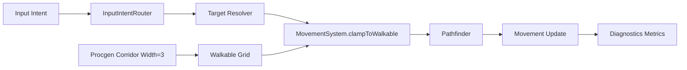

# Phase 5.2 移动与可达性基础（P0）实施文档（PR 级）

**日期**: 2026-03-04  
**阶段**: Phase 5 / 5.2  
**目标摘要**: 优先解决“点不到、走不过、卡边缘”的基础体验痛点，提升地牢移动可达性与输入预期一致性。

**关联文档**:
1. `docs/plans/phase5/2026-03-04-phase5-deep-review-and-roadmap.md`
2. `docs/plans/phase5/2026-03-04-phase5-1-foundation-convergence-and-god-class-reduction.md`
3. `docs/plans/phase5/2026-03-04-phase5-0-baseline-freeze-and-observability-governance.md`

---

## 1. 直接结论

5.2 的核心不是“移动更快”，而是“移动更可靠”：

1. 地图几何改造：走廊从单格扩到三格（可配置），降低狭窄区域误点。
2. 路径吸附改造：`clampToWalkable` 搜索半径 `±2 -> ±4`，并加优先策略（离目标近 + 与玩家连通）。
3. 输入模型改造：在方向键基础上增加 WASD 别名，统一键鼠冲突处理规则。
4. 可观测改造：路径失败日志去重并形成统计，作为 5.2 交付指标。

5.2 完成后的硬结果：

1. 窄区域点击可达率显著提升。
2. `aborted_unreachable` 日志频率下降且可量化对比。
3. 键盘移动体验从“只能方向键”升级为“方向键 + WASD 等价”。

---

## 2. 设计约束（5.2 必须遵守）

### 2.1 确定性约束

1. `procgen` 改造后同 seed 必须保持 deterministic。
2. 连通性、隐藏房入口、刷怪点不可被走廊改造破坏。

### 2.2 语义稳定约束

1. 不改玩家移速、伤害、怪物 AI 参数。
2. 不改变战斗判定语义，只优化可达与路径吸附。

### 2.3 输入一致性约束

1. 键盘和鼠标冲突时必须有固定优先级（可文档化、可测试）。
2. replay input 记录格式保持兼容。

---

## 3. 现状与问题证据（5.2 输入）

### 3.1 地图与路径现状

1. `procgen.carveCorridor` 仅刻单格路径。
2. 房间连接目前是顺序链式（`for i=1..rooms.length-1`）。
3. `MovementSystem.clampToWalkable` 当前搜索窗口是 `±2`。

### 3.2 输入现状

1. `DungeonScene.bindMovementKeys()` 当前仅绑定 `createCursorKeys()`。
2. `updateKeyboardMoveIntent()` 仅消费方向键状态。
3. 鼠标点击与键盘输入共存，但优先级与切换策略可读性不足。

### 3.3 指标现状

1. 存在 `log.pathfinding.aborted_unreachable` 日志。
2. 当前缺少每局聚合统计（失败率、输入延迟分位数）。

---

## 4. 范围与非目标

### 4.1 范围

1. `packages/core/src/procgen.ts`（走廊宽度与通路连通性）。
2. `apps/game-client/src/systems/MovementSystem.ts`（clamp 吸附策略）。
3. `apps/game-client/src/scenes/DungeonScene.ts` 或对应输入模块（WASD + 冲突策略）。
4. diagnostics 指标和日志去重策略。

### 4.2 非目标

1. 不在 5.2 完成拓扑升级（MST/回边留到 5.4）。
2. 不在 5.2 引入战斗触感改造（留到 5.3）。
3. 不在 5.2 修改事件、商店、Endless 规则。

---

## 5. 目标结构（5.2 结束态）



### 5.1 关键策略定义

1. `corridorHalfWidth`
   - 默认 `1`，使走廊有效宽度为 3 格。
2. `clamp search radius`
   - 默认 `4`，可配置并记录 diagnostics。
3. `input priority`
   - 推荐策略：事件面板开启时忽略移动；否则最近输入优先并带短窗口去抖。

---

## 6. PR 级实施计划（5.2）

> 规则：先 core、后 movement、再输入路由与指标收口。

### PR-5.2-01：走廊加宽与连通性回归

**目标**: 把走廊刻画从单格扩展为三格，保留 deterministic 与全连通。

**修改文件（建议）**:
1. `packages/core/src/procgen.ts`
2. `packages/core/src/contracts/types.ts`（如新增 corridor 元数据）
3. `packages/core/src/__tests__/procgen.test.ts`

**关键动作**:
1. 为 `carveCorridor` 增加宽度参数（默认 1 -> 宽度 3）。
2. 走廊边缘处理防越界。
3. 补充连通性与 hidden room 入口回归测试。

**验收标准**:
1. 同 seed 输出稳定。
2. 地图全连通，无隐藏房断链。
3. `procgen` 测试全绿。

### PR-5.2-02：clamp 吸附策略升级

**目标**: 提升边缘点击命中率并减少空路径。

**修改文件（建议）**:
1. `apps/game-client/src/systems/MovementSystem.ts`
2. `apps/game-client/src/systems/__tests__/movementSystem.test.ts`

**关键动作**:
1. 搜索半径 `±2 -> ±4`。
2. 最近点选择增加 tie-break：优先可连通且靠近目标。
3. 为不可达边缘案例补单测。

**验收标准**:
1. 典型窄通道点击案例返回非空路径。
2. 路径搜索耗时无明显退化。

### PR-5.2-03：WASD 输入与冲突规则收敛

**目标**: 完成键盘移动兼容与意图路由规则固化。

**修改文件（建议）**:
1. `apps/game-client/src/scenes/DungeonScene.ts`（或 `InputIntentRouter`）
2. `apps/game-client/src/scenes/dungeon/input/*`
3. `apps/game-client/src/scenes/dungeon/__tests__/input-intent-router.test.ts`

**关键动作**:
1. 新增 `W/A/S/D` 绑定并与方向键等价。
2. 明确键鼠冲突优先级与冷却窗口。
3. 保持 replay input 事件兼容。

**验收标准**:
1. 方向键与 WASD 行为一致。
2. 鼠标点击后键盘接管时行为可预测且无抖动。

### PR-5.2-04：路径失败日志去重与指标导出

**目标**: 形成可比较的“移动可达性指标”。

**修改文件（建议）**:
1. `apps/game-client/src/scenes/dungeon/diagnostics/DiagnosticsService.ts`
2. `apps/game-client/src/scenes/DungeonScene.ts`
3. `apps/game-client/src/scenes/dungeon/debug/DebugCommandRegistry.ts`

**关键动作**:
1. 对同位置/同时间窗口的不可达日志去重。
2. 输出每局 `pathAbortRate` 与 `inputToMoveLatencyP50/P95`。
3. 文档记录 5.2 前后对比样本。

**验收标准**:
1. 日志不刷屏。
2. 指标可用于阶段对比。

---

## 7. 验证与回归清单

### 7.1 自动化

```bash
pnpm --filter @blodex/core test
pnpm --filter @blodex/game-client test
pnpm --filter @blodex/game-client typecheck
pnpm check:architecture-budget
pnpm ci:check
```

### 7.2 手动冒烟

1. 默认优先使用金手指（debug cheats）快速推进到窄走廊/障碍/事件等目标场景进行验证；必要时补 1 轮非金手指复测。
2. 走廊转角、障碍边缘、窄口点击（每类至少 10 次）。
3. 方向键与 WASD 交替移动，确认无冲突抖动。
4. 事件面板开启/关闭下输入拦截符合预期。
5. 观察 diagnostics：路径失败率对比 5.0 有下降。

### 7.3 关键指标（5.2 出口）

1. `pathAbortRate` 比 5.0 baseline 明显下降（建议目标 >= 30% 改善）。
2. `inputToMoveLatencyP95` 稳定在可接受区间（建议 `< 180ms`）。

---

## 8. 风险与止损策略

| 风险 | 等级 | 触发信号 | 止损策略 |
|---|:---:|---|---|
| 走廊加宽导致房间形态污染 | 中 | 房间边缘被异常侵蚀 | 增加 carve 边界保护和回归样本 |
| clamp 半径扩大带来误吸附 | 中 | 点击目标与移动落点偏差过大 | 增加 tie-break 规则与最大偏移阈值 |
| WASD 与技能键冲突 | 中 | Q/W/E/R 等快捷冲突 | 统一输入映射并保留白名单保留键 |
| 指标采样影响性能 | 低 | 高频战斗帧抖动 | 默认聚合采样，避免逐帧重计算 |

回滚原则：

1. 先回滚输入映射，再回滚路径吸附，最后回滚 procgen。
2. 保留 diagnostics 统计逻辑，便于定位回滚后差异。

---

## 9. 5.2 出口门禁（Done 定义）

1. 走廊宽度改造上线且 deterministic 测试通过。
2. `clampToWalkable` 升级并通过边缘案例单测。
3. WASD + 方向键兼容上线并通过手动验证。
4. 路径失败率与输入延迟指标可导出且改善可见。

---

## 10. 与 5.3 的交接清单

进入 5.3 前必须确认：

1. 可达性问题不再是主要体验瓶颈。
2. 输入层边界已收敛，可承接 hitstop/击退输入反馈。
3. 5.2 的指标体系可复用到战斗体感改造评估。
