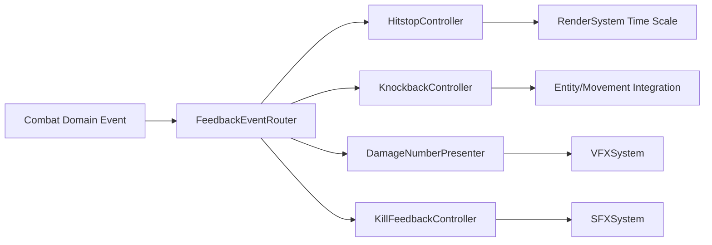

# Phase 5.3 战斗触感核心（P0/P1）实施文档（PR 级）

**日期**: 2026-03-04  
**阶段**: Phase 5 / 5.3  
**目标摘要**: 在不改变战斗数值语义的前提下，构建“命中-受击-击杀”反馈闭环，提升玩家即时体感。

**关联文档**:
1. `docs/plans/phase5/2026-03-04-phase5-deep-review-and-roadmap.md`
2. `docs/plans/phase5/2026-03-04-phase5-2-mobility-and-reachability-p0.md`
3. `docs/plans/phase4/2026-03-03-phase4-5-experience-enhancement-i-g1-g2-g3-g5.md`

---

## 1. 直接结论

5.3 不是“堆特效”，而是做可控的反馈协议：

1. 引入轻量 combat hitstop（默认开启、可配置、可限频）。
2. 增加击退反馈（轻击/重击分层）但不改伤害公式。
3. 伤害数字样式分层（普通/暴击/高伤）并补击杀反馈特征。
4. 保持 deterministic 规则层不变，所有改动限定在表现与反馈通道。

5.3 完成后的硬结果：

1. 普通命中可稳定感知，不再依赖日志判断是否击中。
2. 击杀时刻有明确反馈峰值（视觉+音频）。
3. 自动化回归证明 DPS、击杀时序、成长收益语义未漂移。

---

## 2. 设计约束（5.3 必须遵守）

### 2.1 数值语义约束

1. 禁止修改伤害、暴击、攻速、经验、掉落计算公式。
2. 反馈系统只消费事件，不反向写入战斗判定。

### 2.2 性能与稳定性约束

1. hitstop 必须有频率上限，避免连续触发造成输入冻结感。
2. 粒子与浮字需对象池或节流，避免高压战斗掉帧。
3. 新增音频变体必须进入 `audio-plan -> audio-manifest -> assets:audio:validate` 链路。

### 2.3 一致性约束

1. 普通、精英、Boss 三类战斗反馈规则一致，仅强度差异化。
2. 多源反馈（VFX/SFX/HUD）必须基于同一事件时序。
3. 音频资源缺失时必须回退到默认 SFX，禁止运行时静默失败。

---

## 3. 现状与问题证据（5.3 输入）

### 3.1 当前反馈现状

1. 已有命中闪白、浮字、抖屏和武器反馈分支。
2. 普通战斗路径缺少通用 hitstop；当前仅存在 boss phase 的轻微 `timeScale=0.92` 效果。
3. 连续命中下反馈峰值不稳定，击杀时刻辨识度仍偏弱。

### 3.2 风险点

1. 若直接叠加全局冻结，可能打断输入与节奏。
2. 若击退直接改实体位置，可能引入穿模或卡格。

---

## 4. 范围与非目标

### 4.1 范围

1. hitstop 管线（可调参数、触发条件、限频机制）。
2. 击退反馈（按攻击类型和目标状态分层）。
3. 伤害数字分层样式与击杀反馈。
4. 相关回归测试与性能守护指标。
5. 新增战斗音频资源计划与清单校验。

### 4.2 非目标

1. 不改战斗平衡与角色成长。
2. 不改 Boss Telegraph/Endless Mutator 规则。
3. 不做大规模美术/音频重资源制作（优先复用现有素材）。

---

## 5. 目标结构（5.3 结束态）



### 5.1 推荐接口草案

```ts
export interface HitstopConfig {
  normalMs: number;
  critMs: number;
  maxTriggersPerSecond: number;
}

export interface KnockbackRequest {
  sourceId: string;
  targetId: string;
  distanceCells: number;
  durationMs: number;
}
```

---

## 6. PR 级实施计划（5.3）

### PR-5.3-01：Hitstop 管线落地

**目标**: 增加可控、轻量、可回退的命中停顿反馈。

**新增文件（建议）**:
1. `apps/game-client/src/systems/feedback/HitstopController.ts`
2. `apps/game-client/src/systems/feedback/HitstopConfig.ts`

**修改文件（建议）**:
1. `apps/game-client/src/systems/feedbackEventRouter.ts`
2. `apps/game-client/src/systems/RenderSystem.ts`
3. `apps/game-client/src/scenes/DungeonScene.ts`

**验收标准**:
1. 普通命中与暴击命中都有可感知差异。
2. 高频战斗不出现持续冻结。
3. 可通过配置快速降级关闭。

### PR-5.3-02：击退反馈接入

**目标**: 增加受击空间反馈，不破坏碰撞与寻路稳定性。

**新增文件（建议）**:
1. `apps/game-client/src/systems/feedback/KnockbackController.ts`
2. `apps/game-client/src/systems/feedback/KnockbackResolver.ts`

**修改文件（建议）**:
1. `apps/game-client/src/systems/CombatSystem.ts`
2. `apps/game-client/src/systems/EntityManager.ts`
3. `apps/game-client/src/systems/MovementSystem.ts`

**验收标准**:
1. 击退不会穿墙/越界/卡死。
2. 伤害结算与击杀时序保持等价。

### PR-5.3-03：伤害数字分层与击杀反馈增强

**目标**: 提升“输出有效性”和“击杀完成”的可感知强度。

**新增文件（建议）**:
1. `apps/game-client/src/systems/feedback/DamageNumberProfile.ts`
2. `apps/game-client/src/systems/feedback/KillFeedbackProfile.ts`

**修改文件（建议）**:
1. `apps/game-client/src/systems/VFXSystem.ts`
2. `apps/game-client/src/systems/SFXSystem.ts`
3. `apps/game-client/src/i18n/catalog/en-US.ts`
4. `apps/game-client/src/i18n/catalog/zh-CN.ts`
5. `assets/source-prompts/audio-plan.yaml`
6. `assets/generated/audio-manifest.json`
7. `apps/game-client/public/audio/*`（新增 SFX 变体时）

**关键动作**:
1. 为新增击杀/暴击反馈定义 `eventKey` 与音频命名（例如 `sfx_combat_hit_02`）。
2. 执行 `pnpm assets:audio:compile` 生成或刷新 `audio-manifest`。
3. 执行 `pnpm assets:audio:validate`，确保引用、文件存在性与去重约束通过。

**验收标准**:
1. 普通/暴击/高伤数字可区分且不遮挡核心视野。
2. 击杀反馈稳定触发且无音效堆积。
3. 新增音频资源校验通过，缺失资源时 fallback 生效。

### PR-5.3-04：数值回归与性能门禁补强

**目标**: 确保“体感提升”不引入规则偏移与性能回退。

**新增文件（建议）**:
1. `apps/game-client/src/systems/__tests__/combat-feedback-regression.test.ts`
2. `apps/game-client/src/systems/__tests__/hitstop-rate-limit.test.ts`

**修改文件（建议）**:
1. `docs/plans/phase5/metrics/2026-03-04-phase5-3-combat-feel-compare.md`

**验收标准**:
1. 战斗输出相关回归测试全绿。
2. 性能指标无未解释退化。

---

## 7. 验证与回归清单

### 7.1 自动化

```bash
pnpm --filter @blodex/game-client typecheck
pnpm --filter @blodex/game-client test
pnpm --filter @blodex/core test
pnpm assets:audio:compile
pnpm assets:audio:validate
pnpm assets:validate
pnpm check:architecture-budget
pnpm ci:check
```

### 7.2 手动冒烟

1. 默认优先使用金手指（debug cheats）快速推进到 Normal/Hard/Boss 关键战斗节点完成验证；必要时补 1 轮非金手指复测。
2. Normal/Hard/Boss 各进行至少 1 局，观察命中/击杀反馈稳定性。
3. 连续高频命中（高攻速或群怪）验证 hitstop 限频是否生效。
4. 边缘地形战斗验证击退不会造成穿模与卡死。
5. 模拟缺失音频资源，确认 SFX fallback 与日志告警符合预期。

### 7.3 指标对比（5.3 出口）

1. 玩家可在 1 秒内识别“命中是否生效”。
2. 击杀反馈触发成功率接近 100%（排除合法免疫场景）。
3. 战斗流程帧率与输入响应保持稳定。

---

## 8. 风险与止损策略

| 风险 | 等级 | 触发信号 | 止损策略 |
|---|:---:|---|---|
| hitstop 过强导致操作粘滞 | 高 | 高频战斗可操作性下降 | 立即下调停顿时长并启用限频 |
| 击退引发碰撞异常 | 高 | 穿墙/卡位/单位丢失 | 加入位移合法性校验与回退位置 |
| 反馈堆叠造成性能回退 | 中 | 粒子与音效峰值过高 | 引入对象池和同帧上限 |
| 体感增强误改规则语义 | 中 | DPS 或击杀时序漂移 | 规则回归测试阻断合并 |

回滚原则：

1. 先回滚表现层 profile，再回滚 hitstop/knockback 控制器。
2. 始终保留规则层改动最小化，确保快速止损。

---

## 9. 5.3 出口门禁（Done 定义）

1. hitstop、击退、伤害数字分层、击杀反馈全部落地并可配置。
2. 战斗数值语义回归通过。
3. 性能与稳定性门禁通过。
4. 手动冒烟覆盖 Normal/Hard/Boss 全场景。
5. 若存在音频增量，`audio-plan/audio-manifest/public/audio` 三层一致且通过校验。

---

## 10. 与 5.4 的交接清单

进入 5.4 前必须确认：

1. 战斗反馈已稳定，不再干扰移动与输入层。
2. 拓扑改造可独立评估，不被战斗表现噪音干扰。
3. 5.3 指标文档可作为 5.7 发布材料输入。
