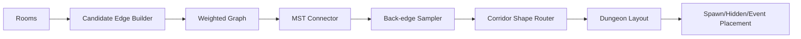

# Phase 5.4 地牢拓扑升级（P1）实施文档（PR 级）

**日期**: 2026-03-04  
**阶段**: Phase 5 / 5.4  
**目标摘要**: 将当前“顺序链式房间连接”升级为“连通且可分支的拓扑网络”，提升重复游玩差异性并保持 deterministic。

**关联文档**:
1. `docs/plans/phase5/2026-03-04-phase5-deep-review-and-roadmap.md`
2. `docs/plans/phase5/2026-03-04-phase5-2-mobility-and-reachability-p0.md`
3. `docs/plans/phase5/2026-03-04-phase5-3-combat-feel-core-p0-p1.md`
4. `docs/plans/phase4/2026-03-03-phase4-3-scene-decomposition-m3-hazard-progression.md`

---

## 1. 直接结论

5.4 的核心是拓扑质量，不是地图面积：

1. 将房间连接从“线性顺序连接”升级为“候选边构图 -> MST 保底连通 -> 回边形成环路”。
2. 走廊形态从单一路径扩展为直连、L 形、双拐策略集合。
3. 隐藏房、刷怪点、事件点、Boss 入口需在新拓扑下保持稳定可达。
4. 所有策略必须 seed 驱动并可回放复现。

5.4 完成后的硬结果：

1. 地图不再以单链为主，出现可感知分支与环路。
2. 同难度多 seed 的路径决策差异明显上升。
3. 不出现断连、死路锁流程、隐藏房异常入口等回归。

---

## 2. 设计约束（5.4 必须遵守）

### 2.1 连通性约束

1. 主流程房间必须 100% 连通。
2. 隐藏房入口必须可达且只在被揭示后生效。

### 2.2 确定性约束

1. 拓扑生成和回边选择全部基于 seed RNG。
2. 同 seed 下 `rooms/corridors/layoutHash` 必须稳定一致。

### 2.3 玩法稳定约束

1. 不改事件/Boss 触发语义。
2. 不改怪物强度与奖励公式。

---

## 3. 现状与问题证据（5.4 输入）

### 3.1 当前连接策略

1. `generateDungeon` 使用 `for i=1..rooms.length-1` 顺序连接相邻房间。
2. 输出 `corridors.length` 近似 `rooms.length - 1`，环路概率极低。

### 3.2 当前问题

1. 路线选择单一，重复局体验趋同。
2. 高层地图探索策略弱化，玩家决策空间有限。

### 3.3 依赖关系

1. 5.2 的走廊加宽将影响新拓扑的碰撞与可读性。
2. 5.3 的战斗反馈会影响路线风险感知，需要在 5.4 验证联动。

---

## 4. 范围与非目标

### 4.1 范围

1. `packages/core/src/procgen.ts` 拓扑连接器重构。
2. 走廊形态策略库与对应测试。
3. 刷怪点/隐藏房/事件点在新拓扑下的一致性校验。
4. 指标输出（分支数、环路数、平均路径长度）。

### 4.2 非目标

1. 不在 5.4 引入新战斗机制。
2. 不在 5.4 做大规模视觉资源重绘。
3. 不在 5.4 变更存档 schema。

---

## 5. 目标结构（5.4 结束态）



### 5.1 关键组件定义

1. `CandidateEdgeBuilder`
   - 计算房间中心距离并生成候选边。
2. `MstConnector`
   - 保证最小连通骨架。
3. `BackEdgeSampler`
   - 按 seed 和楼层参数追加环路边。
4. `CorridorShapeRouter`
   - 为每条边选择走廊形态并返回路径点。

### 5.2 推荐接口草案

```ts
export interface TopologyConfig {
  extraEdgeRatio: number;
  corridorShapeWeights: {
    straight: number;
    lShape: number;
    doubleBend: number;
  };
}
```

---

## 6. PR 级实施计划（5.4）

### PR-5.4-01：MST 连接器引入

**目标**: 先保证“全连通 + 可控复杂度”的主骨架。

**修改文件（建议）**:
1. `packages/core/src/procgen.ts`
2. `packages/core/src/__tests__/procgen.test.ts`

**关键动作**:
1. 候选边构图（房间中心点距离）。
2. 生成 MST 替代顺序连接。
3. 保持 `layoutHash` 与 seed 一致性。

**验收标准**:
1. 全连通率 100%。
2. 同 seed 输出稳定。

### PR-5.4-02：回边策略与环路生成

**目标**: 引入可控环路，提升路径多样性。

**新增文件（建议）**:
1. `packages/core/src/procgenTopology.ts`

**修改文件（建议）**:
1. `packages/core/src/procgen.ts`
2. `packages/core/src/__tests__/procgen.test.ts`

**关键动作**:
1. 按 `extraEdgeRatio` 追加回边。
2. 避免重复边与短环噪声。
3. 输出拓扑指标供 diagnostics 使用。

**验收标准**:
1. 多 seed 下环路比例稳定在期望区间。
2. 无流程断链。

### PR-5.4-03：走廊形态策略化

**目标**: 扩展走廊形态，提高地图视觉与路径差异。

**修改文件（建议）**:
1. `packages/core/src/procgen.ts`
2. `packages/core/src/contracts/types.ts`
3. `packages/core/src/__tests__/procgen.test.ts`

**关键动作**:
1. 支持 `straight/lShape/doubleBend` 三类走廊策略。
2. 保证加宽走廊与形态策略兼容。
3. 增强边界保护，避免 carve 越界。

**验收标准**:
1. 形态策略切换 deterministic。
2. 可读性不下降（手动对比截图可识别）。

### PR-5.4-04：生态点位联调与回归收口

**目标**: 确保隐藏房、刷怪、事件在新拓扑下稳定运行。

**修改文件（建议）**:
1. `packages/core/src/procgen.ts`
2. `packages/core/src/challengeRoom.ts`
3. `packages/core/src/__tests__/integration-biome-hazard-affix.test.ts`

**关键动作**:
1. 刷怪点生成规则适配新拓扑。
2. 隐藏房入口规则回归。
3. 记录 topology 指标样本并入文档。

**验收标准**:
1. Normal/Hard/Endless 关键流程均可完成。
2. 隐藏房与事件点不丢失。

---

## 7. 验证与回归清单

### 7.1 自动化

```bash
pnpm --filter @blodex/core test
pnpm --filter @blodex/game-client test
pnpm check:architecture-budget
pnpm ci:check
```

### 7.2 建议新增测试

1. `procgen` property test：多 seed 连通性和 determinism。
2. 拓扑指标 test：`corridorCount/loopCount` 落在合理范围。
3. 隐藏房与刷怪点 integration test。

### 7.3 手动冒烟

1. 默认优先使用金手指（debug cheats）快速推进到多 seed、Hard/Endless、Boss 入口等目标场景完成验证；必要时补 1 轮非金手指复测。
2. 多 seed Normal 地图走图对比（至少 10 组）。
3. Hard/Endless 验证关键点位可达。
4. Boss 层入口与结算流程完整性检查。

---

## 8. 风险与止损策略

| 风险 | 等级 | 触发信号 | 止损策略 |
|---|:---:|---|---|
| 拓扑重构导致断连 | 高 | 出现不可达关键房间 | 连通性测试阻断 + 回滚 connector |
| 环路过多影响节奏 | 中 | 地图过绕导致时长异常 | 限制 extraEdgeRatio 并分难度配置 |
| 走廊形态增加可读性负担 | 中 | 玩家迷路反馈增加 | 优先保留直连比例并优化 mini-map 提示 |
| 隐藏房入口异常 | 中 | 揭示后仍不可达 | 独立回归 hidden room carve 逻辑 |

回滚原则：

1. 可先回滚回边策略，保留 MST 主骨架。
2. 走廊形态异常时可降级到 `straight + lShape`。

---

## 9. 5.4 出口门禁（Done 定义）

1. 拓扑由单链升级为 `MST + 回边`。
2. 地图连通性、determinism、关键流程可达性全部通过。
3. topology 指标可导出并归档。
4. 无 P0 回归缺陷遗留。

---

## 10. 与 5.5 的交接清单

进入 5.5 前必须确认：

1. 地图拓扑已稳定，视觉增强不再承担“掩盖拓扑问题”的补丁职责。
2. 可提供标准截图/seed 样本给氛围与可读性阶段复用。
3. 关键流程冒烟矩阵已覆盖新拓扑。
