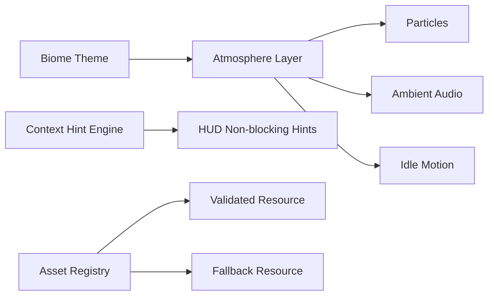

# Phase 5.5 氛围与可读性增强（P1）实施文档（PR 级）

**日期**: 2026-03-04  
**阶段**: Phase 5 / 5.5  
**目标摘要**: 以低风险方式提升视觉氛围与信息可读性，强化“看得清、看得懂、看得快”的体验质量。

**关联文档**:
1. `docs/plans/phase5/2026-03-04-phase5-deep-review-and-roadmap.md`
2. `docs/plans/phase5/2026-03-04-phase5-4-dungeon-topology-upgrade-p1.md`
3. `docs/plans/phase4/2026-03-03-phase4-5-experience-enhancement-i-g1-g2-g3-g5.md`

---

## 1. 直接结论

5.5 聚焦“可感知但不侵入”的体验增强：

1. Idle 微动画与环境粒子：提升场景生命感，不干扰战斗读图。
2. Biome 氛围层补强：在现有主题基础上增加轻量差异（色调、粒子、ambient loop 策略）。
3. 新手首局上下文提示：使用非阻断提示降低理解成本。
4. 资产缺口治理：对 `venom_swamp` 等独立地砖不足问题补齐资源计划和降级策略。

5.5 完成后的硬结果：

1. 视觉反馈更丰富，但战斗可读性不下降。
2. 新手关键操作的首次理解成本下降。
3. 资产缺口不再“隐性存在”，有明确清单与 fallback。

---

## 2. 设计约束（5.5 必须遵守）

### 2.1 可读性优先约束

1. 氛围增强不得遮挡伤害数字、敌人预警、掉落提示。
2. 动画和粒子强度要可配置并支持降级。

### 2.2 资源治理约束

1. 新增视觉/音频资源必须进入资产清单与校验流程。
2. 资源未就绪时必须有 fallback，不阻断主流程。

### 2.3 文案与本地化约束

1. 新增提示文案必须中英文同步。
2. 非阻断提示不得替代关键规则提示（避免误导）。

---

## 3. 现状与问题证据（5.5 输入）

### 3.1 氛围与可读性现状

1. 已有 biome 主题和基础反馈，但场景“生命感”仍偏弱。
2. HUD 与战斗信息较完整，缺少首局上下文引导层。

### 3.2 资产缺口现状

1. 当前 biome 视觉仍存在复用资源占比偏高的问题。
2. `venom_swamp` 的独立地砖资源属于已识别缺口，需要明确接入路径。
3. 部分 biome 仍缺独立 ambient loop（重点 `venom_swamp`），需要明确复用或新增决策。

---

## 4. 范围与非目标

### 4.1 范围

1. Idle 微动画与环境粒子增强。
2. Biome 氛围参数补强与 fallback。
3. 新手首局上下文提示与文案接入。
4. 视觉与音频资产缺口清单，以及接入/降级策略。

### 4.2 非目标

1. 不做大规模美术重绘。
2. 不改战斗与成长规则。
3. 不改存档 schema。

---

## 5. 目标结构（5.5 结束态）



### 5.1 关键组件定义

1. `AtmosphereLayerController`
   - 统一管理 biome 氛围参数和特效生命周期。
2. `ContextHintEngine`
   - 根据 run 进度和玩家行为触发一次性提示。
3. `BiomeAssetFallbackRegistry`
   - 为缺失资源提供稳定回退映射。

---

## 6. PR 级实施计划（5.5）

### PR-5.5-01：Idle 与环境粒子增强

**目标**: 提升静态场景生命感与层次感。

**新增文件（建议）**:
1. `apps/game-client/src/systems/atmosphere/IdleMotionController.ts`
2. `apps/game-client/src/systems/atmosphere/BiomeParticleController.ts`

**修改文件（建议）**:
1. `apps/game-client/src/systems/RenderSystem.ts`
2. `apps/game-client/src/scenes/DungeonScene.ts`

**验收标准**:
1. 动画和粒子可感知但不遮挡战斗信息。
2. 性能稳定，无显著帧率回退。

### PR-5.5-02：首局上下文提示引擎

**目标**: 降低新手首次理解成本。

**新增文件（建议）**:
1. `apps/game-client/src/ui/hud/hints/ContextHintEngine.ts`
2. `apps/game-client/src/ui/hud/hints/HintCatalog.ts`

**修改文件（建议）**:
1. `apps/game-client/src/ui/hud/HudContainer.ts`
2. `apps/game-client/src/i18n/catalog/en-US.ts`
3. `apps/game-client/src/i18n/catalog/zh-CN.ts`

**验收标准**:
1. 提示触发准确且仅在关键时机出现。
2. 中英文文案一致并通过 i18n 校验。

### PR-5.5-03：Biome 资产缺口治理与 fallback

**目标**: 对缺口资源建立可执行治理链路。

**修改文件（建议）**:
1. `assets/generated/*`（资源清单）
2. `apps/game-client/src/systems/RenderSystem.ts`
3. `docs/plans/phase5/metrics/2026-03-04-phase5-biome-asset-gap.md`
4. `assets/source-prompts/audio-plan.yaml`
5. `assets/generated/audio-manifest.json`
6. `apps/game-client/public/audio/*`（新增 biome ambient 时）

**关键动作**:
1. 为 `venom_swamp` 增加独立资源接入入口。
2. 为缺失 biome 定义 ambient loop 策略（独立资源或复用回退）并写入清单。
3. 若资源未就绪，强制 fallback 并输出日志告警。
4. 资产接入通过 `pnpm assets:audio:compile && pnpm assets:audio:validate && pnpm assets:validate`。

**验收标准**:
1. 有资源时显示独立主题。
2. 无资源时可平滑降级。
3. ambient loop 切换稳定，无缺失音频报错。

### PR-5.5-04：可读性回归与阈值收口

**目标**: 防止氛围增强压制可读性。

**新增文件（建议）**:
1. `docs/plans/phase5/metrics/2026-03-04-phase5-5-readability-regression.md`

**修改文件（建议）**:
1. `docs/plans/phase5/templates/phase5-smoke-matrix.md`

**验收标准**:
1. 可读性检查项全部通过。
2. 无 P0/P1 可视信息遮挡问题。

---

## 7. 验证与回归清单

### 7.1 自动化

```bash
pnpm --filter @blodex/game-client typecheck
pnpm --filter @blodex/game-client test
pnpm --filter @blodex/game-client i18n:check
pnpm assets:audio:compile
pnpm assets:audio:validate
pnpm assets:validate
pnpm ci:check
```

### 7.2 手动冒烟

1. 默认优先使用金手指（debug cheats）快速推进到六类 biome 和高压战斗场景完成验证；必要时补 1 轮非金手指复测。
2. 六类 biome 逐层对比（截图 + 短视频）。
3. 战斗高压场景下确认粒子不遮挡关键信息。
4. 首局流程检查提示触发完整性与频率。
5. 在资源缺失模拟下验证 fallback。
6. 验证 biome ambient loop 的切换、复用和缺失回退路径。

---

## 8. 风险与止损策略

| 风险 | 等级 | 触发信号 | 止损策略 |
|---|:---:|---|---|
| 氛围特效压制可读性 | 中 | 玩家难以识别敌我与预警 | 降低特效密度，保留核心信息层级 |
| 新手提示过载 | 中 | 高频弹提示打断节奏 | 增加触发上限与首局一次性策略 |
| 资源缺失导致渲染异常 | 高 | 贴图加载失败或黑块 | 强制 fallback + 资产校验阻断 |
| i18n 不一致 | 低 | 中英文提示内容偏差 | 把新增 key 纳入 i18n gate |

回滚原则：

1. 先回滚氛围层参数，不回滚底层渲染。
2. 新手提示异常时可快速关闭 `ContextHintEngine`。

---

## 9. 5.5 出口门禁（Done 定义）

1. 氛围增强可见但不影响战斗可读性。
2. 新手提示链路完整且中英文一致。
3. Biome 资产缺口有接入结果或已验证 fallback。
4. 自动化与手动回归通过。
5. 若新增音频资源，音频清单与校验链路已留证据。

---

## 10. 与 5.6 的交接清单

进入 5.6 前必须确认：

1. UI 可读性已经稳定，可承载新玩法状态展示。
2. 资源治理链路可复用到 5.6 新系统表现层。
3. 5.5 体验增强不会干扰 5.6 的深度扩展验证。
