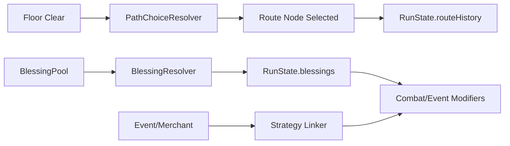

# Phase 5.6 深度扩展（P2）实施文档（PR 级）

**日期**: 2026-03-04  
**阶段**: Phase 5 / 5.6  
**目标摘要**: 在基础体验稳定后，补齐中后期决策深度，提升构筑分化与重玩价值。

**关联文档**:
1. `docs/plans/phase5/2026-03-04-phase5-deep-review-and-roadmap.md`
2. `docs/plans/phase5/2026-03-04-phase5-5-atmosphere-and-readability-enhancement-p1.md`
3. `docs/plans/phase4/2026-03-03-phase4-6-experience-enhancement-ii-g4-g6-g7.md`

---

## 1. 直接结论

5.6 通过“路径选择 + 祝福系统 + 事件联动”三件事扩展策略空间：

1. 楼层路径分支：让玩家在风险、收益、节奏之间做明确选择。
2. 祝福系统：提供单局可叠加增益，形成构筑差异。
3. 事件联动：让事件与路径/祝福产生耦合，而不是孤立奖励点。

5.6 完成后的硬结果：

1. 玩家在中后期不再只有“推进下一层”单一路径。
2. 同武器/同难度下可形成可解释的不同构筑。
3. 新增状态可保存恢复，旧存档可兼容加载。

---

## 2. 设计约束（5.6 必须遵守）

### 2.1 兼容性约束

1. 新增 run 字段优先采用可选字段，兼容旧存档。
2. 若升级 schema，必须补迁移链和 fixture 回归。

### 2.2 确定性约束

1. 路径分支与祝福抽取必须由 seed 和上下文决定。
2. 事件联动不得引入不可回放随机性。

### 2.3 复杂度约束

1. 每局活跃祝福数量需有上限，防止状态爆炸。
2. 规则交互要有冲突处理与优先级定义。

---

## 3. 现状与问题证据（5.6 输入）

### 3.1 当前深度现状

1. Phase 4 已引入 Boss telegraph、Endless mutator、deferred outcomes。
2. 当前单局中后期仍偏线性推进，路径策略表达有限。
3. 事件策略与构筑联动空间可继续扩展。

### 3.2 当前存档现状

1. `RunSaveDataV2` 已支持 `deferredOutcomes`。
2. 仍需要为路径选择和祝福状态定义持久化字段与恢复语义。

---

## 4. 范围与非目标

### 4.1 范围

1. 路径分支状态机与 UI 呈现。
2. 祝福系统核心规则与叠加策略。
3. 事件/商店与路径、祝福的联动逻辑。
4. save/restore 兼容与回归测试。

### 4.2 非目标

1. 不在 5.6 重做基础战斗系统。
2. 不在 5.6 做大型美术资源扩展。
3. 不在 5.6 做发布签署（由 5.7 执行）。

---

## 5. 目标结构（5.6 结束态）



### 5.1 状态字段草案

```ts
export interface RunRouteChoice {
  floor: number;
  options: Array<"standard" | "elite" | "merchant" | "event">;
  selected: "standard" | "elite" | "merchant" | "event";
}

export interface BlessingState {
  id: string;
  tier: 1 | 2 | 3;
  stacks: number;
  source: "event" | "merchant" | "route";
}
```

---

## 6. PR 级实施计划（5.6）

### PR-5.6-01：路径选择状态机与 UI

**目标**: 实现可解释、可恢复的楼层分支选择。

**新增文件（建议）**:
1. `packages/core/src/routeChoice.ts`
2. `apps/game-client/src/scenes/dungeon/world/RouteChoiceRuntime.ts`
3. `apps/game-client/src/ui/hud/panels/RouteChoicePanel.ts`

**修改文件（建议）**:
1. `apps/game-client/src/scenes/dungeon/world/ProgressionRuntimeModule.ts`
2. `packages/core/src/contracts/types.ts`

**验收标准**:
1. 每层分支选择可记录并影响下一层内容。
2. save/restore 后分支状态一致。

### PR-5.6-02：祝福系统核心

**目标**: 引入单局可叠加增益并可控管理复杂度。

**新增文件（建议）**:
1. `packages/core/src/blessing.ts`
2. `packages/content/src/blessings.ts`
3. `apps/game-client/src/scenes/dungeon/world/BlessingRuntimeModule.ts`

**修改文件（建议）**:
1. `packages/core/src/run.ts`
2. `apps/game-client/src/scenes/DungeonScene.ts`（或运行模块装配层）
3. `apps/game-client/src/ui/hud/HudContainer.ts`

**验收标准**:
1. 祝福效果可观测且不冲突。
2. 祝福叠加有上限和冲突策略。

### PR-5.6-03：事件/商店联动扩展

**目标**: 让路径与祝福进入事件收益决策。

**新增文件（建议）**:
1. `packages/core/src/eventBlessingLinker.ts`
2. `packages/core/src/merchantBlessingPolicy.ts`

**修改文件（建议）**:
1. `packages/core/src/randomEvent.ts`
2. `apps/game-client/src/scenes/dungeon/world/EventRuntimeModule.ts`
3. `apps/game-client/src/scenes/dungeon/world/MerchantFlowService.ts`

**验收标准**:
1. 至少 3 个事件/商店分支能消费路径或祝福状态。
2. 收益与风险变化可在日志/HUD 中解释。

### PR-5.6-04：兼容迁移与整合回归

**目标**: 完成存档兼容与跨模块回归收口。

**新增文件（建议）**:
1. `packages/core/src/__tests__/route-choice.test.ts`
2. `packages/core/src/__tests__/blessing.test.ts`
3. `packages/core/src/__tests__/integration-phase5f-depth-expansion.test.ts`

**修改文件（建议）**:
1. `packages/core/src/save.ts`
2. `packages/core/src/meta.ts`（如需）
3. `packages/core/src/__tests__/save.test.ts`

**验收标准**:
1. 旧档可加载，新字段缺省可安全降级。
2. 新系统在 Normal/Hard/Endless 至少各验证一条链路。

---

## 7. 验证与回归清单

### 7.1 自动化

```bash
pnpm --filter @blodex/core test
pnpm --filter @blodex/game-client test
pnpm --filter @blodex/game-client typecheck
pnpm check:architecture-budget
pnpm ci:check
```

### 7.2 手动冒烟

1. 默认优先使用金手指（debug cheats）快速推进到路径分支、祝福叠加和读档验证节点；必要时补 1 轮非金手指复测。
2. 连续 3 层路径选择，验证分支差异。
3. 祝福叠加与替换，验证 HUD/日志一致性。
4. 保存-读档后继续推进，验证状态不丢失、不重复结算。

---

## 8. 风险与止损策略

| 风险 | 等级 | 触发信号 | 止损策略 |
|---|:---:|---|---|
| 状态组合爆炸导致平衡失控 | 高 | 少数组合明显超模或废弃 | 增加冲突规则与 tier 上限 |
| save 字段扩展导致兼容故障 | 高 | 旧档加载失败或状态错乱 | 可选字段优先 + fixture 阻断 |
| 路径分支造成流程断链 | 中 | 特定分支无法推进 | 加入 route fallback 到 standard |
| 事件联动解释不清 | 中 | 玩家无法理解收益来源 | HUD 增加来源标注与日志解释 |

回滚原则：

1. 先关闭祝福联动，保留路径分支框架。
2. 兼容故障优先回滚 save 扩展 PR，再做补丁。

---

## 9. 5.6 出口门禁（Done 定义）

1. 路径选择、祝福系统、事件联动三条主线全部可用。
2. save/restore 兼容回归通过。
3. 新状态在 HUD/日志中可解释。
4. 自动化与手动冒烟通过。

---

## 10. 与 5.7 的交接清单

进入 5.7 前必须确认：

1. 5.6 新增机制均有稳定回归证据。
2. 所有可选字段与迁移路径已冻结。
3. 发布材料可直接引用 5.6 验证结果。
