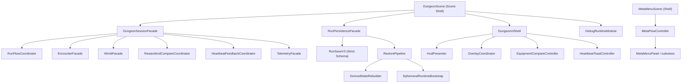

# Phase 7 技术债优先改造路线图（Phase 6 收口 + 核心架构重构）

**日期**: `2026-03-07`  
**状态**: `Proposed`  
**前置输入**:

1. `docs/plans/phase6/2026-03-07-phase6-final-summary-report.md`
2. `docs/plans/phase6/2026-03-06-phase6-roadmap.md`
3. `docs/architecture.md`
4. `docs/plans/phase7/2026-03-06-phase7-carryover-backlog.md`

---

## 1. 直接结论

Phase 6 已完成主要开发，但还没有正式关门。  
当前最重要的工作不应该是继续扩 Boss、扩遭遇、扩内容池，而是把 Phase 6 暴露出来的核心技术债**彻底清零**。

因此，Phase 7 必须改为：

`技术债优先的彻底重构阶段。`

本阶段的排序必须固定为：

1. **第一优先级**: 彻底解决核心技术债  
   重点是 `DungeonScene / HudContainer / MetaMenuScene / save-resume / evidence pipeline` 五类结构债。
2. **第二优先级**: 修复 Phase 6 未完成的功能性遗留  
   包括 Nightmare pacing/cadence、manual smoke、buff/damageType 签署、职业 parity。
3. **第三优先级**: 在前两者完成后，才允许进入原 `Phase 7` 的内容扩展池。

这不是“顺手优化”，而是一次**最大规模、结构性、不可妥协**的重构收口。

如果继续沿用当前 debt ceiling 模式，Phase 7 只会把 Phase 6 的架构债、验证债、证据债、存档债一起放大。  
内容越多，后面越难拆。

本轮还有一个额外约束：

`不考虑旧存档和任何兼容问题，可以直接破坏式修改。`

因此本路线图明确采用：

1. 不保留旧 save schema
2. 不保留旧 restore fallback
3. 不保留 legacy normalization / migration helper
4. 不保留旧 prompt / telemetry / buff snapshot 兼容分支
5. 允许直接替换 local storage key 与序列化结构

---

## 2. 为什么必须先做技术债

基于 `phase6 final summary report`，当前最危险的不是功能缺失，而是这些结构性问题：

### 2.1 场景层 God Object 仍然存在

当前主干仍然存在以下事实：

1. `DungeonScene` 仍是核心装配、状态持有、跨系统协调、反馈路由、存档入口、debug 注入、UI桥接的超级聚合点。
2. `HudContainer` 仍承担过多 overlay、compare、summary、toast、panel 逻辑。
3. `MetaMenuScene` 仍高于原始预算，承担过多 meta 流程与面板装配。

这说明：

1. 预算门禁没有被真正满足；
2. 当前只是“冻结债务，不让继续恶化”；
3. 一旦继续做多 Boss、长 run、元素体系、set 系统，这些文件会再次膨胀。

### 2.2 Save / Resume 仍然脆弱

Phase 6 的多个 PR 都在持续修：

1. restore 后 synergy 重复计数
2. monster move speed 基础值污染
3. active buffs 时间基准漂移
4. legacy telemetry snapshot 兼容
5. compare queue / prompt state 恢复

这意味着当前保存系统不是“稳定”，而是“刚刚被连续补丁救回来”。

### 2.3 证据与签署体系仍然半自动化

Phase 6 的 evidence pack 已有，但最终签署仍卡在：

1. Nightmare pacing/cadence
2. manual smoke / 录像归档
3. buff / damageType 的人工验收
4. release/taste/engineering 三方签署

也就是说，Phase 6 的“规则”和“证据”还没有彻底同构。

### 2.4 当前架构说明与主干现实存在漂移

`docs/architecture.md` 仍然保留了早期“Scene 壳 + 预算接近可控”的叙述，但主干实际已经依赖：

1. debt ceiling no-regression gate
2. 多轮临时 follow-up
3. 超出原始目标的 `MetaMenuScene / HudContainer`

因此，技术债已经不是代码层局部问题，而是：

`架构文档、CI门禁、真实代码结构、发布证据之间的系统性不一致。`

---

## 3. 本阶段目标（必须全部达成）

### 3.1 架构目标

1. `DungeonScene` 降为**真正的 Scene Shell**，不再承载业务协调。
2. `HudContainer` 降为**纯容器层**，不再吞业务语义。
3. `MetaMenuScene` 降为**导航与装配层**，不再承载复杂 meta 业务。
4. 彻底移除 `architecture budget` 中对核心大文件的 debt ceiling 依赖。
5. `docs/architecture.md` 与主干结构重新对齐。

### 3.2 正确性目标

1. save/resume 形成统一 schema、重建、回放模型。
2. runtime local 时间字段与 persisted stable 字段彻底分离。
3. compare queue、reward queue、prompt queue、buff timeline 不再散落在 Scene 各处。

### 3.3 证据目标

1. `Phase6EvidencePack` 从“报告构建器”升级为“可审计证据注册中心消费者”。
2. calibration / threshold / pacing target / sign-off scenario 全部显式注册化。
3. manual smoke 与录像归档形成正式目录与 checklist，不再只是文档里的 `Pending`。

### 3.4 发布目标

1. Nightmare pacing / cadence 修到可签署。
2. `S6-05`、`S6-07` 补齐。
3. Phase 6 完成正式 sign-off。
4. 只有在上述全部完成后，才允许进入 Boss / content expansion。

---

## 4. 核心技术债定义（必须彻底解决）

### 4.1 债一：`DungeonScene` 超级聚合债

**问题本质**

`DungeonScene` 当前不是“Scene Shell”，而是：

1. lifecycle holder
2. runtime state bag
3. module assembler
4. cross-module coordinator
5. save/restore surface
6. compare / reward / telemetry 桥接器
7. debug cheat 注入器
8. diagnostics exporter

这会导致：

1. 一处字段变化影响大量模块 host port
2. save / reward / feedback / event 等边界耦合
3. 任何新功能都倾向于“直接回流 Scene”
4. review 成本和回归半径持续变大

**彻底解决标准**

1. `DungeonScene` 只保留：
   - Phaser 生命周期
   - 根装配
   - frame entry
   - top-level fatal error boundary
2. 所有业务协调逻辑移出 Scene。
3. Scene 不再直接暴露大面积 runtime 字段给模块 host。
4. `DungeonScene` 行数必须压回硬目标，不允许 debt ceiling 豁免。

### 4.2 债二：`HudContainer` 业务吞噬债

**问题本质**

`HudContainer` 目前不只是 view container，还在吞：

1. compare prompt 行为语义
2. overlay 阻塞语义
3. summary / panel 业务动作
4. heartbeat / toast 呈现策略

这会让 UI 层持续吸收业务规则，破坏：

1. 复用性
2. 测试边界
3. prompt / queue / overlay 的一致性

**彻底解决标准**

1. `HudContainer` 只负责渲染与 DOM/Phaser 组件装配。
2. 所有 `equip / later / ignore / close / defer` 行为语义必须回到 runtime/controller 层。
3. overlay blocking contract 统一进入一个独立协调器。

### 4.3 债三：`MetaMenuScene` / `MetaMenuPanel` 过度耦合债

**问题本质**

meta 流程和 UI 面板装配长期混在 scene/component 中，导致：

1. blueprint / progression / unlock / run continue / docs 路径都聚在同一层
2. 面板改动会放大到 scene 层
3. 后续若扩 set / archetype / boss codex，会继续恶化

**彻底解决标准**

1. `MetaMenuScene` 只做导航与状态注入。
2. `MetaFlowController` 统一承接 meta 业务。
3. `MetaMenuPanel` 只做 view 组合。

### 4.4 债四：Save / Resume 分层混乱债

**问题本质**

当前 save/resume 的问题不是某一个 bug，而是模型本身长期混合了：

1. persisted stable state
2. runtime derived state
3. session-local timeline state
4. UI/prompt transient state

这就是为什么一个阶段会连着修：

1. buff 时间 rebasing
2. compare prompt 恢复
3. monster speed / base state 重建
4. telemetry snapshot 兼容

**彻底解决标准**

1. 明确四层状态模型：
   - `Persistent Domain State`
   - `Persistent Runtime Snapshot`
   - `Restore-Derived State`
   - `Ephemeral Session State`
2. restore 时只允许经过：
   - strict deserialize
   - persistent load
   - derived rebuild
   - ephemeral bootstrap
3. 删除所有 `legacy migration / normalize / fallback deserialize`。
4. 任何带 `nowMs / expiresAtMs / cursor / queue pointer / overlay lock` 的状态，都必须显式分类，不允许隐式混用。

### 4.5 债五：Evidence / Calibration / Sign-off 体系分裂债

**问题本质**

当前 Phase 6 已经有：

1. `RealBalanceReport`
2. `RealBalanceCalibration`
3. `Phase6Pacing`
4. `Phase6EvidencePack`
5. release docs
6. browser smoke docs

但这些还没有真正形成：

`证据注册中心 -> 报告生成器 -> smoke matrix -> sign-off checklist -> release archive`

的一条统一链。

**彻底解决标准**

1. calibration 记录必须显式包含：
   - scenario
   - sampleSize
   - baselineCommit
   - source command
   - evidence artifact
2. evidence pack 只消费 registry，不自己硬编码策略结论。
3. smoke matrix 的自动项必须从 assessment 派生，手动项必须从归档目录派生。
4. release/taste/engineering sign-off 不再靠人工复制文案，而是基于同一套 checklist artifact。

---

## 5. 彻底重构方案（推荐主方案）

### 5.1 总体原则

1. **不做温和清理，直接做结构重构。**
2. **先拆边界，再修行为。**
3. **先让 Host Port 缩小，再让文件变小。**
4. **先统一状态模型，再继续加系统。**
5. **先恢复硬预算，再谈内容扩展。**

### 5.2 目标架构



### 5.3 关键拆分

#### A. `DungeonScene` 拆成 6 个明确外壳

1. `DungeonSessionFacade`
   - 聚合 run/player/world/boss/feedback/save 的高层协调
2. `RunFlowCoordinator`
   - 接手 active/update/event-panel/boss-victory/frame flow
3. `RewardAndCompareCoordinator`
   - 接手 loot / merchant / boss reward / fallback / compare queue
4. `HeartbeatFeedbackCoordinator`
   - 接手 toast/prompt 的调度预算与优先级
5. `RunPersistenceFacade`
   - 接手 save/restore 的统一入口
6. `DungeonDiagnosticsFacade`
   - 接手 debug snapshot、evidence export、diagnostics

#### B. `HudContainer` 拆成 5 个独立 Presenter/Controller

1. `OverlayCoordinator`
2. `EquipmentCompareController`
3. `HeartbeatToastController`
4. `RunSummaryController`
5. `CombatHudPanelController`

要求：

1. `HudContainer` 不再持有业务动作回调语义。
2. 控制器只消费 `UIStateSnapshot` 和 typed action。
3. 业务决策回到 runtime/controller。

#### C. `MetaMenuScene` 拆成 3 层

1. `MetaMenuScene`
2. `MetaFlowController`
3. `MetaMenuPanel + 子 view`

#### D. save/resume 彻底重建为 pipeline

1. `RunSaveV3`
2. `RunSaveSerializer`
3. `RunStateLoader`
4. `DerivedStateRebuilder`
5. `EphemeralRuntimeBootstrap`

说明：

1. 本阶段不保留旧版 `RunSaveDataV1/V2` 兼容入口。
2. 删除旧 migration / normalization / legacy fallback 逻辑。
3. 若检测到旧版存档，直接视为无效数据，而不是尝试迁移。

#### E. evidence/sign-off 注册中心化

1. `CalibrationRegistry`
2. `ThresholdRegistry`
3. `SmokeScenarioRegistry`
4. `SignoffChecklistRegistry`
5. `ReleaseArtifactIndex`

---

## 6. 分阶段执行（技术债优先）

### 7.0A 核心架构去债（P0）

**目标**

彻底把 `DungeonScene / HudContainer / MetaMenuScene` 从 God object / fat container 拉回目标结构。

**主要工作**

1. 冻结新的 scene/ui/meta 分层规则
2. 引入 `DungeonSessionFacade`
3. 拆出 `RewardAndCompareCoordinator`
4. 拆出 `HeartbeatFeedbackCoordinator`
5. 拆出 `RunPersistenceFacade`
6. 拆出 `OverlayCoordinator / EquipmentCompareController / HeartbeatToastController`
7. 拆出 `MetaFlowController`
8. 更新 `docs/architecture.md`
9. 删除核心大文件的 debt ceiling 白名单

**硬门禁**

1. `DungeonScene.ts <= 1500`
2. `HudContainer.ts <= 450`
3. `MetaMenuScene.ts <= 650`
4. `MetaMenuPanel.ts <= 450`
5. `check:architecture-budget` 不再对这些文件使用 debt ceiling

### 7.0B Save / Resume 体系重构（P0）

**目标**

把 save/resume 从“多轮补丁修复”变成稳定 pipeline。

**主要工作**

1. 建立 `Persistent / Derived / Ephemeral` 状态分类
2. 直接重建 `RunSaveV3` 严格 schema
3. 删除旧 save key、旧 migration、旧 normalize helper
4. restore pipeline 正式化
5. timeline rebasing 统一化
6. compare queue / reward queue / prompt state 纳入同一瞬态恢复模型
7. 所有 runtime local 时间字段显式标注

**硬门禁**

1. 所有 restore 路径必须经过统一 pipeline
2. no direct Scene mutation during deserialize
3. 不允许保留 `legacy normalize / fallback deserialize`
4. save/restore 只对 `RunSaveV3` 做严格契约测试

### 7.0C Evidence / Release 基建重构（P0）

**目标**

让 Phase 6 的 evidence / sign-off 不再是“半自动报告 + 手工文档”。

**主要工作**

1. 建立 `CalibrationRegistry`
2. 建立 `SmokeScenarioRegistry`
3. 建立 `ReleaseArtifactIndex`
4. 把 browser smoke、录像、regression matrix、sign-off checklist 全部绑定到 registry
5. 把 `Phase6EvidencePack` 改成 registry consumer

**硬门禁**

1. evidence pack 不再硬编码自动 smoke 结论
2. sign-off checklist 只消费 registry / assessment / archive
3. release docs 中的状态必须可由代码生成或校验

### 7.1 Phase 6 未完成项收口（P0）

**目标**

完成 Phase 6 正式签署。

**主要工作**

1. 调整 Nightmare pacing
2. 调整 Nightmare active cadence
3. 完成 `S6-05` 三职业 parity 样本
4. 完成 `S6-07` 中 `buff / damageType` 的录像和回归样本
5. 完成 release/taste/engineering 三方签署

**硬门禁**

1. Phase 6 release readiness 从 `Pending` 变为 `Signed`
2. regression matrix 无阻塞 pending 项

### 7.2 评分与仿真债治理（P1）

**目标**

把 `itemTradeoff`、`PowerSpikeAmplitudeScorer`、`RealBalanceCalibration` 从启发式提升为可审计模型。

**主要工作**

1. 建立 `ItemTradeoffCalibrationAsset`
2. 建立 `SpikeAmplitudeCalibrationAsset`
3. 将 TTK/EHP representative sample 引入 scorer 校准
4. 区分 `policy threshold` 与 `calibration override`
5. 清理临时 override 的长期滞留风险

### 7.3 内容扩展入口（P2）

只有 `7.0A ~ 7.1` 全部通过后，才允许恢复原 Phase 7 backlog：

1. 多 Boss
2. 更多 affix / consumable / talent rank
3. 完整元素体系
4. set / 长 run / 更多楼层

---

## 7. 推荐 PR 拆分

### PR-7.0A-01 Scene Shell 拆分

1. `DungeonSessionFacade`
2. `RunFlowCoordinator`
3. `RewardAndCompareCoordinator`
4. `HeartbeatFeedbackCoordinator`

### PR-7.0A-02 UI 容器拆分

1. `OverlayCoordinator`
2. `EquipmentCompareController`
3. `HeartbeatToastController`
4. `RunSummaryController`

### PR-7.0A-03 Meta 分层重构

1. `MetaFlowController`
2. `MetaMenuScene` shell 化
3. `MetaMenuPanel` 纯 view 化

### PR-7.0B-01 RunSaveV3 Strict Schema

1. `RunSaveV3` schema
2. serializer / deserializer
3. 删除旧 save key 与旧 migration 入口

### PR-7.0B-02 Restore Pipeline

1. loader
2. derived rebuild
3. ephemeral bootstrap

### PR-7.0C-01 Evidence Registry

1. calibration / threshold / smoke / signoff registry
2. `Phase6EvidencePack` 改造
3. release artifact index

### PR-7.1-01 Nightmare pacing closure

1. cadence / duration 调优
2. rerun evidence

### PR-7.1-02 Manual smoke & sign-off closure

1. parity/buff/damageType 录像
2. regression matrix 归档
3. final sign-off

---

## 8. 验证方案

### 8.1 自动化

```bash
pnpm -r typecheck
pnpm test
pnpm check:architecture-budget
pnpm ci:check
pnpm phase6:evidence:report
```

新增必须补的门禁：

1. `scene-shell-budget.test`
2. `save-restore-pipeline.contract.test`
3. `evidence-registry.integrity.test`
4. `release-artifact-index.test`
5. `overlay-compare-coordinator.contract.test`

对 save/resume 的测试策略改为：

1. 只测新 schema
2. 只测严格 deserialize
3. 只测 rebuild 与 bootstrap
4. 不再维护 legacy compatibility case

### 8.2 手动与录像

1. 三职业完整 run
2. Nightmare 完整 run
3. buff/debuff 白盒验证 run
4. damageType 差异 run
5. compare queue / save-resume / boss reward 组合回归

---

## 9. 风险与止损

### 风险 1：大规模重构引入回归

**止损**

1. 先拆 facade，再迁业务，再删旧入口
2. 每一步都加 contract tests

### 风险 2：拆分后 Host Port 暴增

**止损**

1. 先做 facade，再做内部强类型 port
2. 禁止 scene 直接暴露 runtime field bag

### 风险 3：为了通过预算，做表面拆文件

**止损**

1. 预算验收同时要求职责重分配
2. 禁止“只搬函数，不改边界”

### 风险 4：Phase 6 closure 被无限延后

**止损**

1. `7.1` 必须作为 `7.0` 的直接后续，不允许跳过
2. 任何内容扩展 PR 若在 `7.1` 前出现，一律拒绝

---

## 10. 最终完成定义（必须全部满足）

只有以下条件全部满足，才允许说“核心技术债已被彻底处理”：

1. `DungeonScene / HudContainer / MetaMenuScene` 压回硬预算，无 debt ceiling
2. save/resume 采用统一 pipeline，相关历史补丁被结构化吸收
3. `Phase6EvidencePack` 只消费 registry，不再手工拼接结论
4. Phase 6 的所有 sign-off 项全部完成
5. `docs/architecture.md` 与主干实际结构重新一致
6. 之后的新内容扩展不再需要回流 Scene/UI God object

---

## 11. 当前建议

在这个新方向下，原 `2026-03-06-phase7-carryover-backlog.md` 不应被直接执行。  
正确顺序应改为：

1. 先执行本文件的 `7.0A ~ 7.1`
2. 再回到旧的 `phase7 carryover backlog`

否则，Phase 7 只是在不稳定地基上继续加层。
